# Summerville Credit Union — nFinia Member Guide
## Membership Settings: Delete Membership & Manage Membership Address

**Platform:** Summerville Credit Union — nFinia Digital Banking  
**Module:** More > Membership Settings / More > Forms > Address Change Form  
**User Roles:** Primary Member, Joint Member  
**Prepared by:** Jeeva Krishnamurthy, Senior Product Manager — Tyfone

---

## Section 1 — Product Summary

The **Membership Settings** module within Summerville's nFinia digital banking platform gives members direct control over how their memberships appear and behave inside online banking. Two frequently used capabilities within this module are **Delete Membership** (removing a membership from the digital banking view) and **Manage Membership Address** (submitting an address change request across one or more memberships).

**Delete Membership** allows a member to remove an existing membership from their digital banking dashboard without closing the underlying account at the credit union. This is particularly useful when a member holds joint memberships they no longer wish to see in their account list, or when duplicate memberships exist that cause clutter. The underlying account remains open — only the digital banking visibility is affected.

**Manage Membership Address** allows a member to submit a formal Address Change Form for one or more of their memberships simultaneously. The form supports both local (domestic) and foreign address updates, allows the member to select which memberships should be updated, and sets an effective date. Because address changes affect legal records and payment processing, the form routes through back-office processing within three business days and the member receives a clear success confirmation upon submission.

Both features require authentication through Summerville's standard Multi-Factor Authentication (OTP) flow before the member can access account settings.

| Attribute | Detail |
|-----------|--------|
| Feature Names | Delete Membership; Address Change Form (Manage Membership Address) |
| Module | More > Membership Settings; More > Forms > Address Change Form |
| User Roles | Primary Member, Joint Member |
| Access Level | Authenticated member; membership-specific |
| Key Actions | Delete (hide) membership; Update residential/mailing address across memberships |
| Regulatory Relevance | Address of record for BSA/AML compliance; audit trail for address changes |

---

## Section 2 — Use Cases

| Use Case | Who Uses It | What They Do | Business Value |
|----------|-------------|--------------|----------------|
| Remove unwanted membership from view | Primary or Joint Member | Selects a membership and clicks "Delete membership" to hide it from the dashboard | Reduces clutter in account list without requiring branch interaction or account closure |
| Update residential address after moving | Primary Member | Navigates to Address Change Form, enters new address, selects all affected memberships, submits | Ensures credit union holds current address of record, supporting regulatory compliance and accurate statement delivery |
| Apply address change to multiple memberships at once | Member with multiple accounts | Selects all memberships under the Additional Membership Information section before submitting | Single-form update reduces member friction and eliminates need for repeated branch visits |
| Submit foreign address | International or dual-residence member | Uses the "Update Foreign Address" option in the Address Change Form to enter a non-US address | Supports members with international addresses without requiring branch intervention |
| Set a future effective date for address change | Member who is relocating | Sets the Effective Date field to a future date before submitting the form | Ensures CU systems update at the right time without requiring a follow-up action |
| Verify identity before accessing membership settings | Any member | Completes OTP verification via text, call, or email before accessing sensitive settings | Protects member accounts from unauthorized changes; satisfies authentication requirements |

The Delete Membership and Manage Membership Address features collectively reduce inbound branch and call center volume for routine administrative requests. By allowing members to self-serve these changes digitally, Summerville CU can reallocate member services staff to higher-value interactions.

---

## Section 3 — End-to-End Workflows

### 3A — Delete Membership

#### 3A.1 Prerequisites
- Member must have a valid Summerville digital banking login (User ID and password)
- Member must have at least two memberships enrolled in digital banking (one to delete, one to retain)
- OTP delivery method must be on file (phone number or email)

#### 3A.2 Step-by-Step Flow

**Step 1 — Login**  
The member navigates to the Summerville Online Banking portal and enters their User ID and password, then clicks **Log in**.

---

**Step 2 — OTP Verification: Select Delivery Method**  
The platform presents the Verification screen prompting the member to choose how they want to receive their One-Time Passcode: **Send me a message**, **Call me**, or **Send me an email**.

---

**Step 3 — OTP Verification: Select Contact**  
If the member selects "Send me a message," the platform lists available phone numbers on file (masked for security). The member selects the desired number.

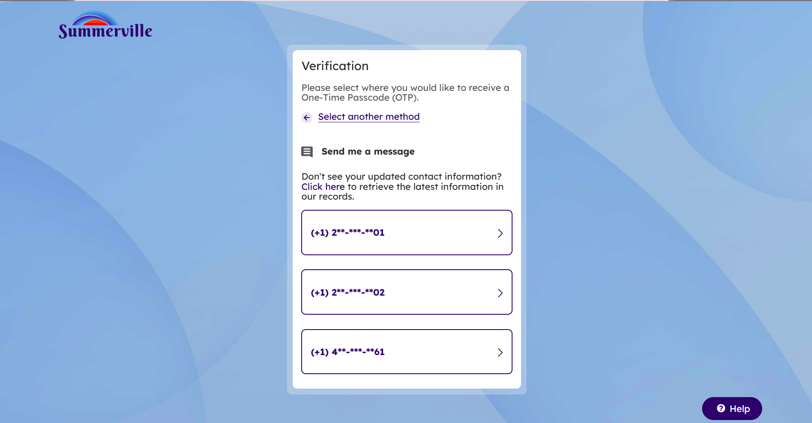

---

**Step 4 — OTP Entry**  
An OTP is sent to the selected contact. The member enters the 6-digit code. A "Retry in 52s" countdown is displayed. The member may optionally check **Remember Device/Browser** to skip this step on future logins from the same device.

---

**Step 5 — Dashboard**  
Upon successful authentication, the member lands on the personalized Dashboard showing account balances and the Quick Transfer widget.

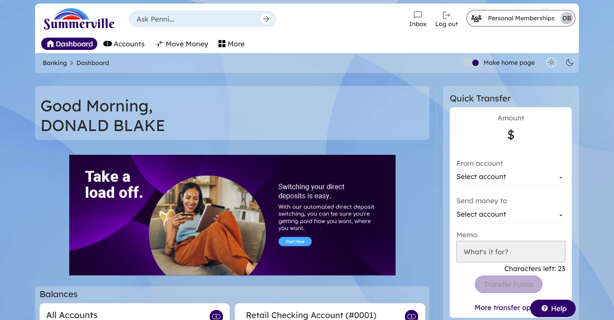

---

**Step 6 — Navigate to Membership Settings**  
The member clicks **More** in the top navigation bar. The expanded menu reveals options including **Membership Setting**, **Accounts and Memberships**, and **Personal Information**. The member clicks **Membership Setting**.

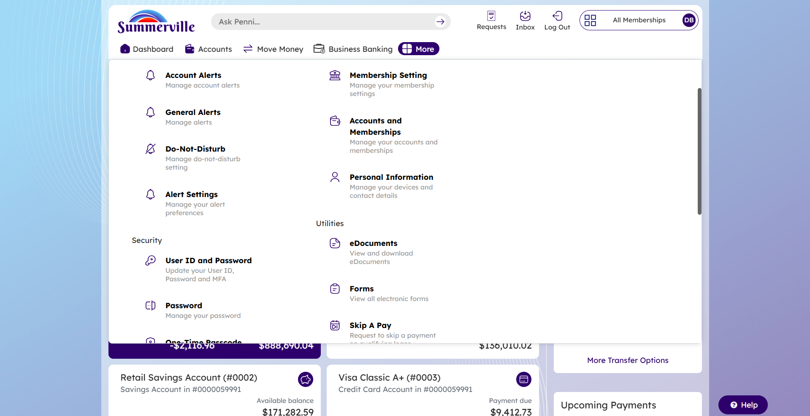

---

**Step 7 — Membership Settings: Select Membership to Delete**  
The Membership Settings page displays under the **Account Settings / Membership Settings** tabs. The member uses the **"Select membership to view details"** dropdown to choose the membership they want to remove (e.g., #0000059991 - DONALD). The page displays:
- Ownership type (Primary / Joint)
- Members listed (Primary and Joint holders)
- Trust beneficiaries (if any)
- Mask membership numbers toggle
- A **Delete membership** button in red at the bottom

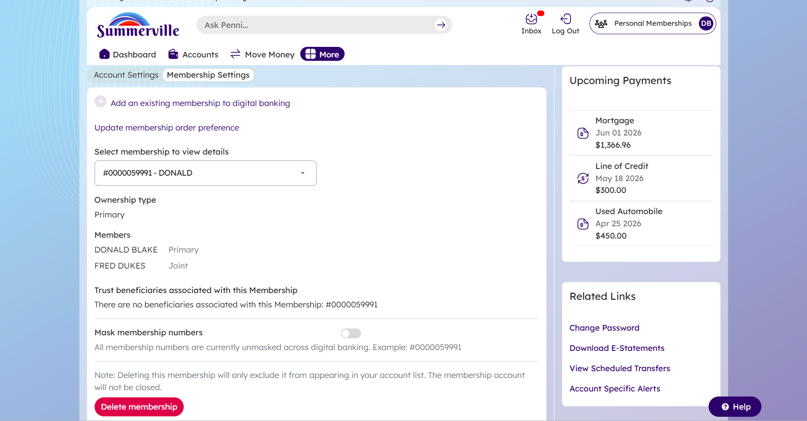

---

**Step 8 — Confirmation Dialog**  
Clicking **Delete membership** triggers a modal dialog: *"Are you sure you want to delete the following membership?"* with two buttons: **Cancel** and **Proceed**.

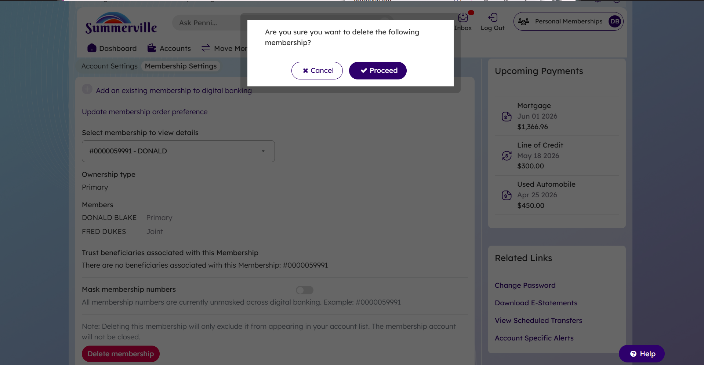

---

**Step 9 — Success Confirmation**  
After clicking **Proceed**, the platform returns to the Membership Settings page displaying a success banner:  
*"Membership #: 0000059991 deleted successfully."*  
The dropdown now shows the next available membership (e.g., #0000060071 - VICTOR), confirming the deleted membership has been removed from the digital banking view.

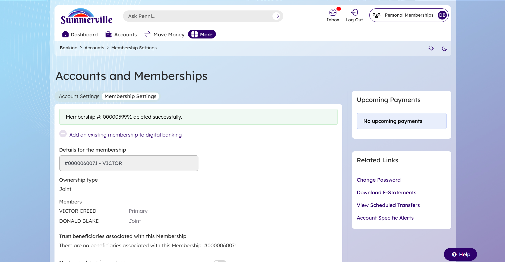

---

#### 3A.3 Decision Points & Branching
- If the member has only one membership enrolled, the Delete button is not available (the member must retain at least one membership in digital banking).
- The note on-screen clarifies: *"Note: Deleting this membership will only exclude it from appearing in your account list. The membership account will not be closed."* — no downstream account closure occurs.

#### 3A.4 Completion & Confirmation
- Success banner displayed on Membership Settings page
- Membership removed from dropdown selector and account list
- Underlying account at the credit union remains open and unaffected

#### 3A.5 Error Handling
- If the OTP code is incorrect, the system shows an error and allows retry
- If the "Retry" countdown expires, the member may request a new code
- If the session expires mid-flow, the member is returned to the login screen

---

### 3B — Manage Membership Address (Address Change Form)

#### 3B.1 Prerequisites
- Member must be authenticated (same OTP flow as above)
- Member must be listed as an owner or joint owner on the memberships they want to update
- Current contact information must be on file (the form auto-populates existing data)

#### 3B.2 Step-by-Step Flow

**Step 1 — Login**  
Same login flow as Delete Membership (steps 1–5 above).

---

**Step 2 — OTP: Select Delivery Method**

---

**Step 3 — OTP: Select Contact**

---

**Step 4 — OTP Entry**

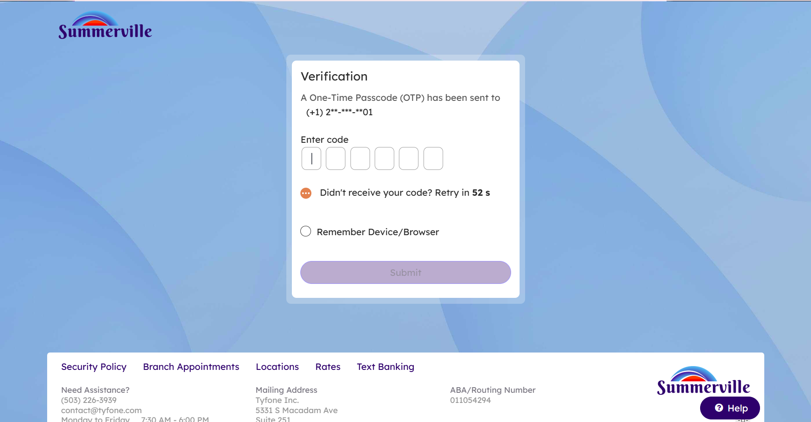

---

**Step 5 — Dashboard**

---

**Step 6 — Navigate via More Menu**  
The member clicks **More** in the top navigation. They navigate to **Forms** under the Utilities section.

---

**Step 7 — Forms Library**  
The Forms page lists all available self-service forms. The member locates and clicks **Address Change Form**.

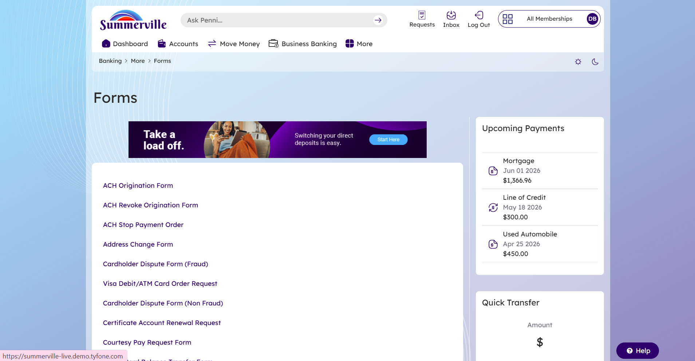

---

**Step 8 — Address Change Form: Member Information & Current Contact**  
The Address Change Form loads with key sections auto-populated:
- **Membership number** dropdown pre-selects the member's primary membership
- **Current Contact Information** displays the member's name, current address, city, state, zip, and Online Banking email address

An important note is displayed: *"Any recent personal account changes could prohibit the processing of Wire Transfer requests by fax, phone, Online Banking, and US mail. Please visit a branch to initiate a new ACH or wire."*

The member selects **"Update Local Address"** radio button and proceeds.

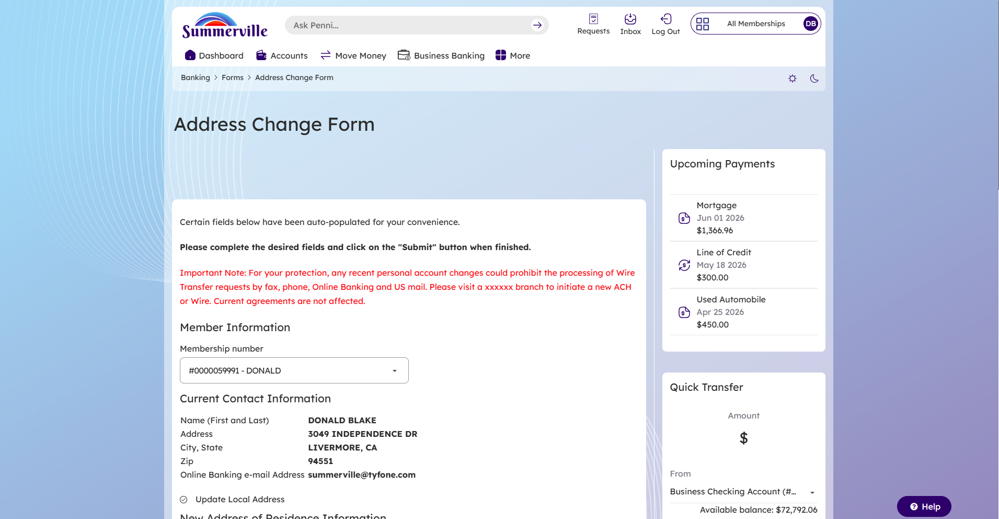

---

**Step 9 — New Address of Residence Information**  
The form expands to show the **New Address of Residence Information** section:
- **Address** field (no P.O. Boxes)
- **State** dropdown
- **City** field
- **Zip** field
- Radio options: **Use this as Mailing Address** / **Have Different Mailing Address**
- **Update Foreign Address** option for non-US addresses

The current address is pre-filled for the member's convenience. The member updates the fields as needed.

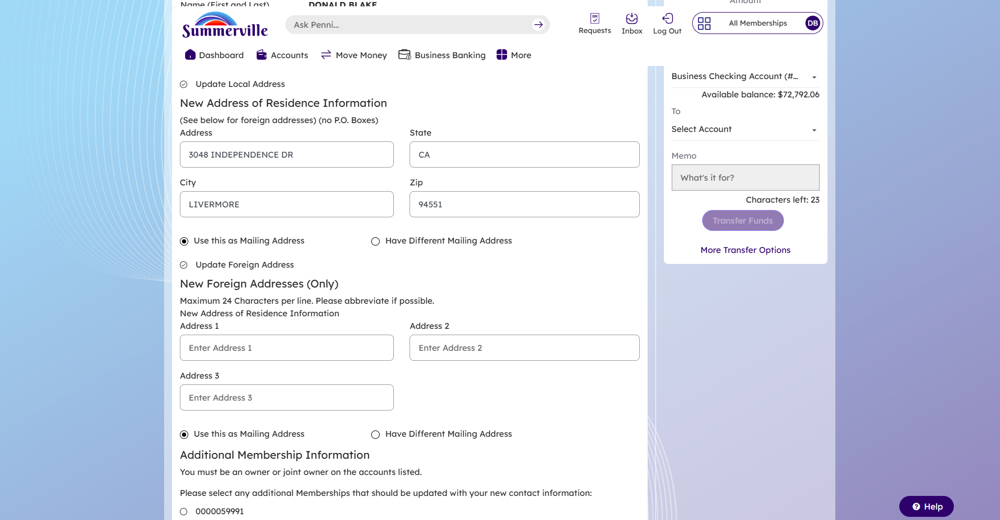

---

**Step 10 — Foreign Address, Additional Memberships & Effective Date**  
Below the domestic address section:
- **New Foreign Addresses (Only)**: Three address line fields (max 24 characters each; abbreviate where possible)
- **Additional Membership Information**: Lists all memberships the member owns or co-owns with radio buttons to select which memberships should be updated (e.g., #0000059991, #0000060071, #0000096321)
- **Effective date**: Defaults to today's date; can be changed to a future date
- **Legal acknowledgment text**: Confirms the member is requesting the address change across all selected accounts
- **Reset** and **Submit** buttons

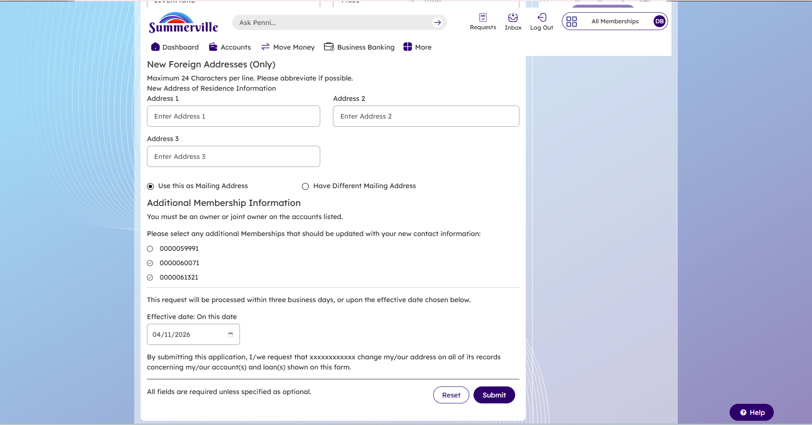

---

**Step 11 — Success Confirmation**  
After submission, the member is returned to the Forms page with a green success banner:  
*"Address Change Form submitted successfully."*  
The form is queued for back-office processing within three business days.

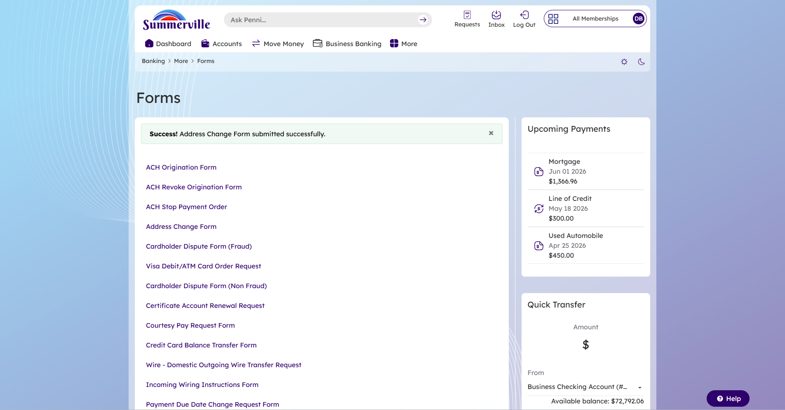

---

#### 3B.3 Decision Points & Branching
- **Local vs. Foreign address**: Member selects "Update Local Address" for domestic or "Update Foreign Address" for international addresses. Both sections are shown; only the selected type is required.
- **Mailing address**: If different from residence, a separate mailing address section appears when "Have Different Mailing Address" is selected.
- **Multiple memberships**: The member must explicitly select each membership to be updated; not all are selected by default.

#### 3B.4 Completion & Confirmation
- Green success banner on the Forms page confirms submission
- Request processed within 3 business days or on the chosen effective date
- No immediate account changes occur — processing is handled by back-office staff

#### 3B.5 Error Handling
- Required fields not filled: System prevents submission and highlights missing fields
- Foreign address character limit (24 per line): Enforced client-side; abbreviation recommended
- Session timeout: Member returned to login screen; form data not saved

---

## Section 4 — Feature Overview (UI Walkthrough)

### Login Screen

The standard Summerville Online Banking login page. Accepts User ID and password. Provides a "I need help logging in" link for account recovery.

| Field / Element | Type | Description | Notes |
|-----------------|------|-------------|-------|
| User ID | Text Input | Member's digital banking username | Auto-filled if "Save User ID" was enabled previously |
| Password | Password Input | Member's account password | Masked by default; eye icon to reveal |
| I need help logging in | Link | Initiates forgot User ID / password recovery | Routes to self-service recovery flow |
| Log in | Button | Submits credentials | Triggers OTP flow on success |
| Enroll | Button | New member enrollment | Top-right corner |

---

### Verification Screen — OTP Method Selection

Displayed after successful password entry. Requires the member to choose a delivery channel for the One-Time Passcode.

| Field / Element | Type | Description | Notes |
|-----------------|------|-------------|-------|
| Send me a message | Button | Sends OTP via SMS to a phone on file | Lists masked phone numbers on sub-screen |
| Call me | Button | Automated voice call with OTP | Alternative for members who prefer voice |
| Send me an email | Button | Sends OTP to email address on file | Third delivery option |

---

### Verification Screen — OTP Entry

Displayed after delivery channel is selected. The member enters the passcode received.

| Field / Element | Type | Description | Notes |
|-----------------|------|-------------|-------|
| Enter code | 6-box Input | OTP entry field | Each digit in a separate box |
| Retry in Xs | Countdown Label | Shows time remaining before resend is available | Resets on new code request |
| Remember Device/Browser | Checkbox | Skips OTP on future logins from this device | Optional; applies to current browser session |
| Submit | Button | Validates OTP and proceeds | Disabled until code is entered |

---

### Dashboard

Post-login landing screen. Shows personalized greeting, account balances, promotional banners, and Quick Transfer widget.

| Field / Element | Type | Description | Notes |
|-----------------|------|-------------|-------|
| Good Morning, [Name] | Label | Personalized greeting | Time-of-day aware |
| Balances | Section | Lists all enrolled accounts with balance | Scrollable |
| Quick Transfer | Widget | Shortcut for moving money between accounts | Amount, From/To selectors, Memo field |
| Dashboard / Accounts / Move Money / More | Nav Tabs | Primary navigation | "More" expands utilities and settings |

---

### More Menu

Expanded navigation panel accessed from the "More" tab. Organizes additional features by category.

| Field / Element | Type | Description | Notes |
|-----------------|------|-------------|-------|
| Account Alerts | Nav Link | Manage account-specific alerts | Under Alerts category |
| General Alerts | Nav Link | Manage general notification preferences | Under Alerts category |
| Membership Setting | Nav Link | Access membership-level settings | Under Settings category |
| Accounts and Memberships | Nav Link | View/manage all accounts | Under Settings category |
| Personal Information | Nav Link | Update personal contact details | Under Settings category |
| eDocuments | Nav Link | Access digital statements | Under Utilities category |
| Forms | Nav Link | Access self-service form library | Under Utilities category |
| User ID and Password | Nav Link | Security settings | Under Security category |

---

### Membership Settings Page

Accessed via More > Membership Setting. Shows details for a selected membership and allows deletion.

| Field / Element | Type | Description | Notes |
|-----------------|------|-------------|-------|
| Account Settings / Membership Settings | Tabs | Toggle between account and membership settings | "Membership Settings" tab active for this flow |
| Add an existing membership to digital banking | Link | Enroll an additional membership | Reverse of delete |
| Update membership order preference | Link | Reorder how memberships appear | Cosmetic preference |
| Select membership to view details | Dropdown | Choose which membership to manage | Lists all enrolled memberships by number and name |
| Ownership type | Label | Shows Primary or Joint | Read-only |
| Members | Table | Lists all members on the selected membership | Primary and Joint designations shown |
| Trust beneficiaries | Label | Displays beneficiary info if configured | Shows "none" if not set |
| Mask membership numbers toggle | Toggle | Hides/shows full membership numbers across digital banking | Affects all memberships |
| Delete membership | Button (Red) | Initiates deletion of selected membership from digital banking | Does not close the account |

---

### Delete Membership — Confirmation Dialog

Modal overlay requiring explicit confirmation before proceeding with membership deletion.

| Field / Element | Type | Description | Notes |
|-----------------|------|-------------|-------|
| Dialog text | Label | "Are you sure you want to delete the following membership?" | Includes membership number |
| Cancel | Button | Dismisses dialog; no action taken | Returns to Membership Settings |
| Proceed | Button (Purple) | Confirms and executes deletion | Triggers success state |

---

### Forms Library

Accessed via More > Forms. Lists all available self-service forms for the member.

| Field / Element | Type | Description | Notes |
|-----------------|------|-------------|-------|
| ACH Origination Form | Link | ACH payment origination request | — |
| ACH Revoke Origination Form | Link | Revoke existing ACH origination | — |
| ACH Stop Payment Order | Link | Request ACH payment stop | — |
| Address Change Form | Link | Update residential/mailing address | Target form for this workflow |
| Cardholder Dispute Form (Fraud / Non-Fraud) | Link | Dispute a card transaction | — |
| Certificate Account Renewal Request | Link | Renew a certificate | — |
| Courtesy Pay Request Form | Link | Opt into overdraft coverage | — |
| Wire Transfer forms | Link | Domestic/incoming wire requests | — |

---

### Address Change Form

Multi-section form for submitting a residential or mailing address update.

| Field / Element | Type | Description | Notes |
|-----------------|------|-------------|-------|
| Membership number | Dropdown | Select which membership's details to display | Auto-populates current contact info |
| Name (First and Last) | Label (Read-only) | Member's name on file | Not editable via this form |
| Address, City, State, Zip | Labels (Read-only) | Current address on file | Auto-populated for reference |
| Online Banking e-mail Address | Label (Read-only) | Email on file | Not editable via this form |
| Update Local Address | Radio | Select to update domestic address | Reveals New Address of Residence fields |
| Update Foreign Address | Radio | Select to update international address | Reveals Foreign Address fields |
| Address (New) | Text Input | Street address (no P.O. Boxes) | Required for local update |
| State | Dropdown | US state | Required for local update |
| City | Text Input | City name | Required |
| Zip | Text Input | ZIP code | Required |
| Use this as Mailing Address | Radio | Sets residence address as mailing address too | Default selection |
| Have Different Mailing Address | Radio | Reveals separate mailing address fields | Optional |
| New Foreign Addresses (Only) | Section | Address 1, 2, 3 text fields | Max 24 characters per line |
| Additional Membership Information | Radio Group | Select which memberships to apply the change to | Member must be owner/joint owner |
| Effective date | Date Picker | Date the change should take effect | Defaults to today; future dates allowed |
| Reset | Button | Clears all entered data | Returns form to pre-filled state |
| Submit | Button | Submits form for back-office processing | Triggers success banner |

---

## Section 5 — Quick Reference

| Task | Navigation Path | Who Can Do It | Notes |
|------|----------------|---------------|-------|
| Delete a membership from digital banking view | More > Membership Setting > Select Membership > Delete membership | Primary or Joint Member | Does not close the account; reversible by re-enrolling the membership |
| Update residential address | More > Forms > Address Change Form > Update Local Address | Primary or Joint Member (owner only) | Processed within 3 business days |
| Update mailing address separately | More > Forms > Address Change Form > Have Different Mailing Address | Primary or Joint Member | Appears after selecting the local address option |
| Update foreign/international address | More > Forms > Address Change Form > Update Foreign Address | Primary or Joint Member | Max 24 characters per line; abbreviate if needed |
| Apply address change to multiple memberships | More > Forms > Address Change Form > Additional Membership Information | Must be owner/joint on each selected membership | Select each membership individually before submitting |
| Set a future effective date for address change | More > Forms > Address Change Form > Effective date | Any authenticated member | Defaults to today's date; can be changed to a future date |
| Mask membership numbers across digital banking | More > Membership Setting > Mask membership numbers (toggle) | Primary Member | Applies to all memberships |

---

*Guide prepared by Jeeva Krishnamurthy, Senior Product Manager — Tyfone. Feature documentation based on observed workflows within the Summerville Credit Union nFinia digital banking platform.*
