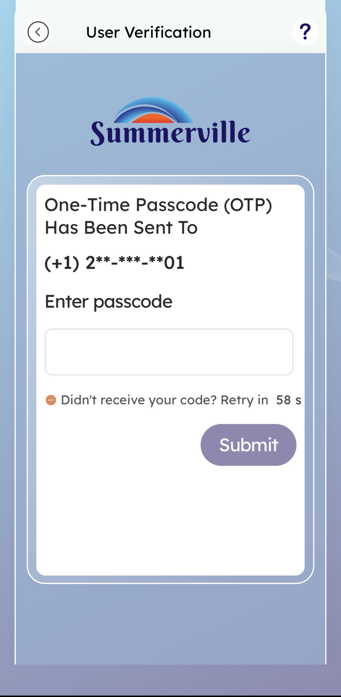
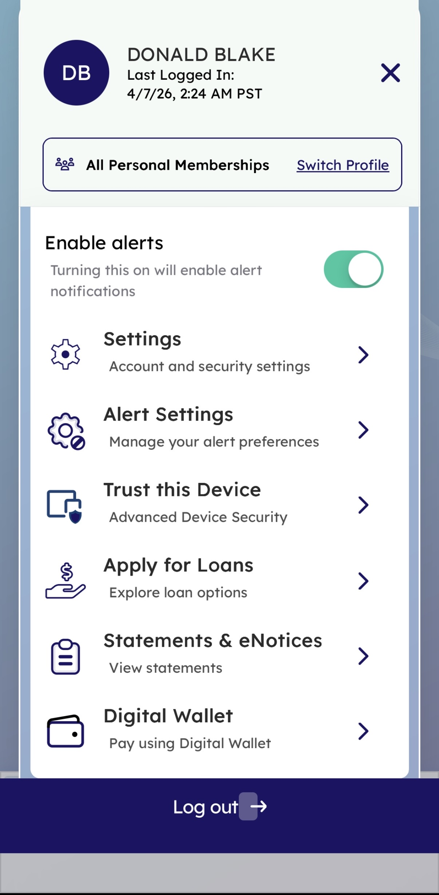
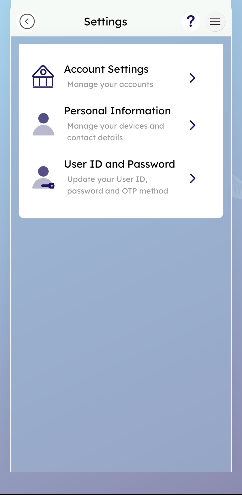
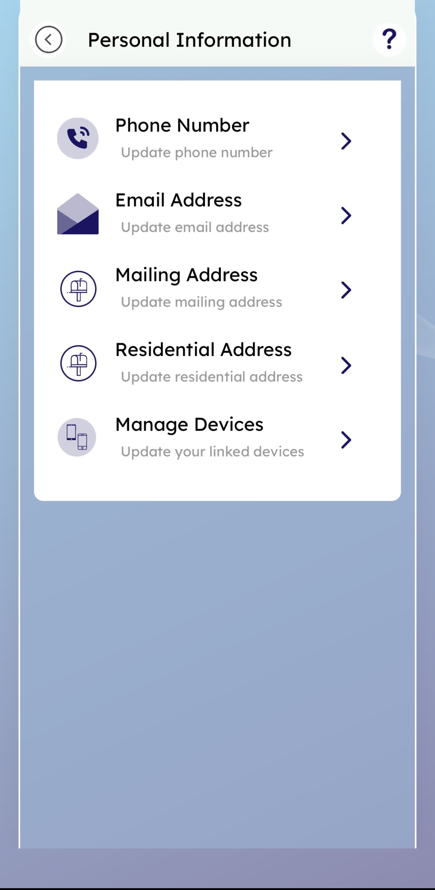
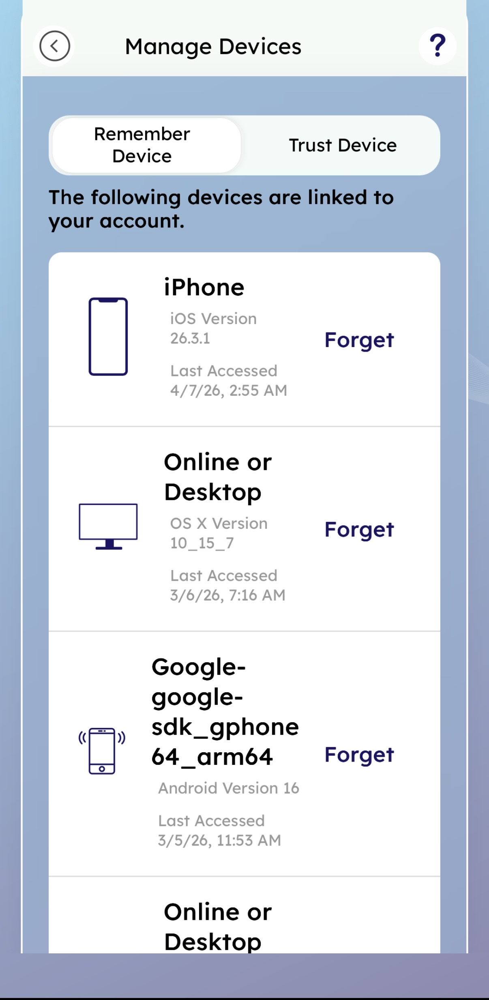
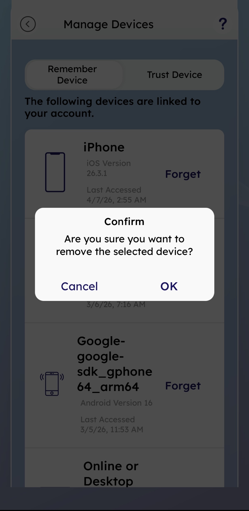
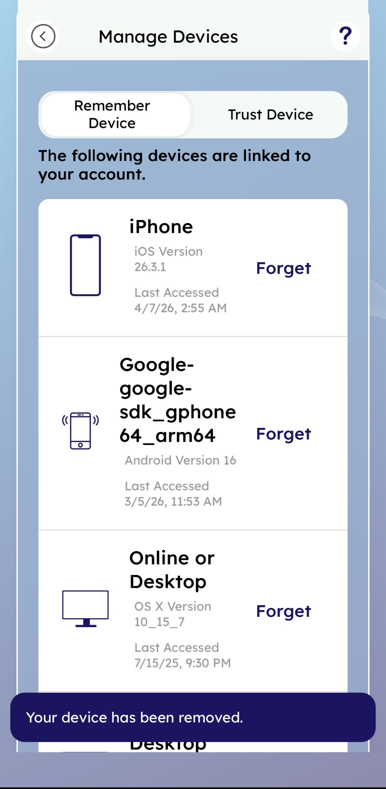

# Device Management — Feature Guide

**Platform:** Summerville Credit Union — nFinia Digital Banking **Module:** Settings > Personal Information > Manage Devices **Prepared by:** Jeeva Krishnamurthy, Senior Product Manager — Tyfone

***

## 1. Product Summary

Device Management in the Summerville Credit Union nFinia platform gives members visibility and control over every device linked to their account. The feature surfaces under **Settings > Personal Information > Manage Devices** and encompasses two discrete sub-features: **Manage Devices** (view all linked devices with their OS version and last-access timestamp) and **Forget Device** (delink any individual device on demand).

This feature serves retail members who want to maintain good account hygiene — particularly when they've replaced a phone, completed banking on a shared computer, or suspect unauthorized access from a device they don't recognize. For the credit union, it reduces inbound call volume related to "I logged in from a new device" friction and supports the broader trusted-device security model that governs OTP bypass on recognized devices.

The feature is available to any authenticated member. No special role or permission is required beyond a standard login. Access is available on both the mobile app and desktop browser.

| Attribute            | Detail                                                     |
| -------------------- | ---------------------------------------------------------- |
| Feature Name         | Device Management (Manage Devices / Forget Device)         |
| Module               | Settings > Personal Information > Manage Devices           |
| User Roles           | All authenticated retail members                           |
| Access Level         | Member self-service (no admin approval required)           |
| Key Actions          | View linked devices, Remove (forget) a device              |
| Regulatory Relevance | Account access security, session control, fraud mitigation |

***

## 2. Use Cases

| Use Case                                             | Who Uses It                                  | What They Do                                                                                                 | Business Value                                                                                      |
| ---------------------------------------------------- | -------------------------------------------- | ------------------------------------------------------------------------------------------------------------ | --------------------------------------------------------------------------------------------------- |
| View all linked devices                              | Any authenticated member                     | Opens Manage Devices to see all devices registered under their account with OS version and last access time  | Gives members full transparency into account access; reduces "unauthorized access" anxiety          |
| Remove a replaced device                             | Member who got a new phone                   | Taps Forget on the old device entry to delink it from the account                                            | Prevents stale device records; ensures OTP trust is not inadvertently extended to a disposed device |
| Remove a shared/public computer                      | Member who logged in on a library or work PC | Forgets the desktop entry to ensure that machine cannot bypass OTP on next login                             | Reduces exposure to credential reuse on shared machines                                             |
| Audit recent login activity                          | Security-conscious member                    | Reviews Last Accessed timestamps across all devices to identify unexpected sessions                          | Provides a lightweight access audit log without requiring a call to member services                 |
| Switch between Remember Device and Trust Device tabs | Member exploring device security options     | Taps the Trust Device tab to view which devices have elevated trust status vs. simple Remember Device status | Enables members to distinguish between two tiers of device recognition                              |

The Manage Devices and Forget Device features are especially valuable for credit unions serving digitally active members who regularly switch between mobile and desktop banking. By surfacing device data in plain language (device type, OS version, last access date), Summerville CU reduces friction-driven support calls while giving members the security control they expect from a modern digital banking platform.

***

## 3. End-to-End Workflow

### 3.1 Prerequisites

* Member must have an active Summerville CU digital banking enrollment.
* Member must complete login (username, password, and OTP verification if logging in from an unrecognized device).
* The Manage Devices entry point is available both from the pre-login Welcome screen (via the Manage Devices quick-action tile) and post-login via the hamburger menu.

***

### 3.2 Workflow A — Manage Devices (View Linked Devices)

**Step 1 — Welcome Screen**

The member opens the Summerville CU app and sees the Welcome screen. The screen provides quick-action tiles: **Accounts**, **Move Money**, **Check Deposit**, and **Manage Devices**. The member may tap **Manage Devices** directly from this unauthenticated state, or tap **Log In** to authenticate first.

***

**Step 2 — Log In**

The member enters their **Username** and **Password**. Optionally, they may check **Remember me** (to save the username for future logins) or **Enable Face ID**. Tapping **Log In** submits credentials for authentication.

***

**Step 3 — Select Authentication Method (OTP)**

If logging in from a device that is not already recognized and trusted, the platform prompts the member to select an OTP delivery method. Options include Text and Call across all verified phone numbers on file. Masked phone numbers are shown for privacy. The member selects their preferred channel.

***

**Step 4 — Enter One-Time Passcode**

A six-digit OTP is delivered to the selected contact. The member enters the passcode in the **Enter passcode** field and taps **Submit**. A 60-second retry timer is shown. If the code is not received, the member may retry after the timer expires.

***

**Step 5 — Dashboard (Post-Login)**

After successful authentication, the member lands on the Dashboard showing their name, credit score offer, account balances, and bottom navigation (Dashboard, Accounts, Move Money, Deposit). To navigate to Manage Devices, the member taps the **hamburger menu (≡)** in the top right.

***

**Step 6 — Side Menu**

The slide-out menu displays the member's name, last login timestamp, and profile options. The member taps **Settings** (Account and security settings) to proceed.

***

**Step 7 — Settings**

The Settings screen presents three categories: **Account Settings** (manage accounts), **Personal Information** (manage devices and contact details), and **User ID and Password** (update credentials and OTP method). The member taps **Personal Information**.

***

**Step 8 — Personal Information**

The Personal Information screen lists all updateable contact and device entries: Phone Number, Email Address, Mailing Address, Residential Address, and **Manage Devices**. The member taps **Manage Devices** to proceed.

***

**Step 9 — Manage Devices Screen**

The Manage Devices screen loads showing all devices linked to the member's account. Two tabs are available: **Remember Device** and **Trust Device**. Each device entry displays the device type/name, OS version, and last accessed date and time. A **Forget** action link appears on the right side of each device row.

Example devices shown:

* **iPhone** — iOS Version 26.3.1, Last Accessed 4/7/26, 2:55 AM
* **Online or Desktop** — OS X Version 10\_15\_7, Last Accessed 3/6/26, 7:16 AM
* **Google SDK Emulator (Android)** — Android Version 16, Last Accessed 3/5/26, 11:53 AM

***

### 3.3 Workflow B — Forget Device (Remove a Linked Device)

The Forget Device flow begins at the same Manage Devices screen reached in Workflow A (Steps 1–9 above). Once the member identifies the device they want to remove, they proceed as follows.

**Step 10 — Tap "Forget"**

On the Manage Devices screen, the member taps **Forget** next to the device they wish to remove. A confirmation dialog immediately appears overlaying the screen.

**Step 11 — Confirmation Dialog**

A modal dialog appears with the message: _"Are you sure you want to remove the selected device?"_ Two actions are presented: **Cancel** (dismisses the dialog without taking action) and **OK** (confirms removal).

***

**Step 12 — Device Removed — Success Toast**

Upon tapping **OK**, the platform removes the device from the linked devices list and displays a dark toast notification at the bottom of the screen: _"Your device has been removed."_ The device entry disappears from the list, and the remaining devices are displayed in updated order.

***

### 3.4 Decision Points & Branching

* **Cancel on confirmation dialog:** No change is made; the member is returned to the full device list.
* **Remember Device vs. Trust Device tab:** The Remember Device tab lists devices where the member has saved login credentials (username is pre-filled on return). The Trust Device tab lists devices granted elevated trust, which may bypass OTP verification on future logins. Forget actions are available on both tabs.
* **Accessing Manage Devices without logging in:** Tapping the Manage Devices tile on the Welcome screen routes the member through the full login + OTP flow before displaying the device list.

***

### 3.5 Error Handling

| Scenario                                         | What the Member Sees                                                                        | Recovery                                                                   |
| ------------------------------------------------ | ------------------------------------------------------------------------------------------- | -------------------------------------------------------------------------- |
| OTP not received                                 | "Didn't receive your code? Retry in 58 s" timer shown; retry link activates after countdown | Wait for timer; tap retry or go back to select a different delivery method |
| Session expired before confirming device removal | Platform redirects to login screen                                                          | Re-authenticate and navigate back to Manage Devices                        |
| No linked devices on the account                 | Manage Devices screen shows an empty list with no device entries                            | No action needed; the member may navigate away                             |

***

## 4. Feature Overview (UI Walkthrough)

### Welcome Screen

The unauthenticated landing screen for the Summerville CU app. Provides both enrollment and login entry points plus four pre-login quick-action tiles, one of which is **Manage Devices**.

| Field / Element | Type   | Description                                      | Notes                                                       |
| --------------- | ------ | ------------------------------------------------ | ----------------------------------------------------------- |
| Enroll          | Button | Initiates new member enrollment                  | For new users only                                          |
| Log In          | Button | Opens the login screen                           | Primary authentication entry point                          |
| Accounts        | Tile   | Quick access to account balances (requires auth) | Pre-login tile                                              |
| Move Money      | Tile   | Quick access to transfers (requires auth)        | Pre-login tile                                              |
| Check Deposit   | Tile   | Quick access to remote deposit (requires auth)   | Pre-login tile                                              |
| Manage Devices  | Tile   | Routes to device management (requires auth)      | Pre-login tile; routes through login before showing devices |
| Balance         | Button | Tap to see balance                               | Quick balance peek                                          |

***

### Log In Screen

| Field / Element        | Type           | Description                                  | Notes                                              |
| ---------------------- | -------------- | -------------------------------------------- | -------------------------------------------------- |
| Username               | Text Input     | Member's digital banking username            | Pre-filled if "Remember me" was previously checked |
| Password               | Password Input | Member's password; masked by default         | Eye icon toggles visibility                        |
| Remember me            | Checkbox       | Saves username for future sessions           | Does not save password                             |
| Enable Face ID         | Checkbox       | Enables biometric login on supported devices | Only available on capable hardware                 |
| Log In                 | Button         | Submits credentials                          | Triggers OTP if device not recognized              |
| Enroll                 | Button         | Routes to new enrollment                     | For unenrolled members                             |
| I need help logging in | Link           | Self-service recovery options                | Forgotten username/password                        |

***

### OTP Method Selection Screen

| Field / Element            | Type            | Description                                           | Notes                              |
| -------------------------- | --------------- | ----------------------------------------------------- | ---------------------------------- |
| Authentication method list | Selectable List | Shows Text and Call options per verified phone number | Phone numbers masked for privacy   |
| Refresh                    | Link            | Prompts member to update contact info if not current  | Routes to contact info update flow |

***

### OTP Entry Screen (User Verification)

| Field / Element       | Type       | Description                                              | Notes                            |
| --------------------- | ---------- | -------------------------------------------------------- | -------------------------------- |
| Delivery confirmation | Label      | Confirms which number the OTP was sent to (masked)       | Read-only                        |
| Enter passcode        | Text Input | Field for the 6-digit OTP                                | Numeric only                     |
| Retry timer           | Label      | Countdown showing when the member may request a new code | Starts at 60 seconds             |
| Submit                | Button     | Validates the entered OTP                                | Proceeds to Dashboard on success |

***

### Settings Screen

| Field / Element      | Type     | Description                                | Notes                              |
| -------------------- | -------- | ------------------------------------------ | ---------------------------------- |
| Account Settings     | List Row | Navigates to account-level settings        | Manage accounts                    |
| Personal Information | List Row | Navigates to contact and device management | **Entry point for Manage Devices** |
| User ID and Password | List Row | Update username, password, OTP method      | Security credential management     |

***

### Personal Information Screen

| Field / Element     | Type     | Description                                | Notes                                           |
| ------------------- | -------- | ------------------------------------------ | ----------------------------------------------- |
| Phone Number        | List Row | Update primary and secondary phone numbers |                                                 |
| Email Address       | List Row | Update email on file                       |                                                 |
| Mailing Address     | List Row | Update mailing address                     |                                                 |
| Residential Address | List Row | Update home address                        |                                                 |
| Manage Devices      | List Row | View and manage linked devices             | **Direct entry point to Manage Devices screen** |

***

### Manage Devices Screen

| Field / Element     | Type        | Description                                                                        | Notes                                                    |
| ------------------- | ----------- | ---------------------------------------------------------------------------------- | -------------------------------------------------------- |
| Remember Device tab | Tab         | Displays devices where login credentials are saved                                 | Active tab by default                                    |
| Trust Device tab    | Tab         | Displays devices with elevated trust (OTP bypass eligible)                         | Tap to switch view                                       |
| Device Card         | List Item   | One card per linked device; shows device name, OS version, last accessed timestamp | Multiple device types: iPhone, Online/Desktop, Android   |
| Device Icon         | Icon        | Visual indicator of device type (phone, desktop, tablet)                           | Auto-assigned by platform                                |
| Device Name         | Label       | Name/model of the device                                                           | System-reported; e.g., "iPhone", "Online or Desktop"     |
| OS Version          | Label       | Operating system version                                                           | e.g., "iOS Version 26.3.1", "Android Version 16"         |
| Last Accessed       | Label       | Date and time of most recent login from this device                                | Format: M/D/YY, H:MM AM/PM                               |
| Forget              | Action Link | Initiates device removal flow                                                      | Triggers confirmation dialog; see Forget Device workflow |

***

### Forget Device — Confirmation Dialog

| Field / Element      | Type   | Description                                            | Notes                                    |
| -------------------- | ------ | ------------------------------------------------------ | ---------------------------------------- |
| Dialog title         | Label  | "Confirm"                                              | Modal overlay                            |
| Confirmation message | Label  | "Are you sure you want to remove the selected device?" | Non-reversible after confirmation        |
| Cancel               | Button | Dismisses dialog; no action taken                      | Returns member to device list            |
| OK                   | Button | Confirms removal of the device                         | Triggers device delink and success toast |

***

## 5. Quick Reference

| Task                                               | Navigation Path                                                              | Who Can Do It            | Notes                                                  |
| -------------------------------------------------- | ---------------------------------------------------------------------------- | ------------------------ | ------------------------------------------------------ |
| View all linked devices                            | Welcome > Log In > ≡ Menu > Settings > Personal Information > Manage Devices | Any authenticated member | Also accessible via Welcome screen Manage Devices tile |
| Switch between Remember Device / Trust Device view | Manage Devices > tap Trust Device tab                                        | Any authenticated member | Tab toggle; no confirmation required                   |
| Remove a linked device                             | Manage Devices > Forget > OK                                                 | Any authenticated member | Action is immediate upon OK; toast confirms removal    |
| Update contact info                                | Settings > Personal Information > Phone Number / Email / Address             | Any authenticated member | Same screen as Manage Devices entry point              |

***

_Guide prepared by Jeeva Krishnamurthy — Senior Product Manager, Tyfone | Summerville Credit Union nFinia Deployment | April 2026_
