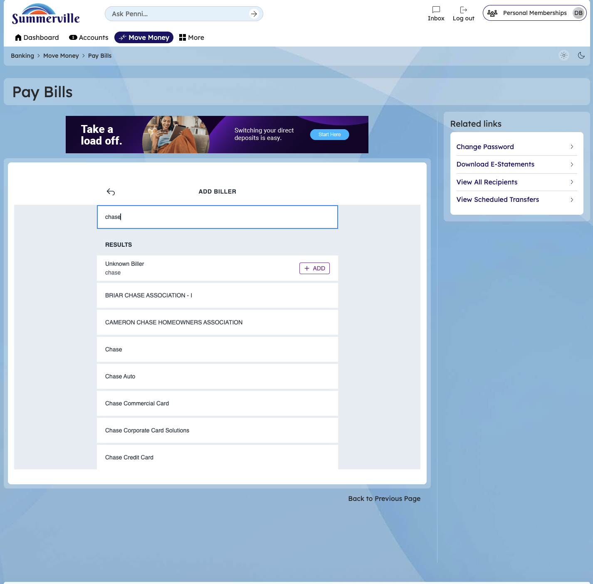
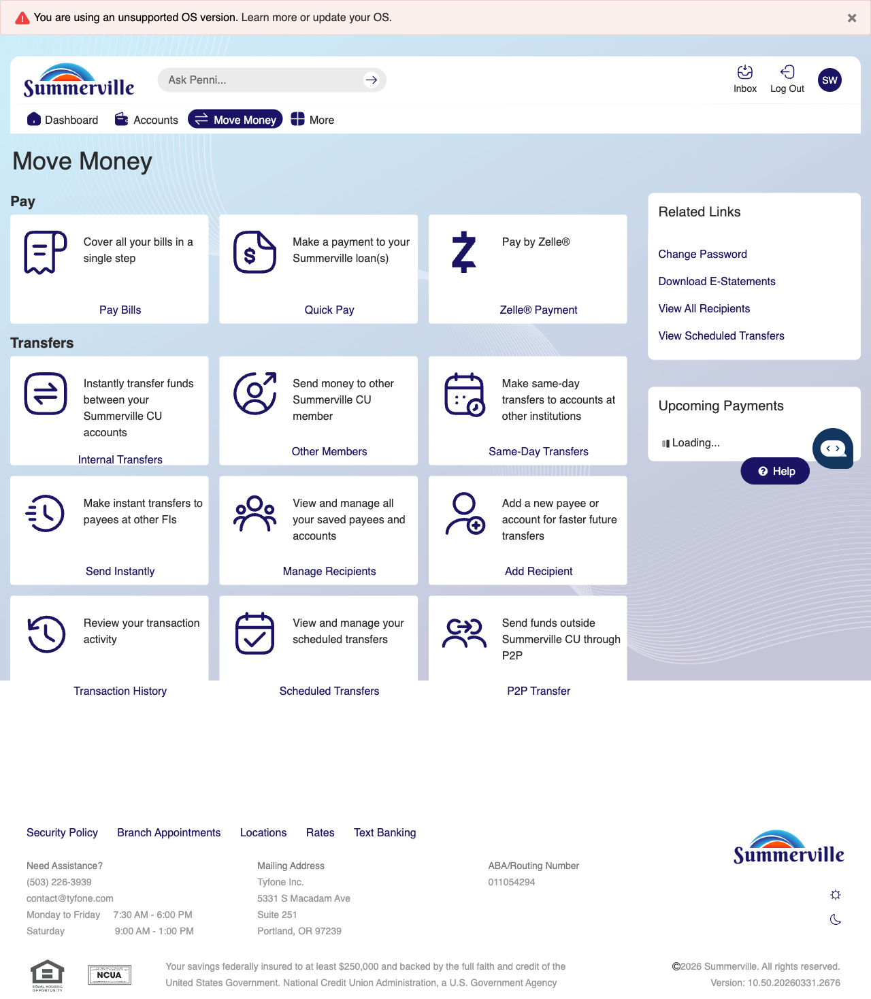
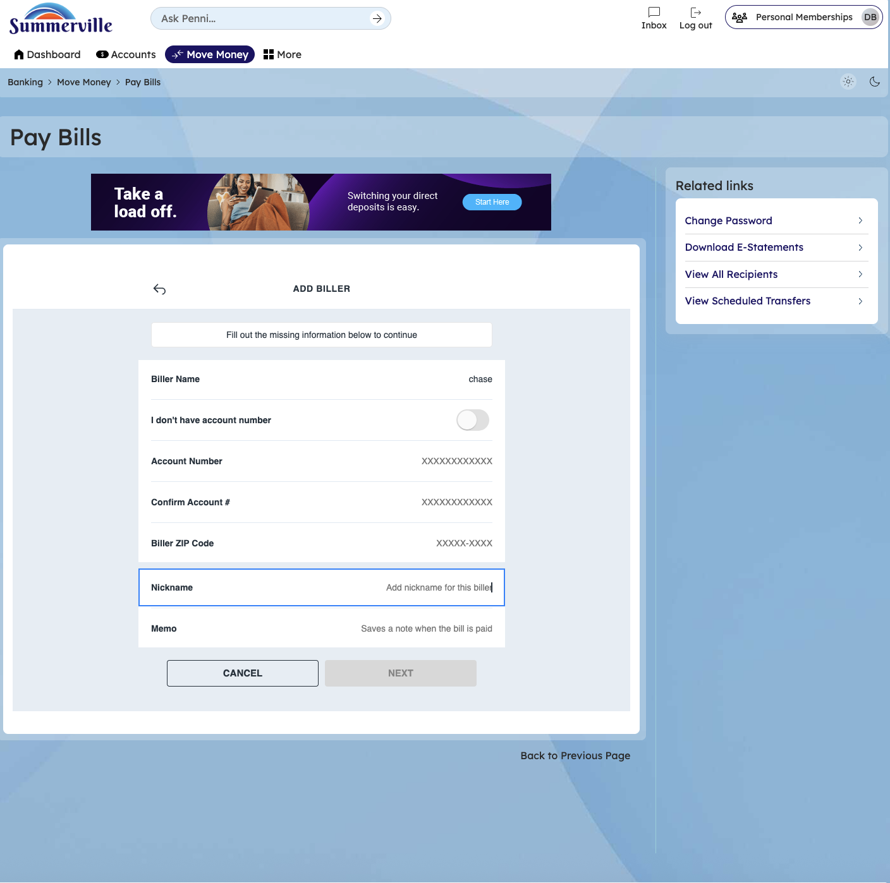
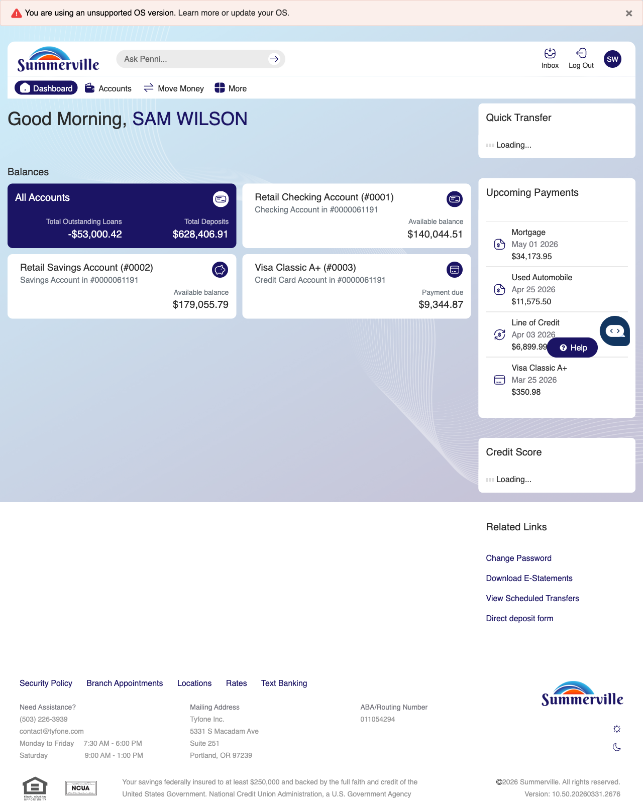

**SUMMERVILLE CREDIT UNION · CONSOLIDATED MEMBER GUIDE · CSUM-14 of 30**

**Loan Payments & Quick Pay**

Module: nFinia Digital Banking \> Move Money \> Quick Pay

*Sources: Summerville Reports Series A (36 docs) + Series B (25 docs) | Features: nFinia Documentation Features Spreadsheet*

> **01 PRODUCT SUMMARY**

Quick Pay SSO is an integrated loan payment hub embedded within the nFinia digital banking platform that allows Summerville Credit Union members to view all active loan accounts in a single payment interface and make payments without leaving digital banking. The SSO (Single Sign-On) design means members authenticated in nFinia are automatically authenticated in the Quick Pay portal without a separate login.

Members can pay the minimum amount due, a custom amount above the minimum, or a full payoff amount. Payments can be funded from any linked CU account. For members who want to pay a loan from an external bank account, the External Account for Loan Repayments feature allows adding and managing external payment sources.

The Pay Loan from External Account feature allows members to link an external bank account specifically for loan payment purposes, enabling direct debit of loan payments from a non-CU checking account — useful for members whose primary income deposits at a different institution.

**At a Glance**

| **Attribute**    | **Detail**                                                      |
| ---------------- | --------------------------------------------------------------- |
| Module           | Move Money \> Quick Pay (SSO)                                   |
| Loan Types       | Auto, Personal, Consumer, Mortgage, Line of Credit, Credit Card |
| Payment Sources  | Any linked CU account; external account for loan repayments     |
| Steps            | 2 (Select Loan → Enter Amount)                                  |
| Same-Day Posting | Available when submitted before daily cut-off                   |
| Related Reports  | CSUM-06 (Move Money Hub), CSUM-21 (Skip A Pay)                  |

> **02 KEY USE CASES**

| **Use Case**                  | **Who Uses It**                                | **What They Do**                                         | **Business Value**                                           |
| ----------------------------- | ---------------------------------------------- | -------------------------------------------------------- | ------------------------------------------------------------ |
| Minimum Monthly Payment       | Members making required monthly loan payment   | Select loan, enter minimum due, confirm                  | Prevents late fees without needing to remember exact amount  |
| Extra Principal Payment       | Members paying above minimum to reduce balance | Select loan, enter custom amount above minimum, confirm  | Reduces loan balance and total interest paid                 |
| Full Payoff                   | Members paying off a loan entirely             | Request payoff quote, enter exact payoff amount, confirm | Single transaction to clear the loan and close the account   |
| External Account Loan Payment | Members whose income deposits elsewhere        | Link external bank account as loan payment source        | Enables loan payment from a non-CU account without ACH setup |

> **03 STEP-BY-STEP GUIDE**
> 
> *Navigation: Dashboard \> Move Money \> 'Quick Pay' OR Dashboard account tile \> Pay Now.*

**Step 1 — Start from Dashboard**

The member begins at the Dashboard after logging in. The Dashboard displays all account balances, upcoming payments, quick-action tiles, and the top navigation bar with links to Accounts, Move Money, and More.

*Step 1: Start from Dashboard*

**Step 2 — Navigate to Move Money Hub**

The member clicks ‘Move Money’ in the top navigation bar. The Move Money Hub displays all payment and transfer options as tiles including Pay Bills, Quick Pay, Zelle Payment, Internal Transfers, Other Members, Same-Day Transfers, Send Instantly, Manage Recipients, Add Recipient, Transaction History, Scheduled Transfers, and P2P Transfer.

*Step 2: Move Money Hub*

**Step 3 — Navigate from Dashboard to Quick Pay**

The Quick Pay page displays the loan selection screen with red action buttons for selecting different loan accounts to make a payment.

*Step 3: Navigate from Dashboard to Quick Pay*

**Step 4 — Select Loan & Enter Payment Amount**

The Bill Pay form is displayed from the Summerville banking interface with form fields for entering payment details and selecting the loan to pay.

*Step 4: Select Loan & Enter Payment Amount*
