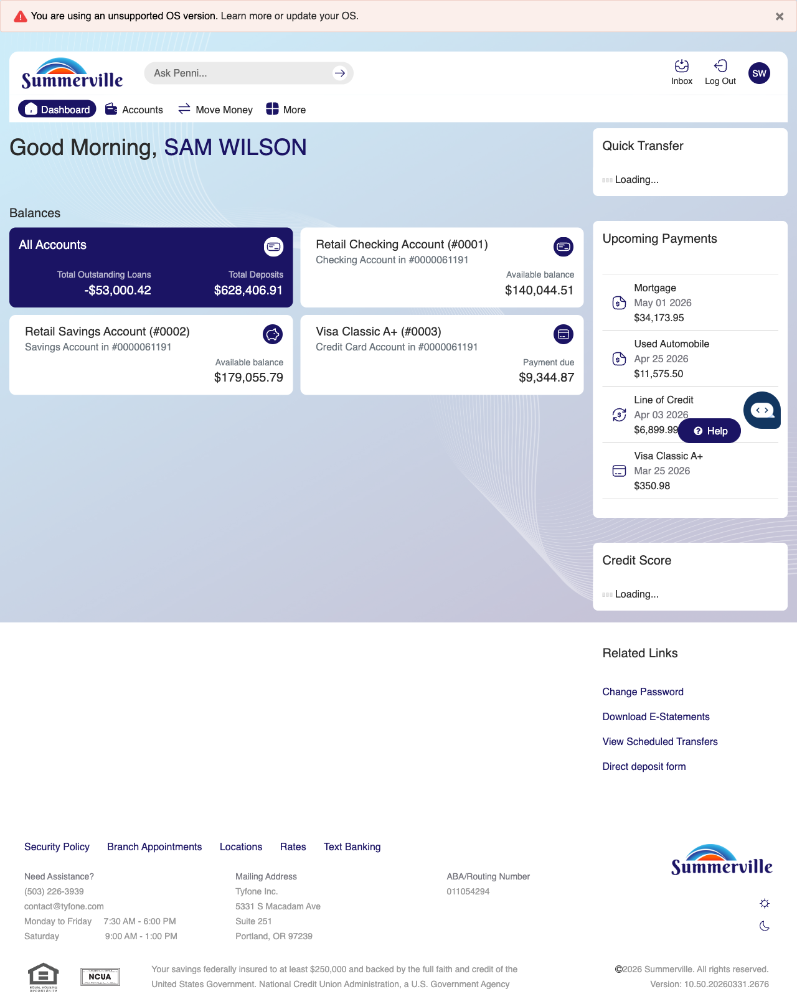
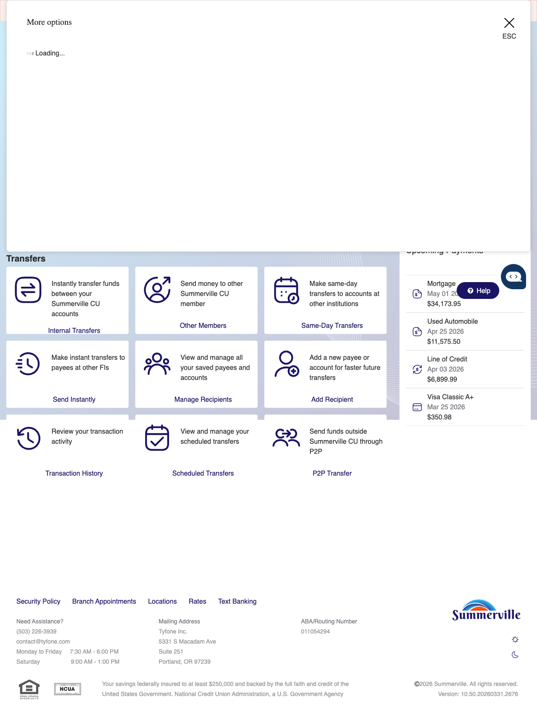
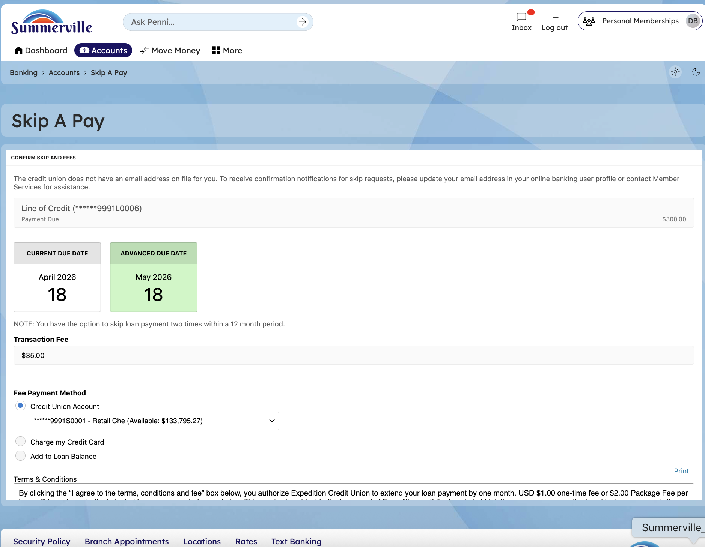
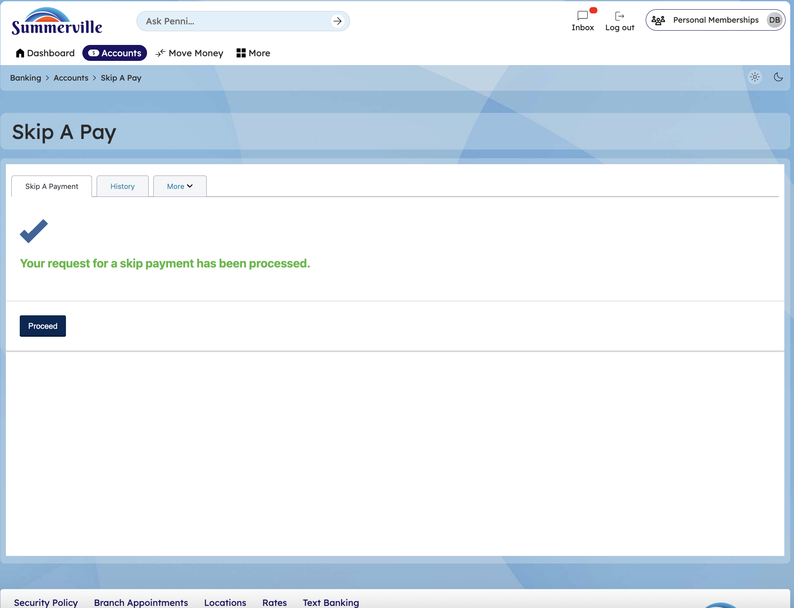

**SUMMERVILLE CREDIT UNION · CONSOLIDATED MEMBER GUIDE · CSUM-21 of 30**

**Skip-A-Pay**

Module: nFinia Digital Banking \> More \> Skip A Pay

*Sources: Summerville Reports Series A (36 docs) + Series B (25 docs) | Features: nFinia Documentation Features Spreadsheet*

> **01 PRODUCT SUMMARY**

Skip-A-Pay is a member financial relief feature that allows eligible members to formally defer one loan payment per eligible period without incurring a late fee. The deferred payment is posted to the loan account, the loan term is extended by one month, and interest continues to accrue during the skipped month.

The digital Skip-A-Pay workflow replaces paper or phone requests with a fully self-service in-app process. Members select the eligible loan, review the terms of the deferral, accept the agreement, and submit — all within a few steps. The Skip Payment Form in the Online Forms section provides an alternative access path for members who prefer the forms workflow.

**At a Glance**

|                 |                                                                   |
| --------------- | ----------------------------------------------------------------- |
| **Attribute**   | **Detail**                                                        |
| Module          | More \> Skip A Pay                                                |
| Eligible Loans  | Qualifying consumer and auto loans per CU eligibility rules       |
| Effect on Loan  | One payment deferred; interest continues to accrue; term extended |
| Fee             | Nominal processing fee may apply per CU policy                    |
| Frequency       | Once per eligible period per loan (typically once per 12 months)  |
| Related Reports | CSUM-14 (Loan Payments), CSUM-18 (Online Forms)                   |

> **02 KEY USE CASES**

|                         |                                             |                                                         |                                                                |
| ----------------------- | ------------------------------------------- | ------------------------------------------------------- | -------------------------------------------------------------- |
| **Use Case**            | **Who Uses It**                             | **What They Do**                                        | **Business Value**                                             |
| Holiday Cash Relief     | Members needing extra funds during holidays | Skip December payment to free up holiday budget         | Maintains loan standing while managing seasonal cash flow      |
| Emergency Expense Cover | Members facing unexpected financial need    | Defer loan payment to cover immediate emergency expense | Avoids late fee while managing short-term cash flow disruption |
| Seasonal Income Gap     | Members with seasonal employment            | Skip payment during low-income month                    | Aligns payment obligation with income cycles                   |

> **03 STEP-BY-STEP GUIDE**
> 
> *Navigation: Dashboard \> More \> 'Skip A Pay'.*

**Step 1 — Start from Dashboard**

The member begins at the Dashboard after logging in. The Dashboard displays all account balances, upcoming payments, quick-action tiles, and the top navigation bar with links to Accounts, Move Money, and More.

*Step 1: Start from Dashboard*

**Step 2 — Open the More Menu**

The member clicks ‘More’ in the top navigation bar. The More options panel expands to show additional features: Check Deposit, User ID and Password, eDocuments, Account Alerts, General Alerts, Password, Forms, One-Time Passcode, Skip A Pay, Do-Not-Disturb, Manage Devices, My Insights, Alert Settings, Recent Activities, and Card Services.

*Step 2: More Menu*

**Step 3 — Navigate from Dashboard to Skip A Pay**

The Skip A Pay page shows the selected loan with a current due date of April 2026 and an advanced due date of May 2026. A $35.00 transaction fee is displayed for the skip payment service.

*Step 3: Navigate from Dashboard to Skip A Pay*

**Step 4 — Select Loan & Review Fee Details**

The Skip A Pay confirmation page displays details about the selected loan, the fee structure, payment method options, and a terms and conditions checkbox that must be accepted before proceeding.

*Step 4: Select Loan & Review Fee Details*

**Step 5 — Accept & Confirm Skip**

A confirmation screen states 'Your request for a skip payment has been processed' with a Continue button to return to the main interface.

*Step 5: Accept & Confirm Skip*
