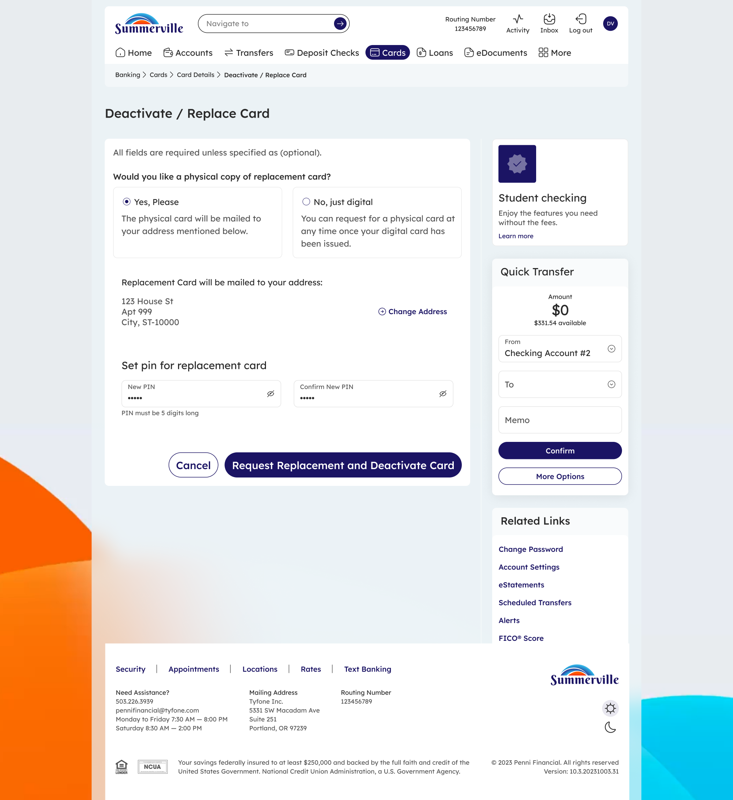

# Freeze-Card

|                                                          |
| -------------------------------------------------------- |
| **SUMMERVILLE CREDIT UNION · CONSOLIDATED MEMBER GUIDE** |

**Freeze Card**

Module: nFinia Digital Banking > Cards > Card Details > Freeze Card

|                        |
| ---------------------- |
| **01 PRODUCT SUMMARY** |

The Freeze Card feature gives you immediate, self-service control over your card security. If you misplace your card, suspect it may have been used without your authorization, or simply want to temporarily pause card activity, you can freeze it instantly from the Cards section of online banking — no branch visit or phone call required.

Freezing a card blocks new purchase and transaction approvals while the card remains in a frozen state. The freeze is fully reversible: you can unfreeze the card at any time by toggling the Card Status back to active from your Cards list. Freezing is not the same as deactivating or replacing a card — the card is not cancelled, and a new card is not issued. It is simply put on hold until you decide to reinstate it. This makes it the ideal first response when you cannot immediately locate your card but are not yet ready to report it lost or stolen.

**At a Glance**

| **Attribute**         | **Detail**                                                     |
| --------------------- | -------------------------------------------------------------- |
| Module                | nFinia Digital Banking > Cards > Card Details > Freeze Card    |
| Effect                | Immediately blocks new card transactions                       |
| Reversible            | Yes — card can be unfrozen at any time from the Cards list     |
| Card Status Indicator | Toggle displayed on the Cards list (On = active, Off = frozen) |
| Card Replacement      | Not triggered — freezing does not cancel or replace the card   |
| Related Features      | Deactivate / Replace Card, Card Controls, Card Alerts, Set PIN |

|                      |
| -------------------- |
| **02 KEY USE CASES** |

| **Use Case**                  | **Who Uses It**                                             | **What They Do**                                                      | **Business Value**                                                        |
| ----------------------------- | ----------------------------------------------------------- | --------------------------------------------------------------------- | ------------------------------------------------------------------------- |
| **Freeze a misplaced card**   | Member who cannot locate their card                         | Navigates to Cards, selects the card, clicks Freeze Card and confirms | Prevents unauthorized transactions while the member searches for the card |
| **Pause an unused card**      | Member who wants to deactivate a secondary card temporarily | Freezes the card from the Cards section                               | Reduces fraud exposure on cards not currently in use                      |
| **Unfreeze a recovered card** | Member who found their previously frozen card               | Toggles card status back to active from the Cards list                | Instantly restores card access without contacting the credit union        |

|                           |
| ------------------------- |
| **03 STEP-BY-STEP GUIDE** |

_Navigation: Log in to Summerville Credit Union online banking. From the Dashboard, click Cards in the top navigation bar._

**Step 1 — Arrive at the Dashboard**

After logging in, you land on the Dashboard displaying your account balances, recent payments, and quick-access shortcuts. The top navigation bar includes a Cards link that takes you directly to your full card list, where you can manage all cards linked to your membership.

_Step 1: Dashboard — click Cards in the top navigation to access your card list_

**Step 2 — Select Your Card and Open Freeze Card**

From the Cards list, locate the card you want to freeze. Click into the card to open its Card Details view. From the card options displayed — which include Card Controls, Set PIN, and Deactivate / Replace Card — select Freeze Card. The Freeze Card confirmation page opens, showing the last four digits of the card to be frozen.

.png>)

_Step 2: Freeze Card confirmation — review the card details before proceeding_

**Step 3 — Confirm the Freeze**

The confirmation screen asks: "Are you sure you want to freeze card ending \[last 4 digits]?" Review the card information to ensure you are freezing the correct card. Click Yes, Freeze Card to apply the freeze immediately, or click No, Cancel to exit without making any changes. The freeze takes effect the moment you confirm — no further steps are required.

.png>)

_Step 3: Freeze confirmed — the card is now blocked from new transactions_

|                                                                                                                                                         |
| ------------------------------------------------------------------------------------------------------------------------------------------------------- |
| **Tip:** To unfreeze your card later, return to the Cards list and toggle the Card Status switch back to On. Your card will be reactivated immediately. |
