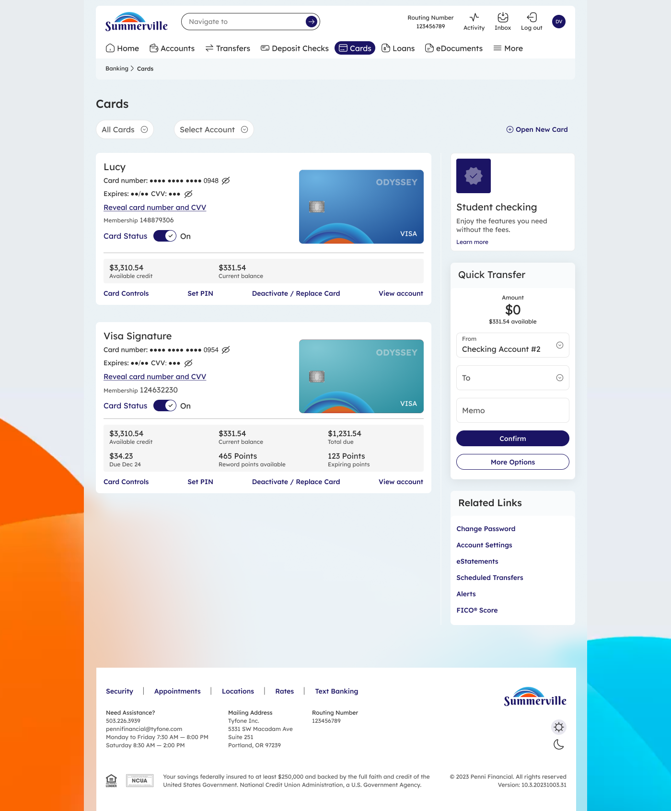

|                                                                           |
| ------------------------------------------------------------------------- |
| **nFinia Digital Banking | Summerville Credit Union | Member User Guide** |

**Link Card to Digital Wallet**

|  |
|  |
|  |

*Module: Banking › Cards › Card Details › Link Card*

|                        |
| ---------------------- |
| **01 PRODUCT SUMMARY** |

Link Card to Digital Wallet lets you add your Summerville Credit Union debit or credit card to Apple Pay, Google Pay, or Samsung Pay directly from nFinia Digital Banking. Once linked, your card is ready for contactless tap-to-pay purchases in stores, in apps, and online — without needing to carry or enter your physical card details.

The process takes less than a minute. You navigate to the card you want to link, choose your preferred digital wallet, accept the provisioning disclaimer, and your card is provisioned immediately. You can link the same card to multiple wallets, and any card you have enrolled in nFinia can be linked.

**At a Glance**

| **Feature Name**       | Link Card to Digital Wallet (Push Provisioning)                                 |
| ---------------------- | ------------------------------------------------------------------------------- |
| **Module Location**    | Banking › Cards › Card Details › Link Card                                      |
| **Who Can Use**        | All nFinia Digital Banking members with an enrolled card                        |
| **Supported Wallets**  | Apple Pay, Google Pay, Samsung Pay                                              |
| **Provisioning Speed** | Immediate — card is available in the wallet as soon as the request is confirmed |
| **Multiple Wallets**   | The same card can be linked to more than one wallet                             |
| **Prerequisites**      | Device must support the chosen digital wallet (NFC-enabled)                     |
| **Availability**       | 24 / 7 — via web or mobile                                                      |

**Supported Wallets**

| **Digital Wallet** | **Supported Devices**                            | **Where You Can Pay**                                    |
| ------------------ | ------------------------------------------------ | -------------------------------------------------------- |
| Apple Pay          | iPhone, Apple Watch, iPad, Mac                   | Contactless in-store terminals, Safari, in-app purchases |
| Google Pay         | Android phones and tablets (NFC-enabled)         | Contactless in-store terminals, Chrome, in-app purchases |
| Samsung Pay        | Samsung Galaxy phones (NFC + MST-enabled models) | Contactless and magnetic stripe terminals, Samsung apps  |

|                      |
| -------------------- |
| **02 KEY USE CASES** |

| **Use Case**                | **Member Goal**                                                   | **Steps**                                                                          | **Outcome**                                                            |
| --------------------------- | ----------------------------------------------------------------- | ---------------------------------------------------------------------------------- | ---------------------------------------------------------------------- |
| Add card to Apple Pay       | Enable tap-to-pay on iPhone or Apple Watch                        | Go to Cards › Card Details › Link Card, select Apple Pay, accept disclaimer        | Card provisioned to Apple Pay immediately; ready for contactless use   |
| Add card to Google Pay      | Enable tap-to-pay on Android device                               | Go to Cards › Card Details › Link Card, select Google Pay, accept disclaimer       | Card provisioned to Google Pay immediately                             |
| Add card to Samsung Pay     | Enable tap-to-pay on Samsung Galaxy device                        | Go to Cards › Card Details › Link Card, select Samsung Pay, accept disclaimer      | Card provisioned to Samsung Pay; works at NFC and MST terminals        |
| Link after card replacement | Resume contactless payments with new card details post-reissuance | After digital card reissuance, navigate to Link Card and re-provision the new card | New card number active in wallet for contactless payments              |
| Check linked wallets        | Confirm which wallets the card is currently linked to             | Open Card Details › Link Card and review the linked status shown on the screen     | Linked wallets are displayed (e.g. "This card is linked to Apple Pay") |

|                           |
| ------------------------- |
| **03 STEP-BY-STEP GUIDE** |

|                                                                                   |
| --------------------------------------------------------------------------------- |
| *📍 Navigation path: Banking › Cards › \[select card\] › Card Details › Link Card* |

**Step 1 Navigate to Your Cards**

From the nFinia top navigation, click Cards. Your enrolled debit and credit cards are listed as tiles. Locate the card you want to add to a digital wallet.

**Step 2 Open Link Card**

Click Card Controls at the bottom of the card tile. Inside Card Details, find and click the Link Card option. The Link Card screen opens and shows the three available digital wallet options: Apple Pay, Google Pay, and Samsung Pay.

|                                                                                                                                                                                           |
| ----------------------------------------------------------------------------------------------------------------------------------------------------------------------------------------- |
| ℹ️ Tip: If the card has already been linked to a wallet, that wallet will show a "linked" indicator. You can still link the same card to a second wallet by selecting a different option. |

**Step 3 Select Your Digital Wallet**

Tap the wallet you want to link to your card. The wallet icon will highlight to confirm your selection. You can only provision one wallet at a time, but you can repeat this process to add the card to additional wallets.

| **Apple Pay**   | Select if you are using an iPhone, Apple Watch, iPad, or Mac |
| --------------- | ------------------------------------------------------------ |
| **Google Pay**  | Select if you are using an Android phone or tablet           |
| **Samsung Pay** | Select if you are using a Samsung Galaxy device              |

**Step 4 Accept the Provisioning Disclaimer**

After selecting your wallet, a disclaimer screen appears. It asks you to acknowledge that by proceeding you are authorizing Summerville Credit Union to provision your card to the selected digital wallet. Read the disclosure and tap Continue (or the equivalent confirm button) to proceed.

|                                                                                                                                                                              |
| ---------------------------------------------------------------------------------------------------------------------------------------------------------------------------- |
| ⚠️ Note: You must accept the disclaimer to complete provisioning. If you navigate away without accepting, the process is cancelled and your card is not added to the wallet. |

**Step 5 Card Linked — Ready for Contactless Payments**

Once the disclaimer is accepted, provisioning completes immediately. The Link Card screen updates to confirm the card is now linked to the selected wallet (e.g. "This card is linked to Apple Pay"). Open your wallet app on your device to verify the card appears and is ready to use for contactless tap-to-pay purchases.

|                                                                                                                                                                                                                                 |
| ------------------------------------------------------------------------------------------------------------------------------------------------------------------------------------------------------------------------------- |
| ℹ️ Tip: After linking, open your digital wallet app to confirm the card is visible. On Apple Pay, look for the card under "Wallet & Apple Pay" in Settings. On Google Pay or Samsung Pay, check the "Cards" section of the app. |

|                                                                                                                                                                                              |
| -------------------------------------------------------------------------------------------------------------------------------------------------------------------------------------------- |
| ⚠️ Note: If you replace your card through the Digital Card Reissuance flow, you will need to re-link the new card to your digital wallet. The old card number will be removed automatically. |
