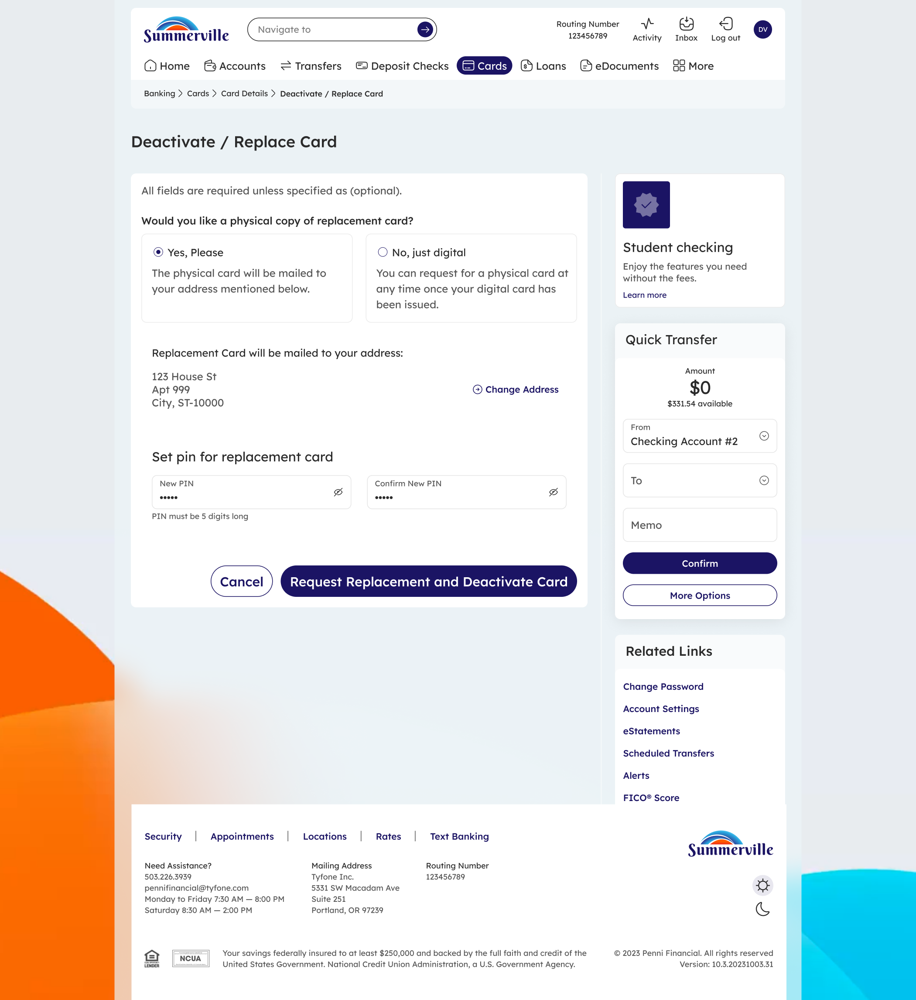

|                                                          |
| -------------------------------------------------------- |
| **SUMMERVILLE CREDIT UNION · CONSOLIDATED MEMBER GUIDE** |

**Lost or Stolen Card**

Module: nFinia Digital Banking \> Cards \> Card Details \> Deactivate / Replace Card

|                        |
| ---------------------- |
| **01 PRODUCT SUMMARY** |

If your card is lost or stolen, you can take immediate action through online banking to permanently deactivate the card and request a replacement — without calling the credit union or visiting a branch. Acting quickly prevents unauthorized transactions on your account.

The Deactivate / Replace Card flow lets you describe what happened to your card (lost, stolen, or damaged), select whether to deactivate only or also request a replacement, and set a PIN for the new card. A digital version of the replacement is available instantly; a physical card is mailed within 5 days. If you are not yet sure the card is permanently lost, consider using Freeze Card first — it is reversible and blocks new transactions while you search.

**At a Glance**

| **Attribute**    | **Detail**                                                                   |
| ---------------- | ---------------------------------------------------------------------------- |
| Module           | nFinia Digital Banking \> Cards \> Card Details \> Deactivate / Replace Card |
| Deactivation     | Permanent — card cannot be reactivated after deactivation                    |
| Replacement      | Digital card available instantly; physical card mailed within 5 days         |
| New PIN Required | Yes — set a 5-digit PIN during the replacement request                       |
| Alternative      | Use Freeze Card if you only misplaced the card temporarily                   |
| Visa Fraud Alert | Contact Summerville CU if unauthorized transactions have already occurred    |

|                      |
| -------------------- |
| **02 KEY USE CASES** |

| **Use Case**                       | **Who Uses It**                     | **What They Do**                                                                                    | **Business Value**                                                            |
| ---------------------------------- | ----------------------------------- | --------------------------------------------------------------------------------------------------- | ----------------------------------------------------------------------------- |
| **Report a lost card**             | Member who lost their card          | Navigates to Cards \> Card Details \> Deactivate / Replace Card, selects lost, requests replacement | Card immediately disabled; digital replacement available instantly            |
| **Report a stolen card**           | Member whose card was stolen        | Selects stolen, deactivates card, requests replacement with new PIN                                 | Card permanently blocked; replacement issued; member should also report to CU |
| **Freeze before confirming loss**  | Member who misplaced their card     | Uses Freeze Card instead of deactivation to temporarily block the card                              | Reversible block while searching — avoids permanent deactivation              |
| **Deactivate without replacement** | Member who no longer needs the card | Selects Deactivate Card only                                                                        | Card permanently closed with no replacement issued                            |

|                           |
| ------------------------- |
| **03 STEP-BY-STEP GUIDE** |

*Navigation: Log in to Summerville Credit Union online banking. Click Cards, select the lost or stolen card, then click Deactivate / Replace Card.*

**Step 1 — Arrive at the Dashboard**

After logging in, you land on the Dashboard showing your account balances, recent payments, and quick-action shortcuts. Click Cards in the top navigation, then select the card that is lost or stolen.

*Step 1: Dashboard — starting point for navigation*

**Step 2 — Select What Happened and Choose an Action**

On the Deactivate / Replace Card page, use the "What happened to your card?" dropdown to select Lost, Stolen, or Damaged. Optionally add a brief description. Choose one of two actions: Deactivate Card only (permanent, no replacement), or Request Replacement & Deactivate Card (issues a new card and immediately disables the current one). Click Continue.

*Step 2: Report your card as lost or stolen and select your preferred action*

**Step 3 — Set Replacement Preferences and PIN**

If you chose Request Replacement, select whether you want a physical card mailed to your address on file. Enter and confirm a new 5-digit PIN for the replacement card. Double-check the mailing address shown and use Change Address if it needs to be updated before a physical card is sent. Click Request Replacement and Deactivate Card to confirm.

*Step 3: Choose delivery preference and set a new PIN for your replacement card*

**Step 4 — Confirm the Card is Deactivated**

A success confirmation confirms the card has been permanently deactivated and no further transactions can be performed. Your digital replacement card is now available in your Cards list. Click Go to Cards or Go to Dashboard to continue.

*Step 4: Deactivation confirmed — report unauthorized transactions to the credit union if applicable*

|                                                                                                                                                                                                                                                                                    |
| ---------------------------------------------------------------------------------------------------------------------------------------------------------------------------------------------------------------------------------------------------------------------------------- |
| **Important:** If you believe unauthorized transactions have already occurred on the lost or stolen card, contact Summerville Credit Union immediately to file a dispute. Deactivating the card stops future transactions but does not automatically reverse charges already made. |
