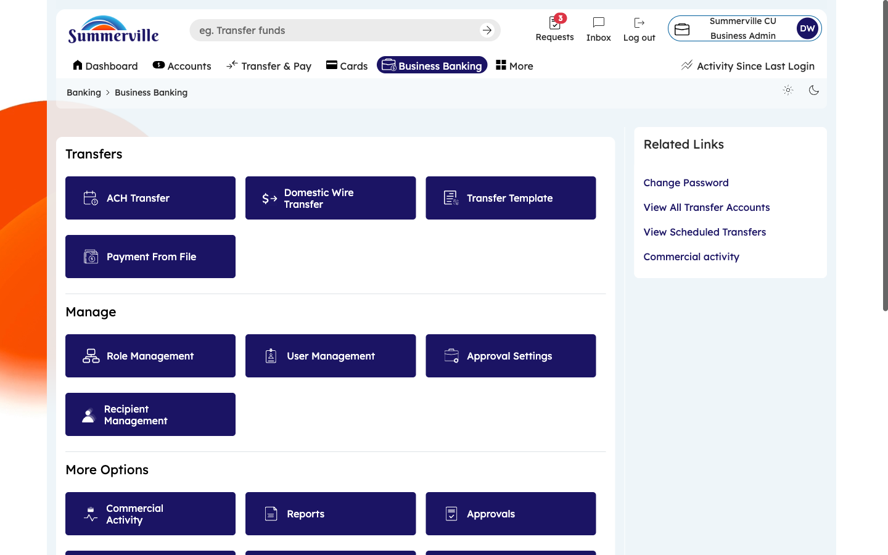
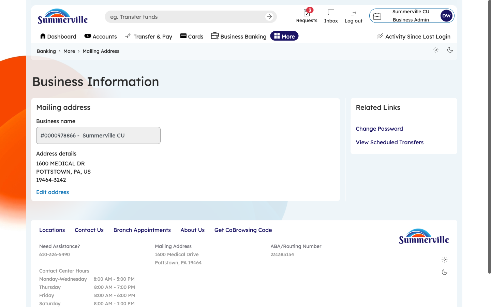
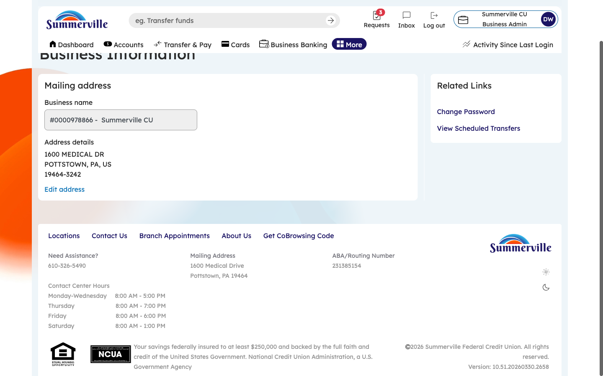

**SUMMERVILLE CREDIT UNION · BUSINESS BANKING USER GUIDE · CSUM-16 of 16**

**Business Address**

Module: Business Banking \> More \> Business Information \> Mailing Address

**Navigation: Dashboard → Business Banking → More → Business Information → Mailing Address**

*Sources: Summerville Reports Series A + Series B | Features: nFinia Documentation Features Spreadsheet*

|                        |
| ---------------------- |
| **01 PRODUCT SUMMARY** |

The Business Address feature displays the registered mailing address for the business entity as stored in the credit union's core system. The interface shows the full mailing address including street address, city, state, and ZIP code, with an Edit address option for authorized users to request updates.

The address information is pulled from the credit union's records and displayed on the Business Information page alongside the Contact Information tab. The footer of the page displays the credit union's own contact details including phone number, mailing address, ABA/Routing Number, and branch hours for reference.

For credit unions, maintaining accurate business addresses is critical for regulatory compliance (BSA/AML address verification), statement delivery, and correspondence. Self-service address viewing reduces calls to the contact center for simple address verification requests.

**At a Glance**

| **Attribute**            | **Detail**                                                                   |
| ------------------------ | ---------------------------------------------------------------------------- |
| **Feature Name**         | Business Address                                                             |
| **Module**               | Business Banking \> More \> Business Information \> Mailing Address          |
| **Navigation**           | Dashboard → Business Banking → More → Business Information → Mailing Address |
| **User Roles**           | Business Owner, Business Admin                                               |
| **Access Level**         | Available to business account primary contacts                               |
| **Key Actions**          | View address, Edit address                                                   |
| **Regulatory Relevance** | BSA/AML address verification, KYC compliance                                 |

|                      |
| -------------------- |
| **02 KEY USE CASES** |

| **Use Case**            | **Who Uses It** | **What They Do**                                          | **Business Value**                                       |
| ----------------------- | --------------- | --------------------------------------------------------- | -------------------------------------------------------- |
| Verify Mailing Address  | Business Owner  | Confirm business address on file matches current location | Ensures statements and correspondence reach the business |
| Request Address Update  | Business Admin  | Edit mailing address after business relocation            | Self-service update without branch visit                 |
| Compliance Verification | Business Owner  | Review address for regulatory filing accuracy             | Supports annual KYC/BSA compliance reviews               |

|                                |
| ------------------------------ |
| **03 STEP-BY-STEP USER GUIDE** |

**How to get here: Dashboard → Business Banking → More → Business Information → Mailing Address**

**Step 1: Log In and Open the Dashboard**

Open your web browser and navigate to the Summerville Credit Union digital banking platform. Enter your username and password on the login screen and click "Log In." If prompted, complete the OTP (One-Time Passcode) verification by entering the code sent to your registered device. After successful authentication, you will land on the Dashboard — also called the Account Overview screen. This is your home base. The Dashboard displays all your business accounts (Savings Accounts, Checking Accounts) with their available and current balances. The top navigation bar shows links to Dashboard, Accounts, Transfer & Pay, Cards, Business Banking, and More. On the right sidebar you will see Related Links (Change Password, Account Settings, View Scheduled Transfers, Account Specific Alerts) and a Quick Transfer widget for fast internal transfers. To proceed to Business Banking features, locate the "Business Banking" tab in the top navigation bar and click on it.

*Figure 1 — Log In and Open the Dashboard*

**Step 2: Open the Business Banking Hub**

After clicking "Business Banking" in the top navigation bar, the Business Banking Hub loads. This is the central command center for all commercial banking operations. The Hub is organized into three sections: "Transfers" at the top (with tiles for ACH Transfer, Domestic Wire Transfer, Transfer Template, and Payment From File), "Manage" in the middle (with tiles for Role Management, User Management, Approval Settings, and Recipient Management), and "More Options" at the bottom (with tiles for Commercial Activity, Reports, and Approvals). Each tile is a direct entry point to its corresponding feature. Only tiles your role has permission to access will be visible. From here, locate and click the tile for the feature you need — the next steps will guide you through the specific workflow.

*Figure 2 — Open the Business Banking Hub*

**Step 3: Navigate to Business Address**

From the Dashboard, click "Business Banking" in the left-side navigation menu to open the Business Banking Hub. Navigate to More → Business Information through the left-side navigation within Business Banking. On the Business Information page, click the "Mailing Address" tab (next to "Contact Information"). The page displays your registered business address: Street Address, City, State, and ZIP Code. To update the address (e.g., after a business relocation), click the "Edit address" link. Depending on your credit union's configuration, address changes may be applied immediately or require verification. Review the address to ensure it matches your current business location.

*Figure 3 — Navigate to Business Address*

**Step 4: View Full Address Page with Credit Union Details**

Scroll down to see the complete Mailing Address page. Below your business address, the credit union's footer information is displayed for quick reference: the credit union's main phone number, mailing address, ABA/Routing Number, and contact center hours. The ABA/Routing Number is especially useful — you will need this when providing banking details to customers or vendors for incoming payments. Note this number for your records. The contact center hours tell you when live support is available if you need assistance. This single page gives you both your business address and the credit union's key reference information in one place.

*Figure 4 — View Full Address Page with Credit Union Details*
