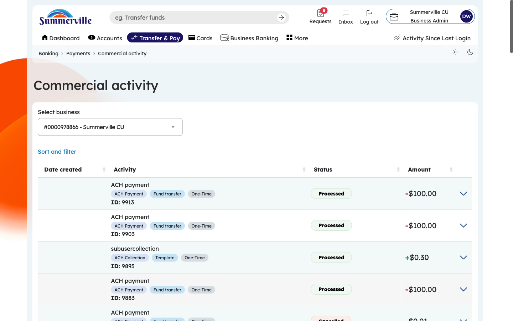
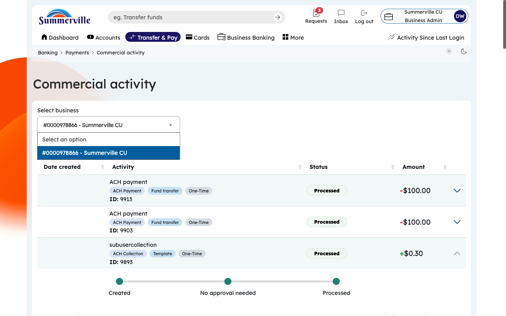
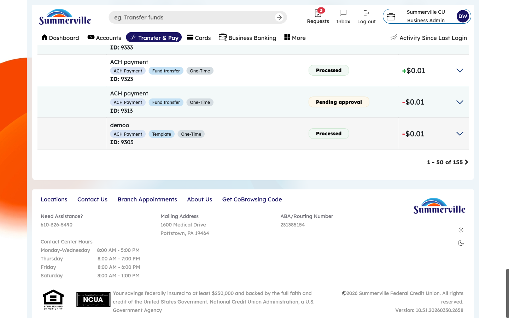

# CSUM-13 Business Banking Commercial Activity

**SUMMERVILLE CREDIT UNION · BUSINESS BANKING USER GUIDE · CSUM-13 of 16**

**Commercial Activity**

Module: Business Banking > Payments > Commercial Activity

**Navigation: Dashboard → Business Banking → Commercial Activity**

_Sources: Summerville Reports Series A + Series B | Features: nFinia Documentation Features Spreadsheet_

|                        |
| ---------------------- |
| **01 PRODUCT SUMMARY** |

Commercial Activity provides a comprehensive transaction history view for all business banking payment activity. The interface displays transactions with columns for Date Created, Activity description, transaction type tags (Fund Transfer, One-Time), Status (Processed, Pending), and Amount. Users can filter transactions by type, date range, and status to find specific records.

The feature supports expanding individual transactions to view full details, accessing transaction-specific information such as confirmation numbers and processing timestamps, and filtering the activity log for specific payment types or date ranges. The full activity view provides an exportable, scrollable ledger of all commercial transactions.

For credit unions, commercial activity reporting provides business members with the transaction visibility they need for daily cash management, reconciliation, and dispute resolution. It serves as the single source of truth for all business payment activity.

**At a Glance**

| **Attribute**            | **Detail**                                              |
| ------------------------ | ------------------------------------------------------- |
| **Feature Name**         | Commercial Activity                                     |
| **Module**               | Business Banking > Payments > Commercial Activity       |
| **Navigation**           | Dashboard → Business Banking → Commercial Activity      |
| **User Roles**           | Business Owner, Authorized Signer, Business Admin       |
| **Access Level**         | Role-based; activity visible based on account access    |
| **Key Actions**          | View transactions, Filter, Expand details, Sort, Export |
| **Regulatory Relevance** | Transaction record-keeping, dispute resolution support  |

|                      |
| -------------------- |
| **02 KEY USE CASES** |

| **Use Case**          | **Who Uses It**   | **What They Do**                                  | **Business Value**                                  |
| --------------------- | ----------------- | ------------------------------------------------- | --------------------------------------------------- |
| Daily Reconciliation  | Business Owner    | Review all processed transactions for the day     | Supports daily cash position management             |
| Transaction Lookup    | Authorized Signer | Search for specific payment by amount or date     | Quick resolution of payment inquiries               |
| Filter by Type        | Business Admin    | View only ACH or wire transactions                | Isolates specific payment channels for review       |
| Dispute Investigation | Business Owner    | Expand transaction detail for confirmation number | Provides evidence for payment disputes or inquiries |

|                                |
| ------------------------------ |
| **03 STEP-BY-STEP USER GUIDE** |

**How to get here: Dashboard → Business Banking → Commercial Activity**

**Step 1: Log In and Open the Dashboard**

Open your web browser and navigate to the Summerville Credit Union digital banking platform. Enter your username and password on the login screen and click "Log In." If prompted, complete the OTP (One-Time Passcode) verification by entering the code sent to your registered device. After successful authentication, you will land on the Dashboard — also called the Account Overview screen. This is your home base. The Dashboard displays all your business accounts (Savings Accounts, Checking Accounts) with their available and current balances. The top navigation bar shows links to Dashboard, Accounts, Transfer & Pay, Cards, Business Banking, and More. On the right sidebar you will see Related Links (Change Password, Account Settings, View Scheduled Transfers, Account Specific Alerts) and a Quick Transfer widget for fast internal transfers. To proceed to Business Banking features, locate the "Business Banking" tab in the top navigation bar and click on it.

.png>)

_Figure 1 — Log In and Open the Dashboard_

**Step 2: Open the Business Banking Hub**

After clicking "Business Banking" in the top navigation bar, the Business Banking Hub loads. This is the central command center for all commercial banking operations. The Hub is organized into three sections: "Transfers" at the top (with tiles for ACH Transfer, Domestic Wire Transfer, Transfer Template, and Payment From File), "Manage" in the middle (with tiles for Role Management, User Management, Approval Settings, and Recipient Management), and "More Options" at the bottom (with tiles for Commercial Activity, Reports, and Approvals). Each tile is a direct entry point to its corresponding feature. Only tiles your role has permission to access will be visible. From here, locate and click the tile for the feature you need — the next steps will guide you through the specific workflow.

.png>)

_Figure 2 — Open the Business Banking Hub_

**Step 3: Navigate to Commercial Activity**

From the Dashboard, click "Business Banking" in the left-side navigation menu to open the Business Banking Hub. Scroll down to the "More Options" section and click the "Commercial Activity" tile. The transaction ledger appears, displaying all business banking payments in reverse chronological order. Columns show: Date Created, Activity description, Type tags (color-coded labels like "Fund Transfer," "One-Time"), Status (Processed, Pending, Failed), and Amount. The most recent transactions appear first. This is your primary screen for daily cash position monitoring and payment reconciliation.

_Figure 3 — Navigate to Commercial Activity_

**Step 4: Expand a Transaction for More Details**

Click on any transaction row to expand an inline detail panel. Without navigating away from the list, you can see additional information: Source Account, Destination Account, Transaction Reference Number, Confirmation Number, SEC Code (for ACH), Effective Date, and Processing Timestamp. This inline expansion lets you quickly check details for multiple transactions without navigating back and forth. To collapse the detail panel, click the row again. If you need even more detail, look for a "View Full Details" link within the expanded panel.

.png>)

_Figure 4 — Expand a Transaction for More Details_

**Step 5: View Full Transaction Detail**

Click "View Full Details" from the expanded panel to open a dedicated transaction detail page. This page shows every data point: complete From/To account details (including routing numbers), exact dollar amount, all timestamps (created, submitted, approved, processed), the initiator's name and role, all approvers' names with approval timestamps, confirmation/reference number, description/memo text, SEC code, and processing status. Use this page for dispute resolution, audit inquiries, or regulatory examination — it provides the complete audit trail for the transaction.

_Figure 5 — View Full Transaction Detail_

**Step 6: Filter Transactions**

Click the Filter icon or button to open the filter panel. You can filter by: Transaction Type (ACH Payment, Wire Transfer, Internal Transfer, etc.), Status (Processed, Pending, Failed, Cancelled), Date Range (custom dates or presets like Today, Last 7 Days, Last 30 Days), and Amount Range (minimum and maximum thresholds). Select your desired filters and click "Apply." You can combine multiple filters — for example, show only Wire Transfers over $10,000 processed in the last 30 days. Click "Clear" to reset all filters and return to the full transaction list.

.png>)

_Figure 6 — Filter Transactions_

**Step 7: Review the Full Transaction History**

Scroll through the complete transaction ledger to review all historical business banking activity. The table format remains consistent as you scroll through older transactions. For businesses with high transaction volumes, use the filter panel to narrow results rather than scrolling through hundreds of entries. To export this data for offline analysis or reconciliation with your accounting system, use the Reports feature (navigate back to the Hub → Reports → Create Report) to generate a downloadable PDF or XLSX version of your transaction activity.

_Figure 7 — Review the Full Transaction History_
