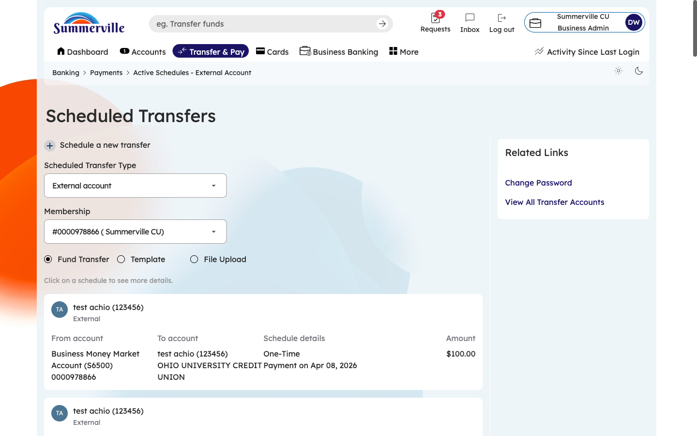
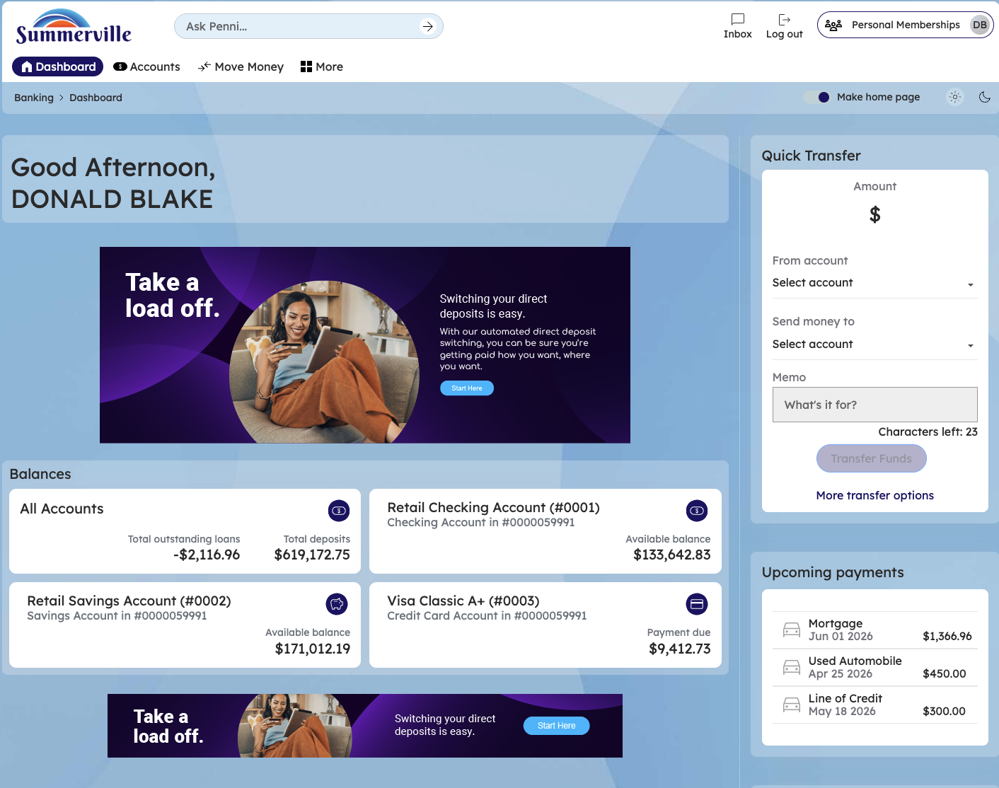

**SUMMERVILLE CREDIT UNION · BUSINESS BANKING USER GUIDE · CSUM-01 of 16**

**Business Banking Hub**

Module: Business Banking \> Hub

**Navigation: Dashboard → Business Banking**

*Sources: Summerville Reports Series A + Series B | Features: nFinia Documentation Features Spreadsheet*

|                        |
| ---------------------- |
| **01 PRODUCT SUMMARY** |

The Business Banking Hub is the central command center for all commercial banking operations within the nFinia digital banking platform. It provides business owners and authorized signers with a single-screen overview of every available business banking feature, organized into logical categories: Transfers (ACH Transfer, Domestic Wire Transfer, Transfer Templates, Payment From File), Manage (Role Management, User Management, Approved Settings, Recipient Management), and More Options (Commercial Activity, Reports, Approvals).

This hub eliminates the need for business members to navigate through multiple menus to find key functions. Each tile is a direct entry point to the corresponding feature module, reducing clicks and improving operational efficiency. For credit unions, the hub serves as a visual catalog of their business banking capabilities, reinforcing the breadth of services offered to commercial members.

**At a Glance**

| **Attribute**            | **Detail**                                              |
| ------------------------ | ------------------------------------------------------- |
| **Feature Name**         | Business Banking Hub                                    |
| **Module**               | Business Banking \> Hub                                 |
| **Navigation**           | Dashboard → Business Banking                            |
| **User Roles**           | Business Owner, Authorized Signer, Business Admin       |
| **Access Level**         | Role-based; tiles visible based on assigned permissions |
| **Key Actions**          | Navigate to any business banking feature                |
| **Regulatory Relevance** | N/A (navigation hub)                                    |

|                      |
| -------------------- |
| **02 KEY USE CASES** |

| **Use Case**        | **Who Uses It**   | **What They Do**                                         | **Business Value**                                          |
| ------------------- | ----------------- | -------------------------------------------------------- | ----------------------------------------------------------- |
| Daily Operations    | Business Owner    | Access hub to initiate ACH, wire, or file-based payments | Single entry point reduces time navigating between features |
| User Administration | Business Admin    | Navigate to Role or User Management from hub             | Centralized access to administrative controls               |
| Payment Review      | Authorized Signer | Access Approvals tile to review pending transactions     | Quick access to dual-control approval queue                 |
| Reporting           | Business Owner    | Navigate to Reports or Commercial Activity               | Immediate access to transaction history and analytics       |

|                                |
| ------------------------------ |
| **03 STEP-BY-STEP USER GUIDE** |

**How to get here: Dashboard → Business Banking**

**Step 1: Log In and Open the Dashboard**

Open your web browser and navigate to the Summerville Credit Union digital banking platform. Enter your username and password on the login screen and click "Log In." If prompted, complete the OTP (One-Time Passcode) verification by entering the code sent to your registered device. After successful authentication, you will land on the Dashboard — also called the Account Overview screen. This is your home base. The Dashboard displays all your business accounts (Savings Accounts, Checking Accounts) with their available and current balances. The top navigation bar shows links to Dashboard, Accounts, Transfer & Pay, Cards, Business Banking, and More. On the right sidebar you will see Related Links (Change Password, Account Settings, View Scheduled Transfers, Account Specific Alerts) and a Quick Transfer widget for fast internal transfers. To proceed to Business Banking features, locate the "Business Banking" tab in the top navigation bar and click on it.

*Figure 1 — Log In and Open the Dashboard*

**Step 2: Log In and Navigate to Business Banking**

Log in to the nFinia digital banking platform using your credentials. Once you arrive at the main Dashboard, locate the left-side navigation menu. Click on "Business Banking" to enter the Business Banking Hub. You will see the Hub's tile-based layout divided into sections. The top section labeled "Transfers" contains four tiles: ACH Transfer, Domestic Wire Transfer, Transfer Template, and Payment From File. These are your primary payment initiation tools. Below that, the "Manage" section displays four administrative tiles: Role Management, User Management, Approval Settings, and Recipient Management. Each tile shows an icon and label. Only tiles your role has permission to access will be visible — if you do not see a tile, check with your business administrator to confirm your role includes that feature.

*Figure 2 — Log In and Navigate to Business Banking*

**Step 3: Scroll Down to View More Options**

Scroll down below the Manage section to reveal the "More Options" area. Here you will find three additional tiles: Commercial Activity (click to view a full transaction ledger of all business payments), Reports (click to generate, schedule, and download financial reports in BAI2, PDF, and XLSX formats), and Approvals (click to open the dual-control approval queue where you can review, approve, or decline pending payment requests). These tiles are also role-gated — they only appear if your assigned role includes the corresponding permission. From this Hub screen, you can click on any tile to navigate directly into that feature. To return to the Hub at any time, use the left-side navigation menu and click "Business Banking" again.

*Figure 3 — Scroll Down to View More Options*
