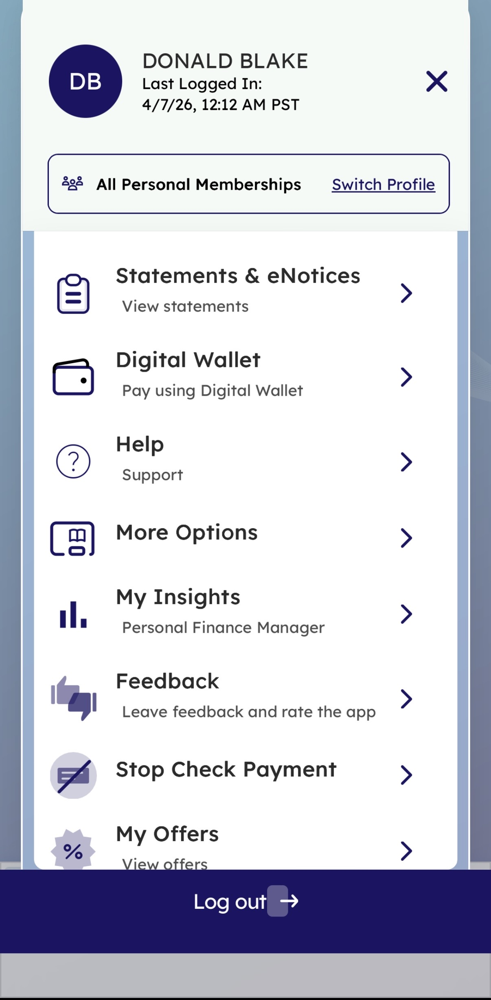
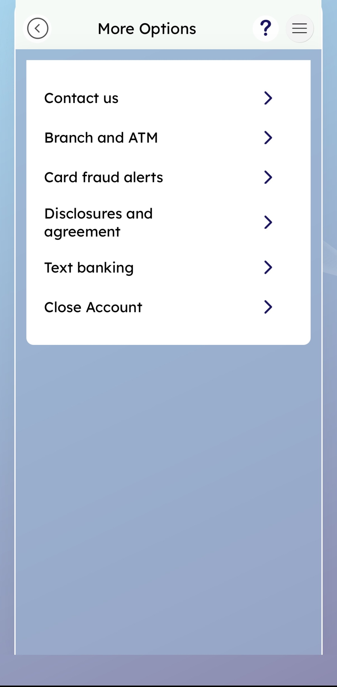
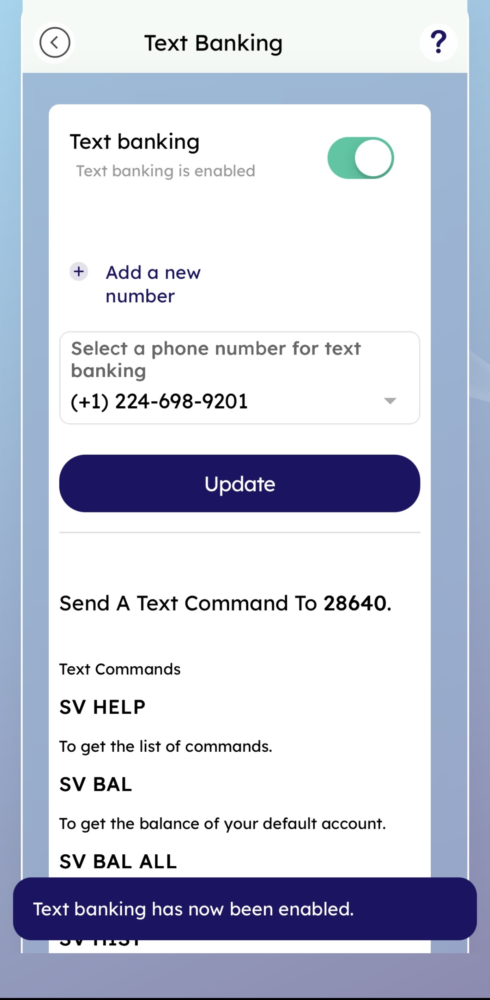
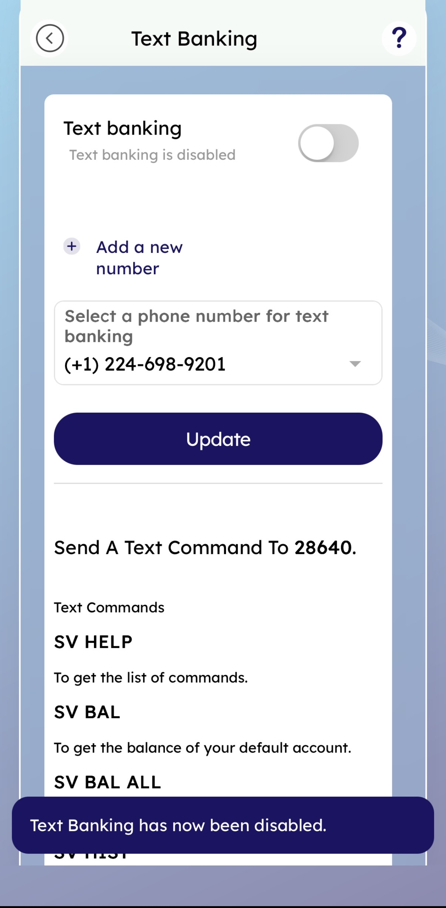
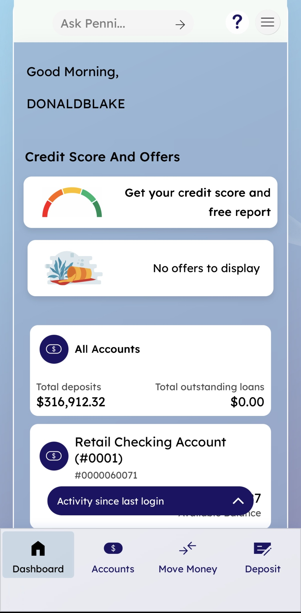

# Text Banking — Feature Guide
**Summerville Credit Union | nFinia Digital Banking Platform**
*Prepared by: Jeeva Krishnamurthy, Senior Product Manager, Commercial & SMB Digital Banking, Tyfone*
*Date: April 7, 2026*

---

## 1. Product Summary

Text Banking is a lightweight, SMS-based channel that allows Summerville Credit Union members to query account information and perform basic banking actions by sending short text commands to a dedicated short code (28640). Once enabled, members do not need the mobile app or a web browser — they send a text message and receive a real-time response. This is particularly valuable for members in low-connectivity environments or those who prefer a frictionless interaction model over launching a full digital banking session.

The feature is managed entirely within the nFinia mobile app under **More Options > Text Banking**. Members can toggle Text Banking on or off, select which registered phone number to associate with the service, and view the full library of supported text commands — all from a single screen. The platform enforces OTP-based authentication before any changes to Text Banking settings take effect, ensuring that the channel cannot be hijacked without access to a verified device.

For Summerville CU, Text Banking extends service reach without increasing call center volume. Members who would otherwise call the branch to check a balance can self-serve via SMS in seconds. The feature also supports member retention in segments that are less engaged with the full mobile banking app but remain active via basic text messaging.

**At a Glance**

| Attribute | Detail |
|-----------|--------|
| Feature Name | Text Banking |
| Module | More Options > Text Banking |
| User Roles | Retail Member (individual account holder) |
| Access Level | Authenticated member; OTP verification required to modify settings |
| Key Actions | Enable / Disable Text Banking, Select phone number, Send text commands |
| Regulatory Relevance | OTP authentication before settings change; phone number tied to member profile on file |
| Short Code | 28640 |
| Supported Commands | SV HELP, SV BAL, SV BAL ALL, SV HIST (and others) |

---

## 2. Use Cases

| Use Case | Who Uses It | What They Do | Business Value |
|----------|-------------|--------------|----------------|
| Enable Text Banking for the first time | Retail member | Navigates to More Options > Text Banking, toggles the feature on, selects a registered phone number, and taps Update | Member gains SMS-based account access without requiring mobile app for routine balance checks |
| Disable Text Banking | Retail member | Navigates to More Options > Text Banking, toggles the feature off, and taps Update | Member can turn off the channel at will, reducing security exposure if a phone is lost or transferred |
| Switch the associated phone number | Retail member | Selects a different number from the dropdown (populated from registered contacts on profile) and taps Update | Ensures text commands are sent/received on the correct current device |
| Check account balance via SMS | Retail member (with Text Banking enabled) | Texts **SV BAL** to 28640 | Instant balance retrieval with no app login required; reduces inbound support calls |
| View command list via SMS | Any member unsure of syntax | Texts **SV HELP** to 28640 | Self-service discovery of available commands; reduces member friction and support load |
| FI operations — member cannot authenticate | Credit union member services rep | Member calls in; rep confirms registered phone numbers on file match what member expects | Ensures the phone number registry is accurate and the OTP verification chain is intact |

These use cases reflect the range of interactions Summerville CU members will encounter across the Text Banking lifecycle — from initial setup through day-to-day use. For the credit union, the channel's value compounds as adoption grows: each member who self-serves a balance inquiry via SMS is a call that never reaches the contact center.

---

## 3. End-to-End Workflow

### 3.1 Prerequisites

- Member must have an active Summerville Credit Union retail membership with nFinia digital banking access.
- At least one phone number must be registered on the member's profile. The Text Banking screen populates the phone number dropdown from the member's profile on file; if no number is registered, the member must update their personal information first.
- The member must have the Summerville nFinia mobile app installed and be able to complete OTP authentication (i.e., have access to one of the registered phone numbers or call options).

---

### 3.2 Step-by-Step Flow — Enable Text Banking

**Step 1 — Launch the App (Welcome Screen)**

The member opens the Summerville nFinia mobile app. The Welcome screen presents options to Enroll, Log In, access Accounts/Move Money/Check Deposit/Manage Devices as a guest, or check a quick Balance.

---

**Step 2 — Log In**

The member taps **Log In** and enters their Username and Password. "Remember me" is available to persist the username. The member taps the **Log In** button to proceed.

---

**Step 3 — Select Authentication Method (Verification)**

The system triggers an OTP challenge. The member is presented with all registered phone numbers and can choose to receive a **Text** or a **Call** to any of them. The member selects their preferred delivery method.

> *Note: If the member does not see their updated contact information, a **Refresh** link is available to reload the phone number list from the profile.*

---

**Step 4 — Enter OTP (User Verification)**

A one-time passcode is sent to the selected number. The member enters the passcode in the field provided and taps **Submit**. A retry timer (58 seconds) is displayed — if the code does not arrive, the member must wait before requesting a new one.

---

**Step 5 — Dashboard**

Upon successful authentication, the member lands on the Dashboard, which shows a personalized greeting, Credit Score & Offers, and an overview of all accounts with total deposits and outstanding loans.

---

**Step 6 — Open the Side Menu**

The member taps the hamburger menu icon (top right) to open the navigation drawer. The menu displays the member's name, last login timestamp, and options including Statements & eNotices, Digital Wallet, Help, **More Options**, My Insights, Feedback, Stop Check Payment, and My Offers.

---

**Step 7 — Navigate to More Options**

The member taps **More Options** in the side menu. The More Options screen lists: Contact us, Branch and ATM, Card fraud alerts, Disclosures and agreement, **Text banking**, and Close Account. The member taps **Text banking**.

---

**Step 8 — Enable Text Banking**

The Text Banking screen loads. The member:
1. Taps the toggle next to **Text banking** to switch it **ON** (toggle turns green; label changes to "Text banking is enabled").
2. Confirms or selects the desired phone number from the dropdown (e.g., (+1) 224-698-9201).
3. Taps **Update**.

The system displays a confirmation toast: **"Text Banking has now been enabled."**

The screen also displays the short code (**28640**) and the supported text commands for immediate reference.

---

### 3.2b Step-by-Step Flow — Disable Text Banking

The navigation path to reach the Text Banking screen is identical (Steps 1–7 above). The only difference is in Step 8:

**Step 8 — Disable Text Banking**

On the Text Banking screen, the toggle is currently **ON** (green). The member:
1. Taps the toggle to switch it **OFF** (toggle turns grey; label changes to "Text banking is disabled").
2. Taps **Update**.

The system displays a confirmation toast: **"Text Banking has now been disabled."**

---

### 3.3 Decision Points & Branching

- **Toggle state on load**: If Text Banking is already enabled, the member arrives on the Text Banking screen with the toggle in the ON position. The workflow to disable is the mirror image of enabling.
- **Phone number selection**: The dropdown is pre-populated with all phone numbers registered on the member's profile. If the member has only one number, it is pre-selected. If multiple numbers exist, the member must confirm the correct one before tapping Update.
- **Adding a new number**: A **+ Add a new number** link is available on the Text Banking screen. This redirects to personal information settings where a new number can be registered. The member must complete that flow before returning to Text Banking to select the new number.
- **OTP failure**: If the member enters an incorrect OTP, the system does not grant access to settings. The member may retry after the countdown timer expires.

---

### 3.4 Completion & Confirmation

Upon tapping **Update** with a valid toggle state and phone number selected, the platform:
- Updates the Text Banking enrollment status in the member's profile.
- Displays an inline toast notification confirming the action ("Text Banking has now been enabled." or "Text Banking has now been disabled.").
- If enabled: the member can immediately begin texting commands to 28640 from the registered number.
- If disabled: any subsequent texts from the previously registered number to 28640 will receive no response or an "inactive" reply.

---

### 3.5 Error Handling

| Scenario | What the Member Sees | Resolution |
|----------|----------------------|------------|
| OTP not received | "Didn't receive your code? Retry in 58s" countdown | Wait for timer to expire, then retry or select a different delivery method (Call) |
| No phone number on profile | Dropdown empty; Update button may be inactive | Member must add a phone number via personal information settings |
| Incorrect OTP entered | Error state on OTP entry; access to settings denied | Re-enter correct code or request a new one after countdown |
| Session timeout | Member returned to login screen | Re-authenticate with username/password and complete OTP again |

---

## 4. Feature Overview (UI Walkthrough)

### Welcome Screen

The app entry point. Displays Summerville branding and four unauthenticated quick-access tiles (Accounts, Move Money, Check Deposit, Manage Devices) plus a Balance slider. The Log In and Enroll buttons initiate authenticated flows.

| Field / Element | Type | Description | Notes |
|-----------------|------|-------------|-------|
| Log In | Button | Initiates authenticated login flow | Primary CTA |
| Enroll | Button | Opens new member enrollment | Outlined/secondary style |
| Accounts | Tile | Unauthenticated account access | Requires member lookup |
| Move Money | Tile | Unauthenticated money movement | Requires member lookup |
| Check Deposit | Tile | Mobile check deposit (unauthenticated entry) | Requires member lookup |
| Manage Devices | Tile | Device management shortcut | Requires authentication |
| Balance | Slider / Button | Quick balance check without full login | Swipe/tap to reveal |

---

### Log In Screen

Standard credential entry screen. Username is pre-filled when "Remember me" was previously checked.

| Field / Element | Type | Description | Notes |
|-----------------|------|-------------|-------|
| Username | Text input | Member's digital banking username | Pre-filled if "Remember me" was checked |
| Password | Password input | Masked entry with show/hide toggle | Eye icon toggles visibility |
| Remember me | Checkbox | Persists username on next launch | Checked by default in screenshots |
| Enable Face ID | Checkbox | Registers device biometric for future logins | Optional |
| Log In | Button | Submits credentials | Primary CTA |
| Enroll | Button | Redirect to enrollment | Secondary |
| I need help logging in | Link | Recovery flow for forgotten credentials | Hyperlink style |
| Tap to see your balance | Persistent bar | Quick balance without full login | Bottom of screen |

---

### Verification Screen (Authentication Method Selection)

Presented after credential submission when OTP is required. Lists all registered phone numbers with Text and Call options for each.

| Field / Element | Type | Description | Notes |
|-----------------|------|-------------|-------|
| Select your authentication method | Header label | Instructional text | Static |
| Text (phone number) | Selectable row | Sends OTP via SMS to the masked number | Multiple rows if multiple numbers |
| Call (phone number) | Selectable row | Delivers OTP via automated voice call | Multiple rows if multiple numbers |
| Refresh | Link | Reloads contact info from member profile | Useful if number was recently updated |
| Back (‹) | Navigation button | Returns to login screen | Top left |
| Help (?) | Navigation button | Opens help/support | Top right |

---

### User Verification Screen (OTP Entry)

Displayed after the member selects a delivery method. Accepts the one-time passcode.

| Field / Element | Type | Description | Notes |
|-----------------|------|-------------|-------|
| OTP destination label | Label | Shows masked number the code was sent to | Read-only, e.g. (+1) 2**-***-**01 |
| Enter passcode | Text input | OTP entry field | Numeric, required |
| Retry countdown | Timer label | "Didn't receive your code? Retry in 58 s" | Counts down; retry available after expiry |
| Submit | Button | Validates OTP and proceeds | Styled in muted purple/lavender |
| Back (‹) | Navigation | Returns to method selection | Top left |
| Help (?) | Navigation | Opens support | Top right |

---

### Dashboard

Post-login landing screen. Shows account summary, credit score widget, and offers. Bottom navigation bar provides access to Dashboard, Accounts, Move Money, and Deposit.

| Field / Element | Type | Description | Notes |
|-----------------|------|-------------|-------|
| Good Morning / [Name] | Greeting label | Personalized with member name | Dynamic by time of day |
| Credit Score And Offers | Widget section | Shows credit score prompt and current offers | "No offers to display" if none active |
| All Accounts | Summary card | Total deposits and total outstanding loans | Aggregated view |
| Retail Checking Account | Account tile | Individual account with ID and activity since last login | Tappable for detail |
| Ask Penni… | AI assistant bar | Top-bar shortcut to AI assistant | → arrow expands |
| Dashboard / Accounts / Move Money / Deposit | Bottom nav | Primary navigation tabs | Persistent |

---

### Side Menu (Navigation Drawer)

Accessed via the hamburger icon (top right). Shows member identity, profile switcher, and secondary navigation options.

| Field / Element | Type | Description | Notes |
|-----------------|------|-------------|-------|
| Member avatar + name | Display | Shows initials, full name, and last login timestamp | Read-only |
| All Personal Memberships | Profile label | Current profile context | |
| Switch Profile | Link | Toggle between personal and business profiles | If business banking is enabled |
| Statements & eNotices | Nav item | Access to document vault | |
| Digital Wallet | Nav item | Pay using Digital Wallet | |
| Help | Nav item | Support and FAQ | |
| More Options | Nav item | **Entry point to Text Banking** | Contains Text banking sub-item |
| My Insights | Nav item | Personal Finance Manager | |
| Feedback | Nav item | App rating and feedback | |
| Stop Check Payment | Nav item | Initiate stop payment request | |
| My Offers | Nav item | Personalized offers | |
| Log out | Button | Ends the session | Bottom of drawer |

---

### More Options Screen

Secondary navigation screen accessible from the side menu. Contains miscellaneous settings and tools not in the primary navigation.

| Field / Element | Type | Description | Notes |
|-----------------|------|-------------|-------|
| Contact us | Nav item | Opens contact center options | |
| Branch and ATM | Nav item | Locator for branches and ATMs | |
| Card fraud alerts | Nav item | Manage fraud alert preferences | |
| Disclosures and agreement | Nav item | Legal disclosures | |
| Text banking | Nav item | **Text Banking settings — enable/disable toggle** | Primary entry point for this feature |
| Close Account | Nav item | Account closure request | Destructive; should require confirmation |
| Back (‹) | Navigation | Returns to previous screen | Top left |

---

### Text Banking Screen

The core feature screen. Controls the Text Banking toggle, phone number selection, and displays the SMS command reference.

**State A: Text Banking Enabled**

**State B: Text Banking Disabled**

| Field / Element | Type | Description | Notes |
|-----------------|------|-------------|-------|
| Text banking toggle | Toggle switch | Enables or disables Text Banking for the account | Green = enabled; grey = disabled |
| Status label | Label | "Text banking is enabled" or "Text banking is disabled" | Dynamically reflects toggle state |
| + Add a new number | Link | Opens personal info settings to register a new phone number | Only needed if desired number is not yet on profile |
| Select a phone number for text banking | Dropdown | Lists all phone numbers registered on member profile | Required before Update can be submitted |
| Update | Button (primary) | Saves the current toggle state and phone number selection | Triggers backend enrollment/de-enrollment |
| Send A Text Command To 28640 | Section header | Informational; displays the SMS short code | Static |
| SV HELP | Command label | Texts this to 28640 to receive a list of available commands | Static reference |
| SV BAL | Command label | Texts this to 28640 to get the balance of the default account | Static reference |
| SV BAL ALL | Command label | Texts this to 28640 to get balances of all accounts | Static reference |
| SV HIST | Command label | (Partially visible) Transaction history command | Static reference |
| Confirmation toast | Toast notification | "Text Banking has now been enabled." / "...disabled." | Appears at bottom after successful Update |
| Back (‹) | Navigation | Returns to More Options | Top left |
| Help (?) | Navigation | Opens support | Top right |

---

## 5. Quick Reference

| Task | Navigation Path | Who Can Do It | Notes |
|------|----------------|---------------|-------|
| Enable Text Banking | Side Menu > More Options > Text banking → Toggle ON → Select number → Update | Authenticated retail member | Requires OTP to log in; confirmation toast on success |
| Disable Text Banking | Side Menu > More Options > Text banking → Toggle OFF → Update | Authenticated retail member | Same path; toggle to OFF position |
| Change associated phone number | Side Menu > More Options > Text banking → Select different number from dropdown → Update | Authenticated retail member | Number must already be on file; use + Add a new number if not |
| Add a new phone number | Side Menu > More Options > Text banking → + Add a new number | Authenticated retail member | Redirects to personal information settings |
| Get account balance via SMS | Text **SV BAL** to 28640 | Member with Text Banking enabled | No app required; instant SMS response |
| Get all account balances via SMS | Text **SV BAL ALL** to 28640 | Member with Text Banking enabled | Returns balances for all linked accounts |
| Get list of available commands | Text **SV HELP** to 28640 | Member with Text Banking enabled | Useful for onboarding and self-service discovery |
| Get transaction history via SMS | Text **SV HIST** to 28640 | Member with Text Banking enabled | Returns recent transaction history |
| Recover from failed OTP | Wait 58 seconds → Retry or select Call delivery | Member during authentication | Retry timer enforced; Call option available as fallback |

---

*This guide covers the Text Banking feature as implemented in the Summerville Credit Union nFinia deployment. Navigation paths and field labels reflect the live platform as of April 7, 2026.*
