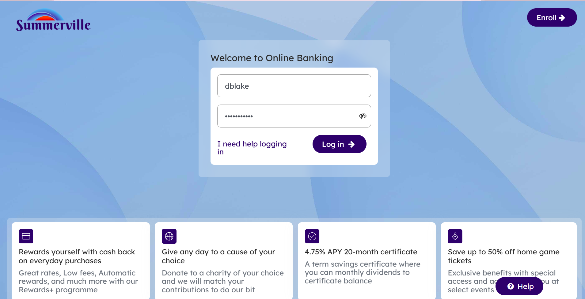
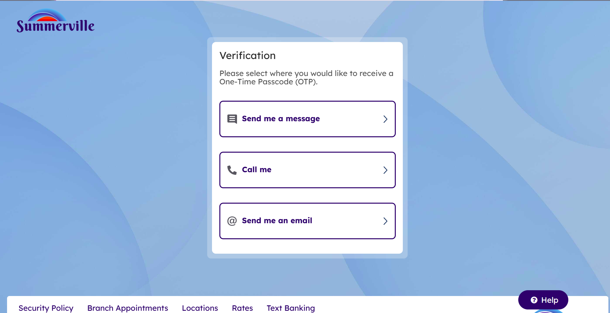
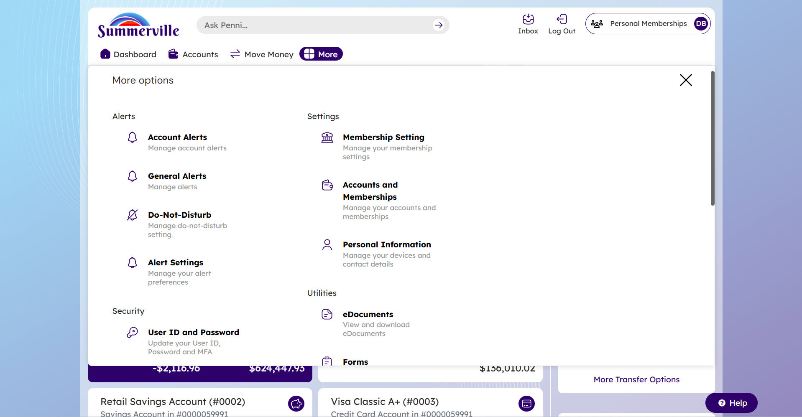
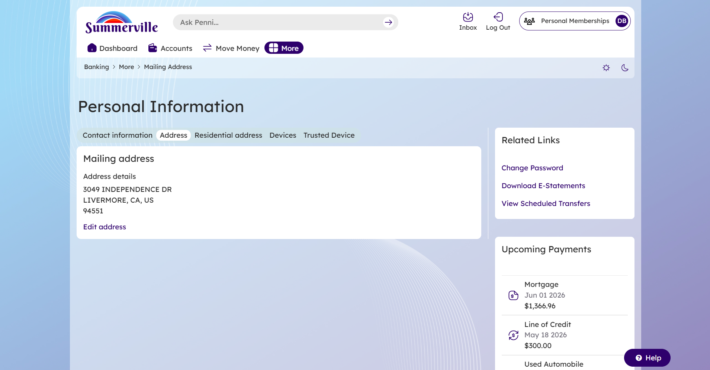
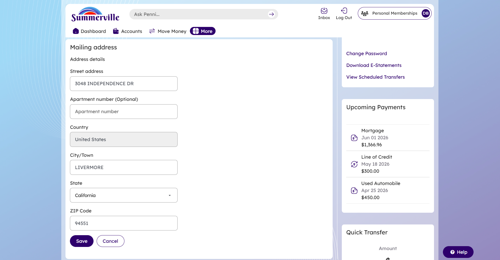
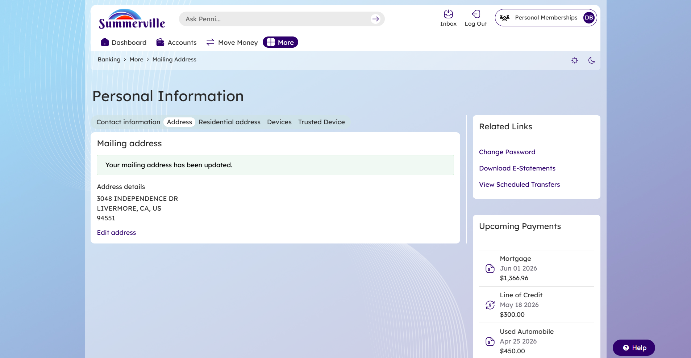
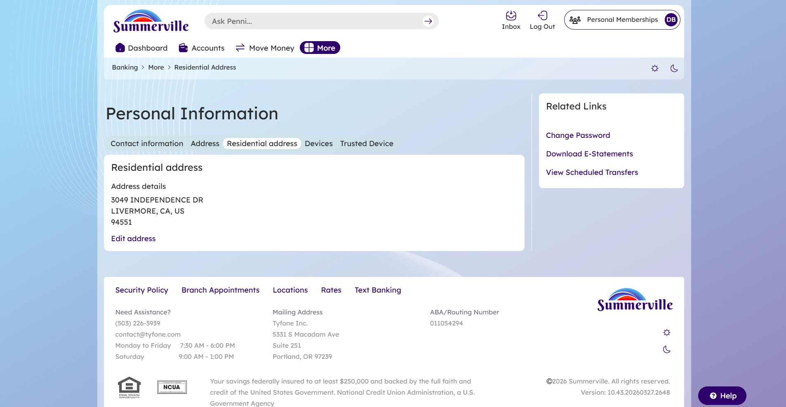
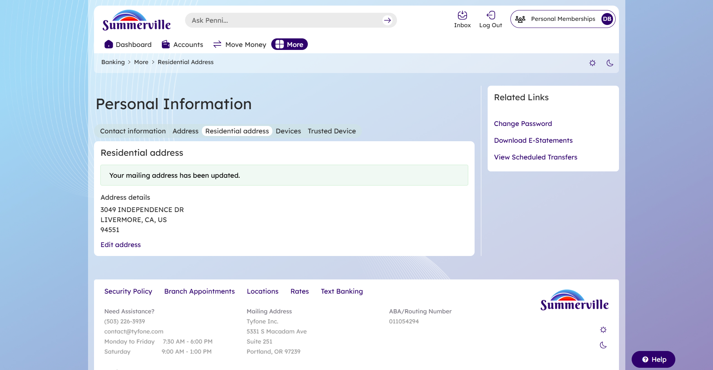

# Address Management — Feature Guide
**Summerville Credit Union | nFinia Digital Banking Platform**
*Prepared by: Jeeva Krishnamurthy, Senior Product Manager, Digital Banking*

---

## Section 1 — Product Summary

The Address Management feature within nFinia's Personal Information module enables Summerville Credit Union members to view and update both their **Mailing Address** and **Residential Address** directly through online banking — eliminating the need for branch visits or phone calls to make routine contact detail changes. The feature is surfaced under **More > Personal Information > Address**, and presents address records in a clean, tab-organized layout alongside related personal details such as Contact Information, Devices, and Trusted Device management.

The feature serves authenticated retail members (personal account holders) who need to keep their address records current. It supports two distinct address types — mailing and residential — each independently editable, allowing members to maintain separate records where their legal/physical address differs from where they receive correspondence. For Summerville CU's operations team, this reduces inbound service calls and manual address-change processing, while giving members a self-service channel that operates 24/7.

Because address changes are sensitive operations that can affect statement delivery, fraud detection, and compliance records, the platform requires identity re-verification via One-Time Passcode (OTP) before granting access to Personal Information. This ensures that unauthorized parties cannot redirect mail or alter member contact data through an unattended session.

### At a Glance

| Attribute | Detail |
|-----------|--------|
| Feature Name | Address Management (Mailing & Residential) |
| Module | More > Personal Information > Address |
| User Roles | Authenticated Retail Member |
| Access Level | Requires active session + OTP verification |
| Key Actions | View address, Edit address, Save changes |
| Regulatory Relevance | Identity verification (OTP), audit trail on address changes, BSA/AML address accuracy |

---

## Section 2 — Use Cases

| Use Case | Who Uses It | What They Do | Business Value |
|----------|-------------|--------------|----------------|
| Update mailing address after relocation | Retail member | Navigates to Personal Information > Address > Mailing Address, edits street/city/state/ZIP, saves | Ensures accurate statement and correspondence delivery; reduces returned mail |
| Update residential address independently | Retail member | Selects the "Residential address" tab, edits address details separately from mailing address | Supports members with PO Box or separate mailing address; maintains accurate KYC records |
| Verify current address on file | Retail member | Navigates to Address tab to review displayed address details without making changes | Self-service lookup reduces call center volume for "what address do you have for me?" inquiries |
| OTP re-verification before access | Security / Compliance | System requires member to complete OTP challenge before Personal Information is accessible | Prevents unauthorized address redirection by someone with an unattended logged-in session |
| Confirm update success | Retail member | Receives on-screen confirmation banner after saving | Provides immediate feedback, reducing repeat submissions and support calls |

Address management self-service is a high-frequency, low-complexity operation that represents significant operational savings for credit unions — Summerville members who can update their own address data reduce the manual processing burden on branch and call center staff while maintaining accurate records for regulatory compliance.

---

## Section 3 — End-to-End Workflow

### 3.1 Prerequisites

- Member must have an active Summerville CU online banking account
- Member must know their User ID and password
- Member must have access to a registered phone number or email address to receive the OTP

---

### 3.2 Step-by-Step Flow

**Step 1 — Login**

The member navigates to the Summerville CU online banking portal and enters their **User ID** and **Password** on the login screen, then clicks **Log in**.

---

**Step 2 — OTP Channel Selection**

The platform presents a **Verification** screen prompting the member to select how they want to receive their One-Time Passcode. Options include:
- Send me a message (SMS)
- Call me
- Send me an email

The member selects their preferred channel.

---

**Step 3 — Select Contact Number (SMS path)**

If the member selects **Send me a message**, the system displays the registered phone numbers on file (masked for security, e.g., `(+1) 2**-***-**01`). The member selects the number they want the OTP sent to.

---

**Step 4 — Enter OTP Code**

The system sends a 6-digit OTP to the selected contact. The member enters the code on the **Verification** screen. A resend timer is displayed ("Retry in 52 s"). An optional **Remember Device/Browser** checkbox allows the member to skip this step on subsequent logins from the same device.

The member enters the code and clicks **Submit**.

---

**Step 5 — Dashboard**

Upon successful authentication, the member lands on the **Dashboard**, personalized with their name (e.g., "Good Morning, DONALD BLAKE"). The member navigates to the **More** menu in the top navigation bar.

---

**Step 6 — More Menu > Personal Information**

Clicking **More** opens a full-page overlay displaying all secondary navigation options. Under **Settings**, the member clicks **Personal Information** — described as "Manage your devices and contact details."

---

### 3.2a — Mailing Address Update Flow (Steps 7–9)

**Step 7 — Personal Information: Address Tab (Mailing)**

The member is taken to the **Personal Information** page. The navigation tabs at the top are: Contact Information | Address | Residential address | Devices | Trusted Device.

The **Address** tab (mailing address) is active by default. The member's current mailing address is displayed under "Address details." An **Edit address** link is available below the address block.

---

**Step 8 — Edit Mailing Address Form**

Clicking **Edit address** expands an inline edit form with the following fields pre-populated with the current address:

- Street address
- Apartment number (Optional)
- Country (dropdown, defaults to United States)
- City/Town
- State (dropdown)
- ZIP Code

The member updates the relevant fields and clicks **Save** (or **Cancel** to discard changes).

---

**Step 9 — Mailing Address Confirmation**

Upon saving, the form collapses and a **success banner** appears: *"Your mailing address has been updated."* The updated address is immediately reflected in the Address details block below.

---

### 3.2b — Residential Address Update Flow (Steps 7–9)

**Step 7 — Personal Information: Residential Address Tab**

The member clicks the **Residential address** tab. The current residential address is displayed under "Address details" along with an **Edit address** link.

---

**Step 8 — Edit Residential Address Form**

Clicking **Edit address** presents the same editable form structure as the mailing address (Street address, Apartment number, Country, City/Town, State, ZIP Code), pre-populated with the current residential address on file.

---

**Step 9 — Residential Address Confirmation**

After saving, the success banner — *"Your mailing address has been updated."* — confirms the change. The updated address is displayed in the Residential address details block.

---

### 3.3 Decision Points & Branching

| Condition | Behavior |
|-----------|----------|
| Member selects SMS for OTP | System shows list of masked registered phone numbers to choose from |
| Member selects Call or Email for OTP | OTP is delivered via the respective channel; code entry screen is the same |
| Member has not registered a device | OTP is required on every login; "Remember Device/Browser" can be used to register |
| Member clicks Cancel on address edit form | No changes are saved; the existing address is displayed unchanged |
| Member leaves required fields empty | Form validates and prevents submission; required fields are highlighted |

---

### 3.4 Completion & Confirmation

Upon a successful address update, the system:
- Displays an inline success banner: *"Your mailing address has been updated."*
- Immediately reflects the new address in the Address details block
- Logs the change in the member's audit trail (system-side, visible to FI operations)

No email or SMS confirmation is sent to the member by default upon address change — Summerville CU may consider enabling a change-notification alert as an added security measure.

---

### 3.5 Error Handling

| Scenario | Member Experience | Recovery |
|----------|------------------|----------|
| OTP not received | Resend timer displayed ("Retry in 52 s"); member can wait and retry | Member can also select a different OTP delivery channel by clicking "Select another method" |
| Invalid OTP entered | Error displayed; member prompted to re-enter | Retry; request new OTP after timer expires |
| Required address field left blank | Form validation prevents save; field highlighted | Member fills in missing field and re-submits |
| Session timeout during edit | Member is returned to login screen | Member re-authenticates and navigates back to Personal Information |

---

## Section 4 — Feature Overview (UI Walkthrough)

### Login Screen

The entry point to online banking. Members enter credentials to begin an authenticated session. OTP verification is triggered immediately after successful credential entry.

| Field / Element | Type | Description | Notes |
|-----------------|------|-------------|-------|
| User ID | Text input | Member's registered username | Pre-fills if "Save User ID" was previously enabled |
| Password | Password input | Member's account password | Masked; eye icon to reveal |
| Log in | Button | Submits credentials | Triggers OTP flow on success |
| I need help logging in | Link | Navigates to self-service recovery options | Covers Forgot User ID and Forgot Password |

---

### Verification Screen — Channel Selection

Displayed after successful credential entry. Requires the member to choose how to receive their OTP before accessing the platform.

| Field / Element | Type | Description | Notes |
|-----------------|------|-------------|-------|
| Send me a message | Selection option | Delivers OTP via SMS | Displays registered phone numbers if selected |
| Call me | Selection option | Delivers OTP via automated phone call | Calls registered phone number on file |
| Send me an email | Selection option | Delivers OTP via email | Sent to registered email address |
| Select another method | Link | Returns to channel selection | Appears after initial method is chosen |

---

### Verification Screen — OTP Entry

Displayed after the OTP is dispatched. The member enters the code to complete authentication.

| Field / Element | Type | Description | Notes |
|-----------------|------|-------------|-------|
| Enter code | 6-cell input | One-Time Passcode entry field | Auto-advances between cells; numeric only |
| Retry timer | Label | Countdown to when a new OTP can be requested | "Didn't receive your code? Retry in XX s" |
| Remember Device/Browser | Checkbox | Registers the current device/browser as trusted | Skips OTP on future logins from this device |
| Submit | Button | Submits the OTP for verification | Disabled until all 6 digits entered |

---

### Dashboard

The member home screen, displayed after successful login and OTP verification.

| Field / Element | Type | Description | Notes |
|-----------------|------|-------------|-------|
| More | Navigation tab | Opens the More options overlay | Contains link to Personal Information |
| Quick Transfer | Panel | Side panel for rapid fund transfers | Not related to address management |
| Balances | Section | Account balance summary tiles | Visible on dashboard |

---

### More Options Overlay

Full-page overlay menu accessible via the **More** tab. Organizes secondary features into Alerts, Security, Settings, and Utilities categories.

| Field / Element | Type | Description | Notes |
|-----------------|------|-------------|-------|
| Personal Information | Navigation link | Opens Personal Information page | Under the Settings section |
| Membership Setting | Navigation link | Manages membership-level settings | Separate from contact info |
| eDocuments | Navigation link | Opens document download center | Under Utilities |
| Forms | Navigation link | Opens forms and applications | Under Utilities |
| Close (×) | Button | Dismisses the overlay | Returns member to previous view |

---

### Personal Information — Address Tab (Mailing)

Displays the member's current mailing address and provides an entry point for editing it.

| Field / Element | Type | Description | Notes |
|-----------------|------|-------------|-------|
| Contact information tab | Tab | Switches to Contact Information view | Shows phone, email |
| Address tab | Tab | Active tab — shows mailing address | Default tab in Address section |
| Residential address tab | Tab | Switches to Residential Address view | Independent of mailing address |
| Devices tab | Tab | Manages registered devices | Security-related |
| Trusted Device tab | Tab | Manages trusted device settings | Controls OTP bypass |
| Address details | Display block | Shows current mailing address on file | Read-only until Edit is clicked |
| Edit address | Link | Opens inline address edit form | Changes label context to editing mode |

---

### Mailing / Residential Address Edit Form

Inline form that expands within the Address details card when **Edit address** is clicked.

| Field / Element | Type | Description | Notes |
|-----------------|------|-------------|-------|
| Street address | Text input | Primary street address line | Required |
| Apartment number | Text input | Unit, suite, or apartment number | Optional |
| Country | Dropdown | Country selection | Defaults to United States |
| City/Town | Text input | City or town name | Required |
| State | Dropdown | US state selection | Required for US addresses |
| ZIP Code | Text input | 5-digit US ZIP code | Required; numeric |
| Save | Button | Submits the updated address | Triggers validation before saving |
| Cancel | Button | Discards changes | Reverts to display-only view with original data |

---

## Section 5 — Quick Reference

| Task | Navigation Path | Who Can Do It | Notes |
|------|----------------|---------------|-------|
| Update mailing address | More > Personal Information > Address | Authenticated retail member | Requires OTP at login |
| Update residential address | More > Personal Information > Residential address | Authenticated retail member | Requires OTP at login |
| View current address on file | More > Personal Information > Address | Authenticated retail member | Read-only view; no edit required |
| Trust a device to skip OTP | More > Personal Information > Trusted Device | Authenticated retail member | Or check "Remember Device/Browser" during OTP step |
| Recover from OTP not received | Verification screen > "Select another method" | Authenticated member (pre-login) | Allows switching delivery channel |

---

*Document generated using the Bank3 Report Format. Feature documented from Summerville Credit Union's nFinia deployment.*
*Version: 1.0 | Date: April 7, 2026*
