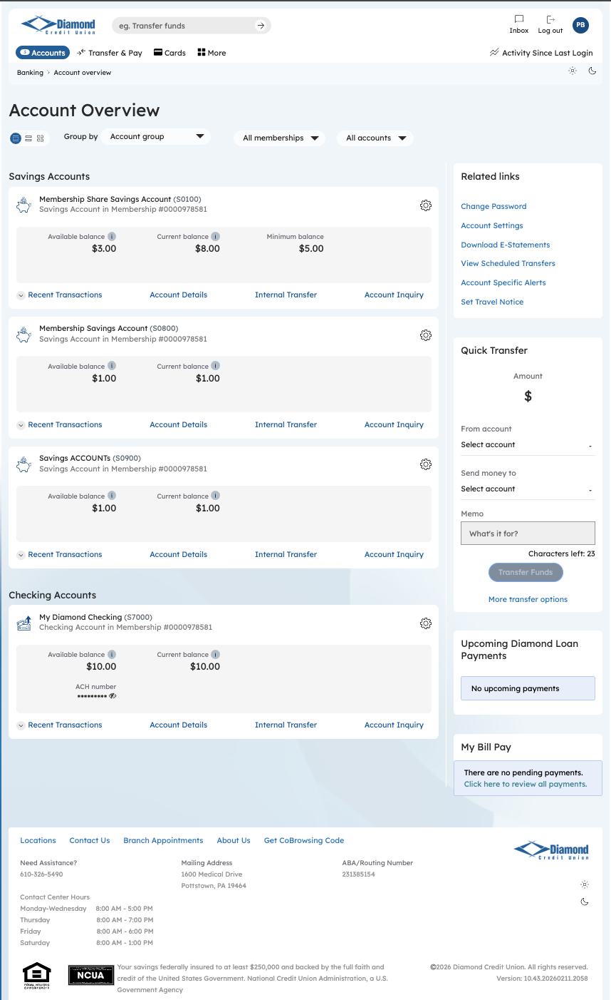
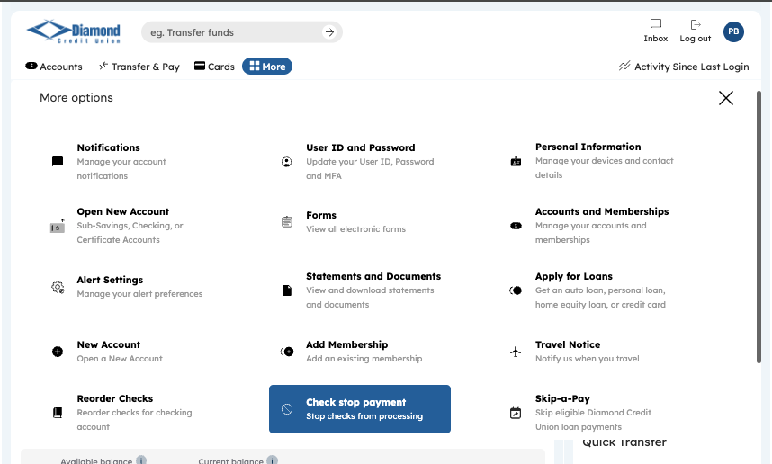
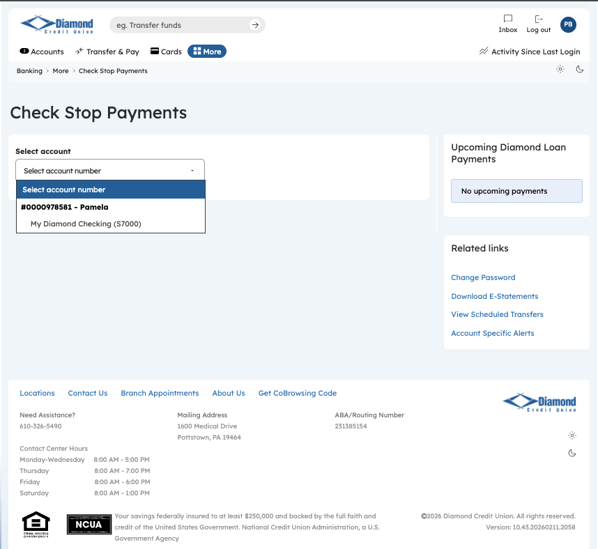
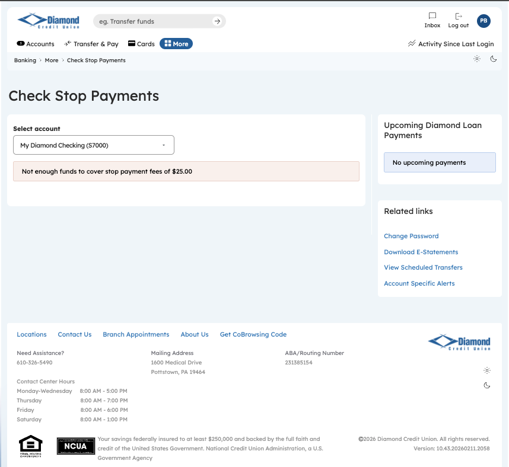

**DIAMOND CREDIT UNION · BUSINESS BANKING GUIDE · Check Stop Payment**

**Check Stop Payment**

Module: nFinia Digital Banking \> Business Banking \> Payments \> Stop Payments

*Platform: Diamond Credit Union nFinia | Feature: Check Stop Payments | Workflow: Verify Stop Payment Eligibility and Fee Coverage*

> **01 PRODUCT SUMMARY**

The Check Stop Payment workflow enables business admins to verify whether an active or pending stop payment request exists for a selected checking account and whether sufficient funds are available to cover the associated processing fee. This feature is part of Diamond Credit Union’s nFinia payment control suite, designed to give authorized business users full visibility into stop payment status before any action is committed against an account.

The workflow begins at Account Overview, where the admin selects the relevant checking account and navigates to the Check Stop Payments screen via the services menu. The platform then performs a real-time balance evaluation: if the account holds sufficient funds to cover the $30.00 stop payment fee, the admin can proceed; if not, an inline notification surfaces immediately, stating the shortfall and blocking the request from advancing to the payment processor.

For credit unions, this fee validation gate is an important operational safeguard. It prevents uncollectable stop payment charges from being applied to accounts that cannot support them, reducing the risk of negative balances and associated servicing costs. Business admins benefit from clear, real-time feedback at the point of request, allowing them to take corrective action — such as transferring funds before resubmitting — without requiring back-office intervention.

**At a Glance**

| **Attribute**     | **Detail**                                                           |
| ----------------- | -------------------------------------------------------------------- |
| Feature Name      | Check Stop Payment                                                   |
| Module            | Business Banking \> Payments \> Stop Payments                        |
| User Roles        | Business Admin, Authorized Signer                                    |
| Key Screens       | Account Overview, Services Menu, Check Stop Payments                 |
| Fee Amount        | $30.00 stop payment processing fee                                   |
| Validation        | Real-time balance check against stop payment fee before processing   |
| Actions Available | Proceed with stop payment (if funds sufficient) or resolve shortfall |

> **02 STEP-BY-STEP GUIDE**
> 
> *Navigation: Business Banking \> Account Overview \> Services Menu \> Check Stop Payments.*

**Step 1 — Account Overview**

The admin accesses Account Overview via the main navigation, which presents a consolidated view of all savings and checking accounts including current balances and recent transaction summaries. This screen serves as the primary entry point for account-specific services, including stop payment requests initiated against checking accounts. From here, the admin identifies the relevant account and navigates to the stop payment service.

*Step 1: Account Overview — Select Starting Point*

**Step 2 — Services Navigation**

The services navigation menu organizes available banking functions into logical categories, giving the admin a single hub to reach account management, payment services, document retrieval, and membership tools. The Check Stop Payments option is accessible from this menu, allowing the admin to navigate directly to the stop payment verification feature without drilling through multiple screens.

*Step 2: Services Menu — Access Stop Payments*

**Step 3 — Check Stop Payments: Select Account**

On the Check Stop Payments screen, the admin selects the target checking account from the “Select account name” dropdown, which lists all eligible accounts associated with the business membership. Once an account is selected, the platform evaluates the account for any active or pending stop payment records. This account-scoped search ensures the admin is reviewing the correct account before taking action.

*Step 3: Check Stop Payments — Account Selection*

**Step 4 — Check Stop Payments: Fee Validation Result**

After account selection, the platform performs a real-time balance check against the stop payment processing fee of $30.00. If insufficient funds are available, an inline notification is displayed — “Not enough funds to cover stop payment fees of $30.00” — preventing the admin from initiating a request that would fail at processing. This fee validation gate protects the credit union from uncollectable service charges and gives the admin clear, actionable guidance on what is needed to proceed.

*Step 4: Check Stop Payments — Insufficient Funds Notification*
