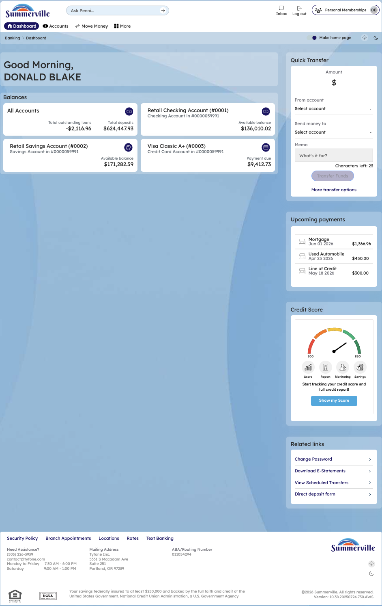
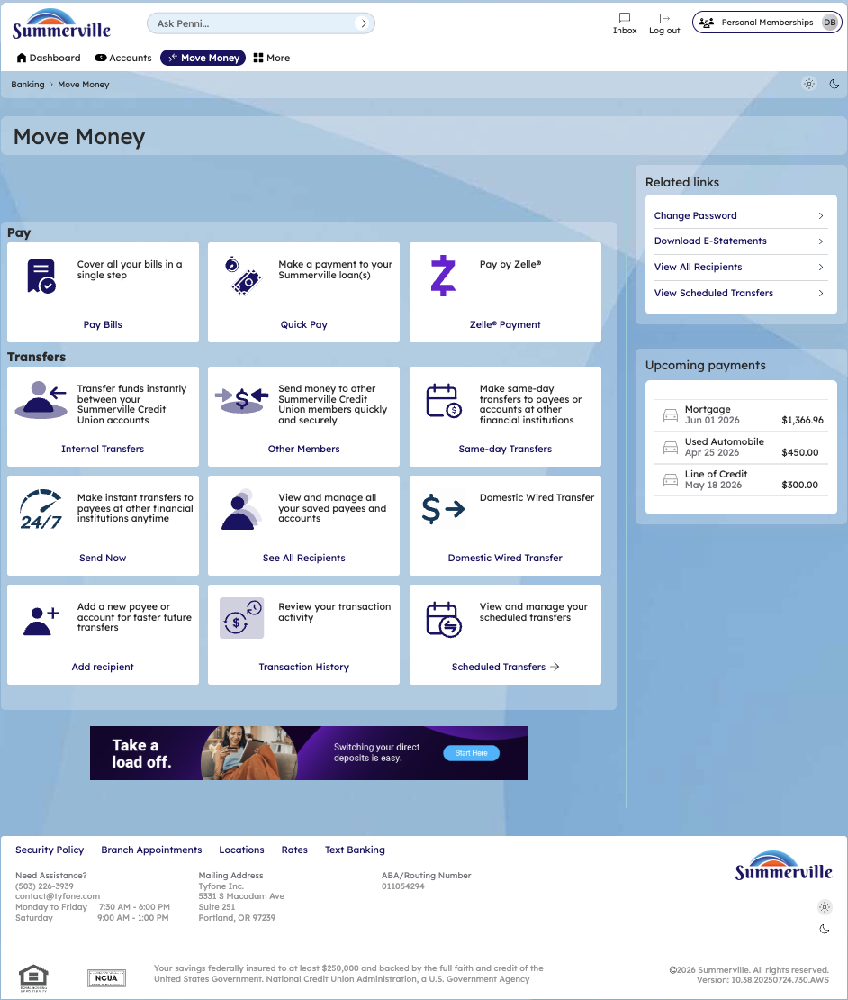
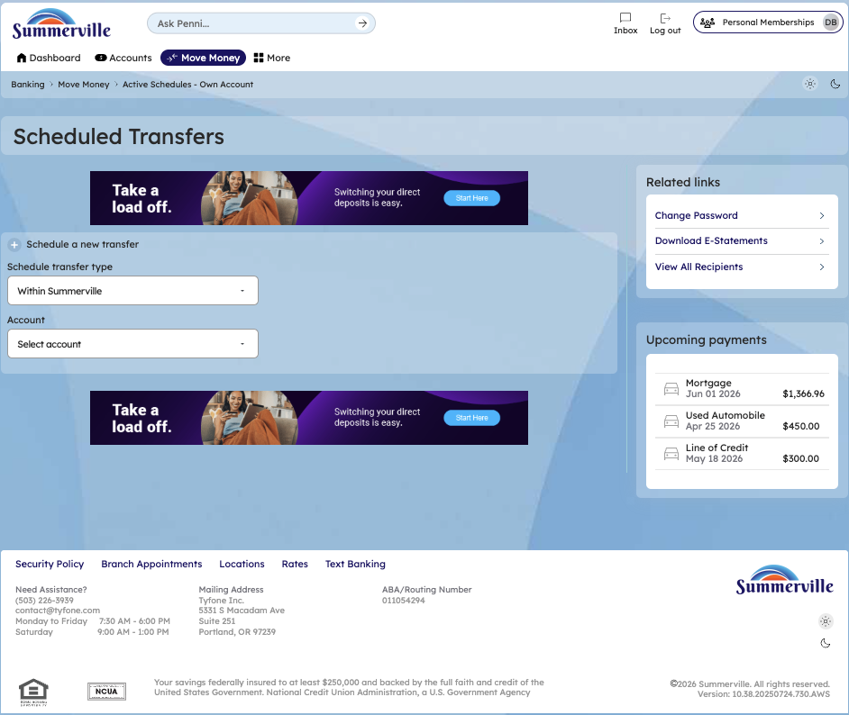
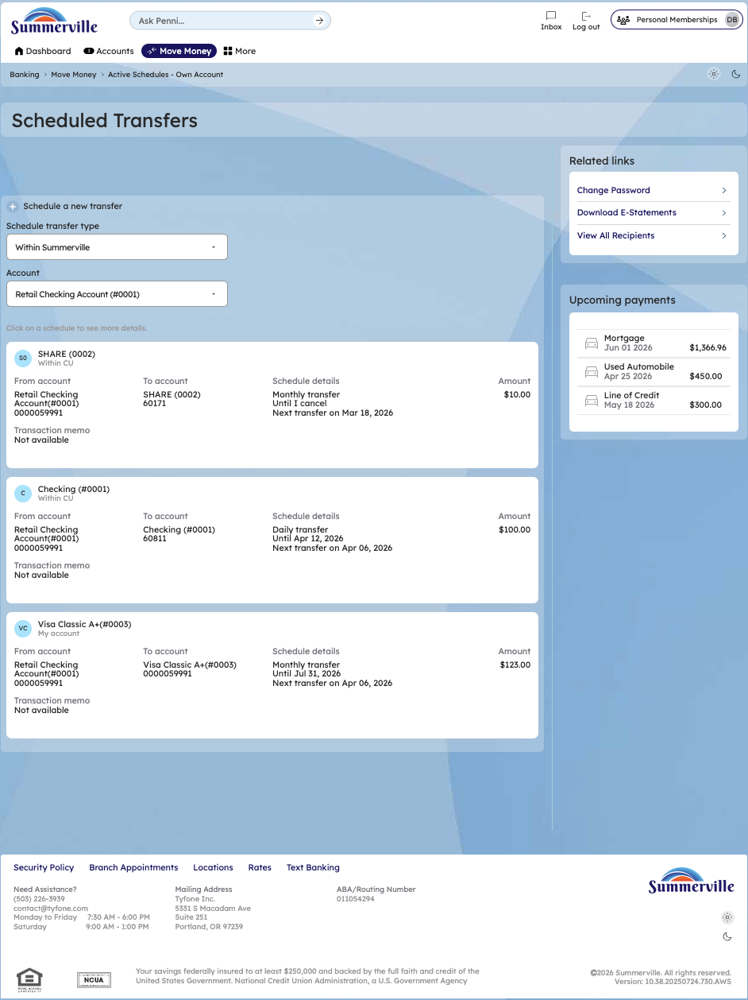
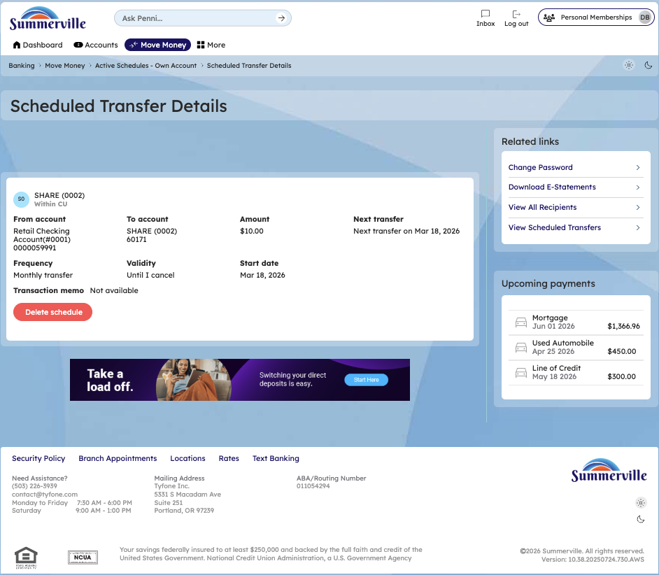
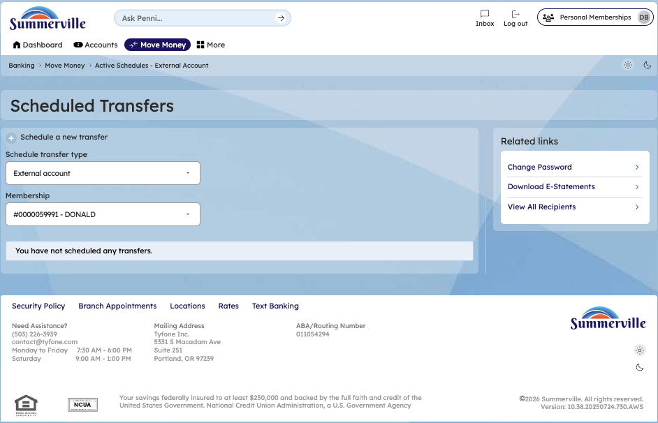

**SUMMERVILLE CREDIT UNION · CONSOLIDATED MEMBER GUIDE · CSUM-06 of 30**

**Scheduled Transfers**

Module: nFinia Digital Banking \> Move Money \> Scheduled Transfers

*Sources: Summerville Reports Series A (36 docs) + Series B (25 docs) | Features: nFinia Documentation Features Spreadsheet*

> **01 STEP-BY-STEP GUIDE**
> 
> *Navigation: Dashboard \> Move Money \> Scheduled Transfers.*

**Step 1 — Start from Dashboard**

After authentication, the member lands on the Dashboard, which surfaces real-time account balances across all products, the Quick Transfer widget for immediate one-off transfers, and upcoming payment obligations in a single consolidated view. To initiate a scheduled transfer review, the member selects Move Money from the top navigation bar.

*Step 1: Start from Dashboard*

**Step 2 — Navigate to Move Money Hub**

The Move Money Hub consolidates every payment and transfer workflow into a single tile-based screen, organized under two categories: Pay (Pay Bills, Quick Pay, Zelle Payment) and Transfers (Internal Transfers, Other Members, Same-day Transfers, Send Now, Domestic Wired Transfer). The member clicks the Scheduled Transfers tile to view and manage all recurring transfer arrangements.

*Step 2: Move Money Hub*

**Step 3 — Access Scheduled Transfers (Initial State)**

The Scheduled Transfers screen opens with a Schedule transfer type selector defaulting to Within Summerville and an Account dropdown. Before any schedules are rendered, the member must select a source account, scoping the results to the correct membership and transfer context.

*Step 3: Scheduled Transfers — initial state*

**Step 4 — View Active Schedules**

With Retail Checking Account (\#0001) selected as the source, the platform surfaces all active recurring schedules linked to that account. Each entry displays the recipient, destination account number, frequency, validity, next transfer date, and transfer amount in a consolidated list — giving members a real-time picture of all committed recurring cash outflows.

*Step 4: Scheduled Transfers — active schedules list*

**Step 5 — Review Scheduled Transfer Details**

Clicking any schedule entry opens the Scheduled Transfer Details screen, which presents the full parameters of that recurring arrangement: source and destination accounts, transfer amount, next transfer date, frequency, validity period, and start date. The member can permanently cancel the recurring schedule from this screen using the Delete schedule button.

*Step 5: Scheduled Transfer Details — SHARE (0002)*

**Step 6 — Check External Scheduled Transfers**

Switching the Schedule transfer type to External account and selecting membership \#0000059991 reveals that no external recurring transfers are currently active for this member, displaying the platform message "You have not scheduled any transfers." This empty state confirms there are no outstanding external ACH recurring obligations tied to this membership.

*Step 6: Scheduled Transfers — External account (no active transfers)*
