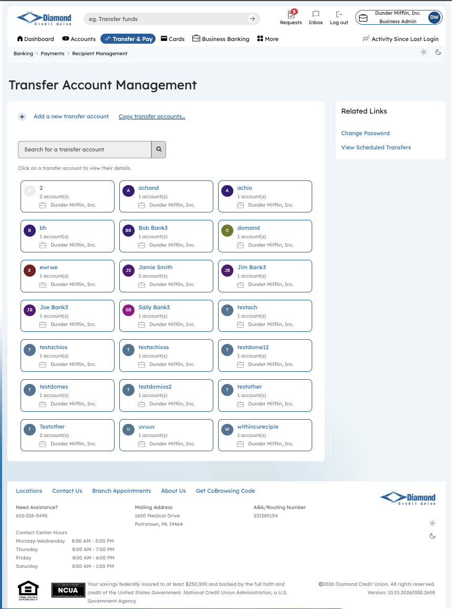
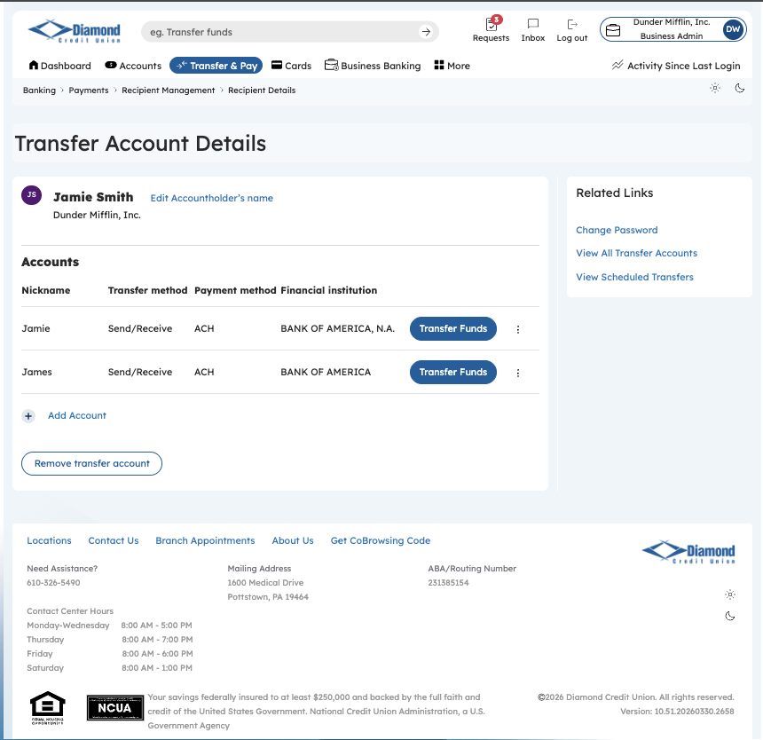
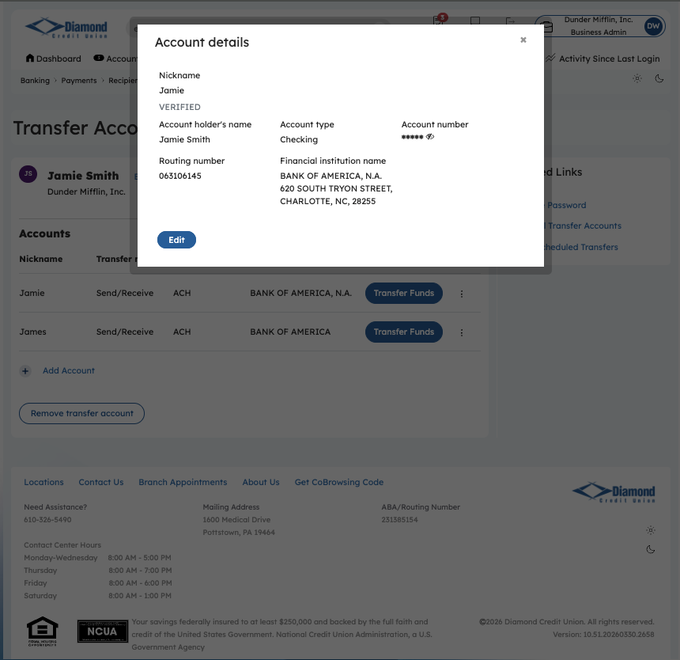
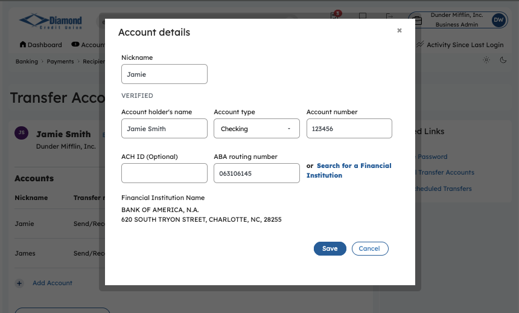
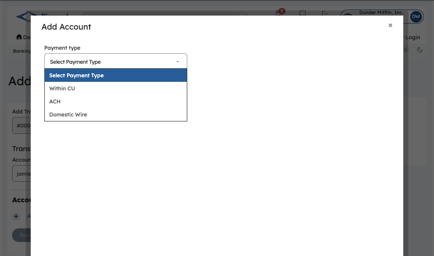
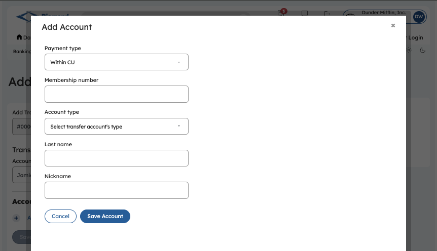

**DIAMOND CREDIT UNION · BUSINESS BANKING GUIDE · Add Multiple-Account Recipient**

**Add Multiple-Account Recipient**

Module: nFinia Digital Banking \> Business Banking \> Transfer & Pay \> Recipient Management

*Platform: Diamond Credit Union nFinia | Feature: Multi-Account Recipient Management | Workflow: Add Multiple Accounts to an Existing Recipient*

> **01 PRODUCT SUMMARY**

The Add Multiple-Account Recipient workflow demonstrates a core capability of the nFinia Transfer Account Management model: a single named recipient can hold multiple payment accounts across different account types, payment methods, and institutions. Rather than creating duplicate payee records for the same individual or vendor, the business admin extends an existing recipient profile by clicking “+ Add Account” within the Transfer Account Details view.

This multi-account structure is particularly valuable for commercial members paying vendors or employees who maintain separate Checking and Savings accounts — even at different branches of the same institution. Each linked account carries its own nickname, account type, and routing details, and exposes an independent “Provide Funds” action so the admin can direct each payment to the correct account without modifying the recipient record.

For credit unions, this model reduces payee list sprawl, improves transfer accuracy, and supports clean audit trails by keeping all accounts for a given counterparty consolidated under one recipient identity. New accounts can be added at any time, and any individual account can be removed without affecting the others.

**At a Glance**

| **Attribute**  | **Detail**                                                       |
| -------------- | ---------------------------------------------------------------- |
| Feature Name   | Add Multiple-Account Recipient                                   |
| Module         | Business Banking \> Transfer & Pay \> Recipient Management       |
| User Roles     | Business Admin, Authorized Signer                                |
| Payment Types  | Within CU, ACH, Domestic Wire (per account)                      |
| Key Actions    | Open Existing Recipient, Add Account, Save                       |
| Account Limit  | Multiple accounts per recipient (no fixed cap)                   |
| Business Value | Consolidates all accounts for a payee under one recipient record |

> **02 STEP-BY-STEP GUIDE**
> 
> *Navigation: Dashboard \> Business Banking \> Transfer & Pay \> Recipient Management \> \[Select existing recipient\] \> + Add Account.*

**Step 1 — Dashboard**

The business admin logs into the nFinia platform and lands on the personalized dashboard, which presents a real-time view of all account balances, upcoming loan obligations, and a Quick Transfer widget. From here, the admin navigates to Business Banking to locate an existing recipient and add a second payment account to their profile.

*Step 1: Dashboard*

**Step 2 — Business Banking Hub**

The Business Banking hub serves as the centralized navigation layer for all commercial payment and administrative operations. The admin navigates to Recipient Management via Transfer & Pay to locate the existing payee and extend their profile with an additional linked account.

*Step 2: Business Banking Hub*

**Step 3 — Transfer Account Management**

The Transfer Account Management screen lists all saved recipients associated with the business. The admin locates the existing recipient — Jamie Smith — and clicks their record to open the Transfer Account Details view, where additional accounts can be added.

*Step 3: Transfer Account Management*

**Step 4 — Transfer Account Details: Existing Account**

The Transfer Account Details screen shows Jamie Smith’s current profile: one ACH account with nickname “Jamie” linked to BANK OF AMERICA, N.A., with a “Provide Funds” action available. The admin clicks “+ Add Account” to link a second payment account under the same recipient record — avoiding the need to create a duplicate payee entry.

*Step 4: Transfer Account Details — One Account Saved*

**Step 5 — Add Account: Second Account Details**

The Add Account modal is completed for the second account: ACH payment type, account holder Jamie Smith, account number 123456, account type Savings, and routing number 081500875 — with the institution auto-resolved to BANK OF AMERICA via the institution search. The nickname “James” distinguishes this Savings account from the existing Checking account (“Jamie”) so the admin can identify the correct account at transfer time.

*Step 5: Add Account — Second Account (Savings, ACH)*

**Step 6 — Transfer Account Details: Two Accounts Saved**

With both accounts saved, the Transfer Account Details screen now displays Jamie Smith with two independently actionable accounts: “Jamie” (Checking) and “James” (Savings), both at BANK OF AMERICA, N.A. Each account carries its own “Provide Funds” button, allowing the admin to direct payments to either account without modifying the recipient record — a key capability for vendors or employees with multiple bank accounts.

*Step 6: Transfer Account Details — Two Accounts Saved*
