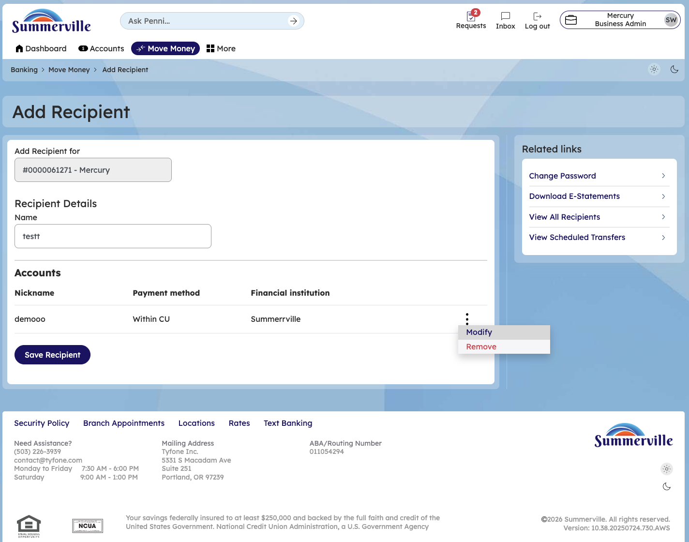
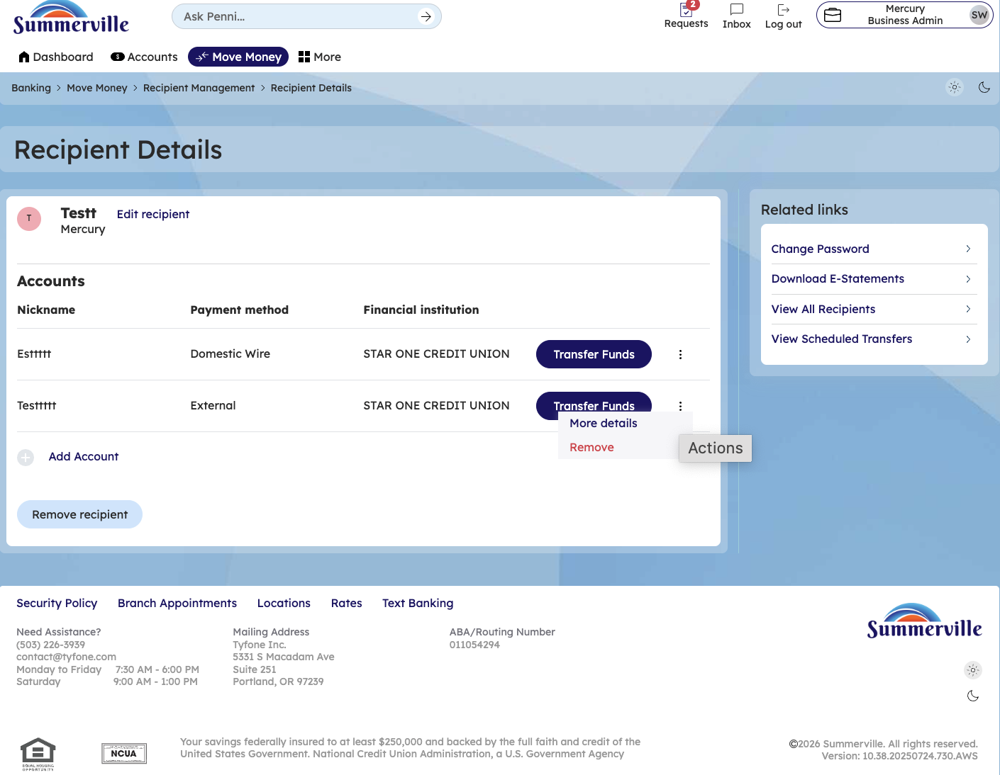
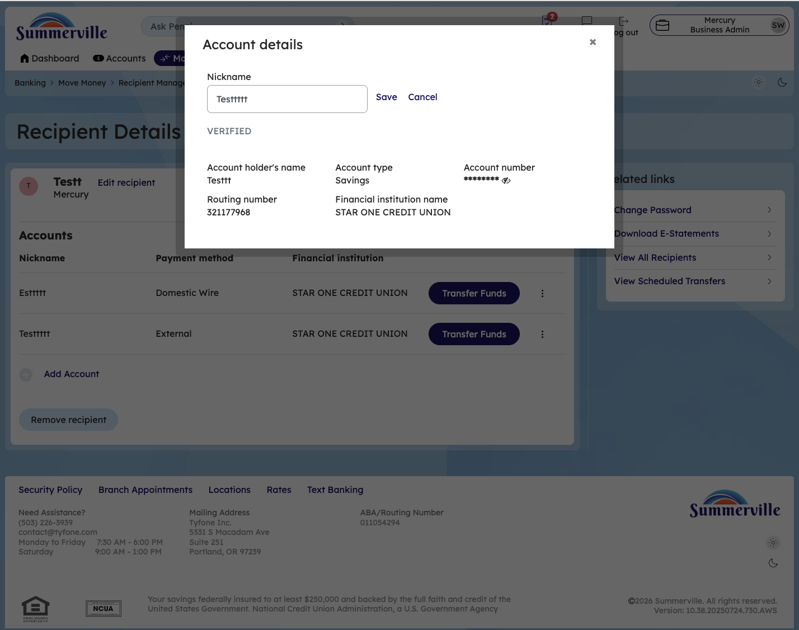
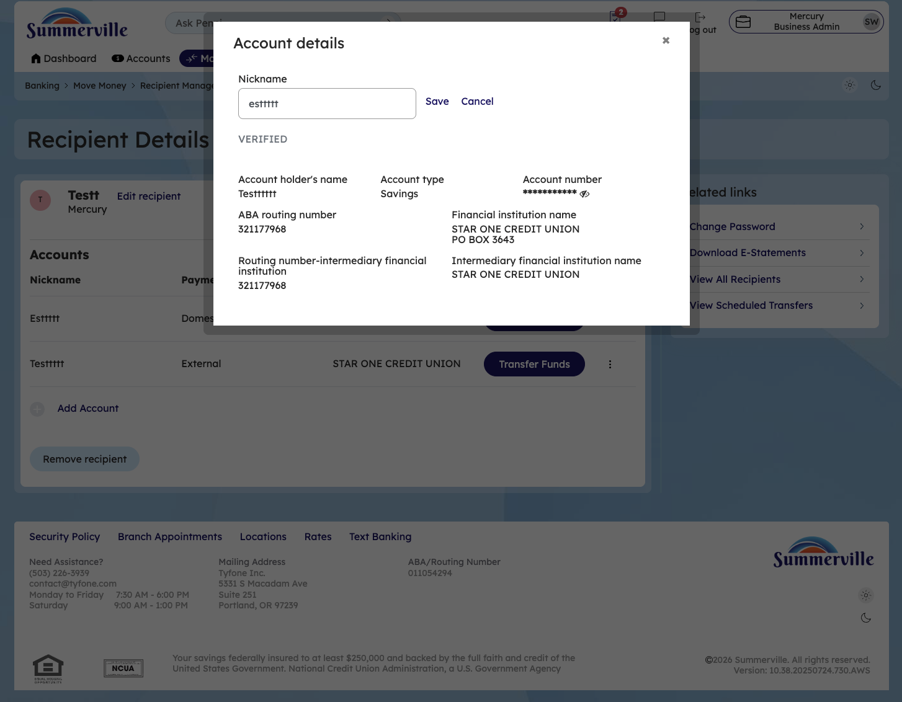
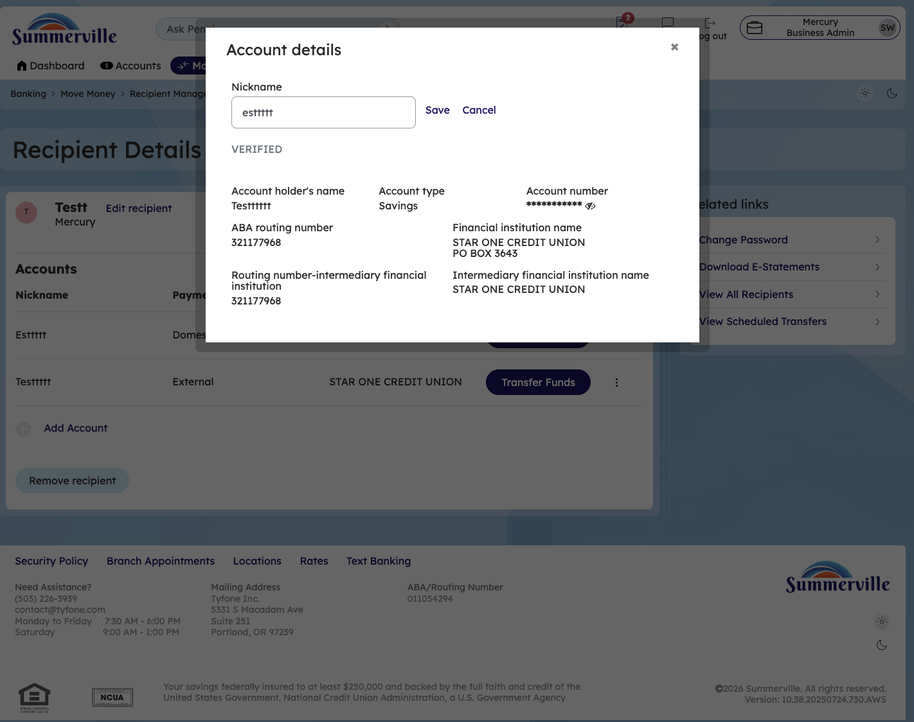
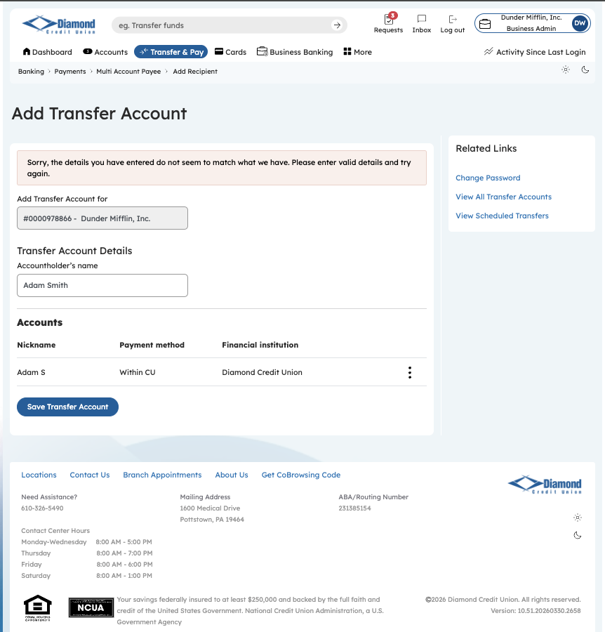
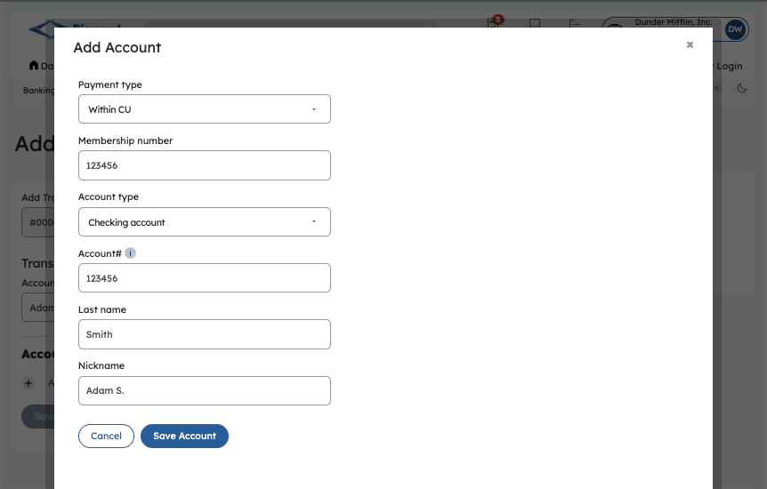

**SUMMERVILLE CREDIT UNION · CONSOLIDATED MEMBER GUIDE · CSUM-11 of 30**

**Recipient Management**

Module: nFinia Digital Banking \> Move Money \> Recipient Management

*Sources: Summerville Reports Series A (36 docs) + Series B (25 docs) | Features: nFinia Documentation Features Spreadsheet*

> **01 PRODUCT SUMMARY**

Recipient Management is the centralised address book for all transfer and payment recipients. Members can store details for other CU members, external ACH bank accounts, domestic wire beneficiaries, international wire beneficiaries, and FedNow recipients. Saved recipients appear as quick-select options throughout all payment workflows, eliminating the need to re-enter banking details for each transaction.

The module supports multiple recipient types with different required fields: domestic wire recipients require an ABA routing number and account number, international wires require a SWIFT/BIC code and international address, external ACH accounts require routing and account number plus account type. Members can view, add, edit, rename, delete, copy, and verify recipients from one management screen.

Transfer Templates are an advanced feature within recipient management that allows members to pre-configure complete transfer transactions (from account, to recipient, amount, frequency) which can be re-run on demand with a single click. This is particularly valuable for business members with recurring payment obligations.

**At a Glance**

| **Attribute**      | **Detail**                                                         |
| ------------------ | ------------------------------------------------------------------ |
| Module             | Move Money \> Recipient Management                                 |
| Recipient Types    | CU Member, External ACH, Domestic Wire, International Wire, FedNow |
| Fields Stored      | Name, institution, routing, account number, account type, nickname |
| Transfer Templates | Pre-configured full transfers reusable on demand                   |
| Security           | Adding new recipients may trigger OTP verification                 |
| Related Reports    | CSUM-09 (External ACH), CSUM-15 (Wire Transfers)                   |

> **02 KEY USE CASES**

| **Use Case**             | **Who Uses It**                          | **What They Do**                                      | **Business Value**                                        |
| ------------------------ | ---------------------------------------- | ----------------------------------------------------- | --------------------------------------------------------- |
| Add External Account     | Members setting up ACH pull/push         | Add external bank routing and account numbers         | Required before initiating any external ACH transfers     |
| Add Wire Beneficiary     | Members who send domestic wires          | Enter ABA, account number, beneficiary name for wire  | Saves wire recipient details for recurring wire transfers |
| Create Transfer Template | Business members with recurring payments | Configure a complete transfer as a reusable template  | Single-click execution for repeat payment transactions    |
| Audit Saved Recipients   | Members reviewing payee list             | View all saved recipients with masked account details | Identify and remove outdated or incorrect payees          |

> **03 STEP-BY-STEP GUIDE**
> 
> *Navigation: Dashboard \> Move Money \> 'Recipient Management'.*

**Step 1 — Start from Dashboard**

The member begins at the Dashboard after logging in. The Dashboard displays all account balances, upcoming payments, quick-action tiles, and the top navigation bar with links to Accounts, Move Money, and More.

*Step 1: Start from Dashboard*

**Step 2 — Navigate to Move Money Hub**

The member clicks ‘Move Money’ in the top navigation bar. The Move Money Hub displays all payment and transfer options as tiles including Pay Bills, Quick Pay, Zelle Payment, Internal Transfers, Other Members, Same-Day Transfers, Send Instantly, Manage Recipients, Add Recipient, Transaction History, Scheduled Transfers, and P2P Transfer.

*Step 2: Move Money Hub*

**Step 3 — View Recipient List**

The Recipient Management page displays all saved recipients as cards in a grid layout. Recipients shown include Jane Smith, John Smith, Mr Recipient, Nemo Clownfish, Steven Richards, and Tony Stark, each displaying the number of linked accounts. A search bar and 'Add a new recipient' link are available at the top.

*Step 3: View Recipient List*

**Step 4 — View Recipient Details & Linked Accounts**

The Recipient Details page for Jane Smith is displayed. The Accounts section lists two linked external accounts with columns for Nickname, Payment method, and Financial Institution. Each account shows action buttons including 'Initiate Transfer' and a delete option. An 'Add Account' button and 'Remove recipient' link are available below.

*Step 4: View Recipient Details & Linked Accounts*

**Step 5 — Add a New Recipient**

The Add Recipient form is displayed with a 'Recipient Details' section containing a Name field. The Accounts area shows an 'Add Account' link to attach payment accounts to the new recipient. Related Links are available in the right sidebar.

*Step 5: Add a New Recipient*

**Step 6 — Add Account to Recipient**

The Add Account modal is open with fields for Payment type (set to 'within CU'), Membership number, Account type (set to '1st savings account'), optional First name and Last name fields, and a Nickname field. Cancel and 'Save Account' buttons appear at the bottom.

*Step 6: Add Account to Recipient*

**Step 7 —Delete internal Payee**

Search for an Internal payee and and remove the internal payeeSearch for an Internal payee, verify the payee details, and then proceed to remove the internal payee from the recipient management list.

**Step 8 —Delete External Payee**

Search for an External payee and and remove the internal payeeSearch for an External payee, verify the payee details, and then proceed to remove the External payee from the recipient management list.

**Step 9 —Edit external nickname**

Click on edit external payee nickname and change the nickname and click save

**Step 10 —Edit internal nickname**

Click on edit internal payee nickname and change the nickname and click save

**Step 11 —Edit domestic Wire nickname**

Click on edit domestic Wire nickname and change the nickname and click save

**Step 12 —Remove Domestic Wire Recipient Payee**

Click on recipient details,click on the hamburger menu and click on remove option to remove the recipient

**Step 13 —Remove Recipient**

Click on remove Recipient and Click on OK to remove this recipient

