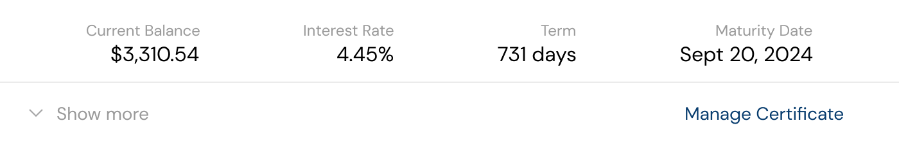
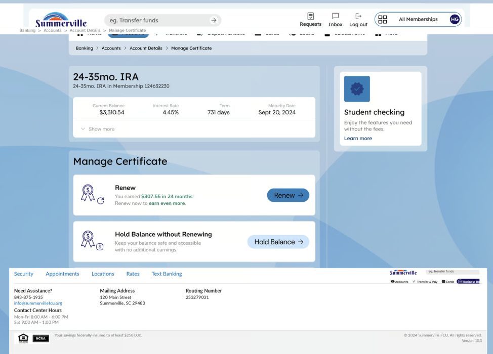
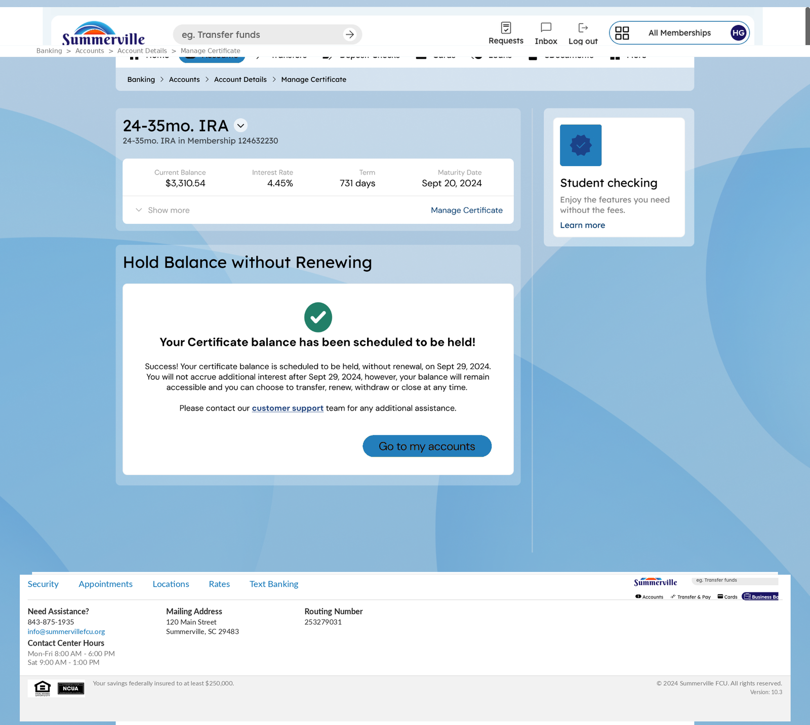
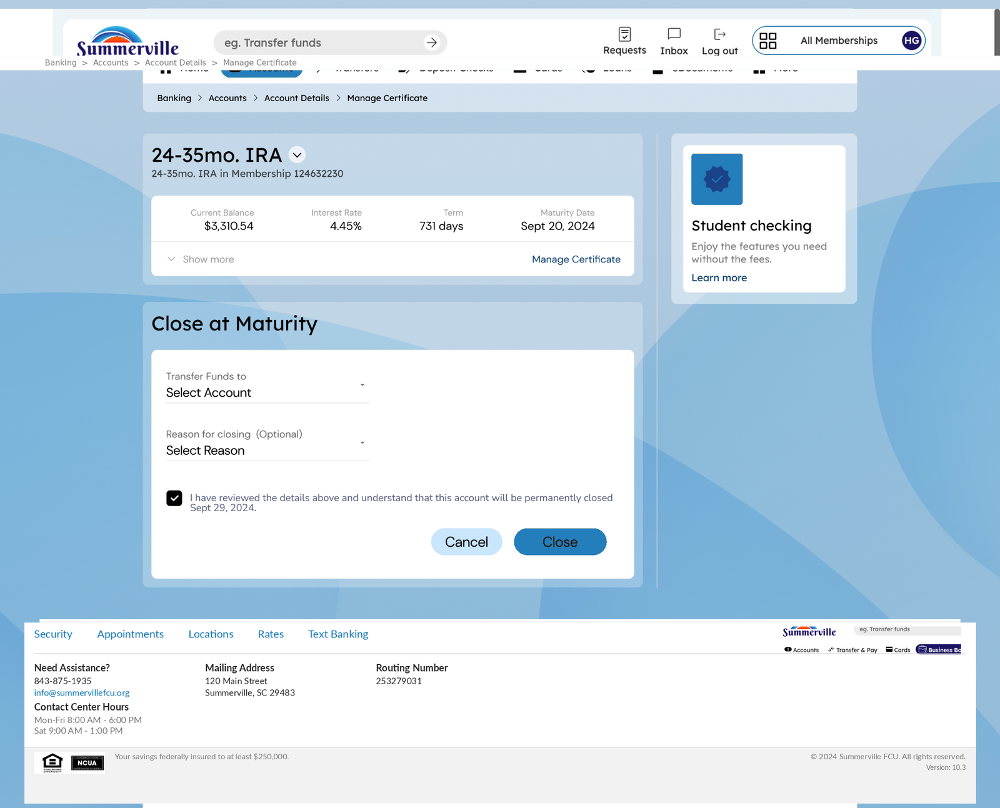
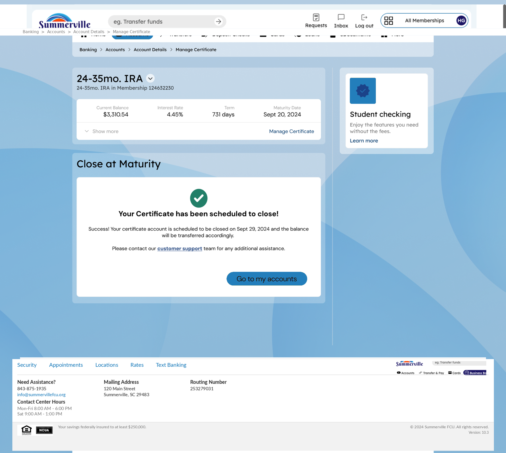

# Certificate Management

***

### **1. Product Summary**

Certificate Management is a core feature of the nFinia Digital Banking platform that enables credit union to manage  certificate (CD) accounts directly through the digital banking portal. This capability allows members to renew certificates, hold balances without renewal, and close certificates at maturity --- all without visiting a branch or calling the contact center.

Certificate Management reduces operational burden on branch staff by enabling self-service certificate lifecycle management. Members benefit from 24/7 access to manage their certificate accounts on their own schedule, with clear review screens and confirmation steps that ensure informed decision-making.&#x20;

***

### **2. End-to-End Workflow**

**2.1 Prerequisites**

• Member must be enrolled in digital banking with an active membership.

• Members must hold at least one eligible Certificate account&#x20;

• The Certificate Management feature must be enabled for the FI

• The certificate must be within its maturity management window for renewal, hold, or closure options to appear.

**2.2 Step-by-Step Workflow**

**Step 1: View Certificate on Account Details**

<figure><figcaption></figcaption></figure>

Member logs into the  digital banking portal and navigates to their Account Details page for the  certificate account. The page displays key certificate information including Current Balance, Interest Rate, Term (in days), and Maturity Date. A "Manage Certificate" link is prominently displayed, providing the single entry point to all certificate management actions.

**Step 2: Manage Certificate Options**

<figure><figcaption></figcaption></figure>

Clicking "Manage Certificate" presents the available maturity options configured for this certificate. The options include Renew Certificate (reinvest the full balance or rollover to a new product), Hold Balance Without Renewing (keep funds in account without accruing additional interest), and Close at Maturity (transfer balance to another account).&#x20;

**Step 3: Renew Certificate**&#x20;

<figure><figcaption></figcaption></figure>

When you select Renew Certificate, the renewal options are presented in a guided stepper workflow. Step 1 asks member to choose between renewing the existing certificate (reinvest full balance at current or new term) or reinvesting/rolling over to a new certificate product. The current maturity option is pre-selectedby default. If  Reinvest or Rollover is selected, additional fields appear for selecting the rollover product and specifying a partial withdrawal amount.

**Step 4: Select Term**

<figure><figcaption></figcaption></figure>

In Step 2 of the renewal flow,  select the term for the renewed certificate.  Members review the selected term and clicks Next to proceed to the review screen.

**Step 5: Review Renewal Details**

<figure><figcaption></figcaption></figure>

The Review screen presents a comprehensive summary of the renewal configuration: the certificate account, selected renewal option, chosen term, current balance, interest rate, and maturity date. Members can click Back to modify any selection (all previously entered data is retained) or click Renew to submit the renewal request to the core banking system.

**Step 6: Renewal Success**

<figure><figcaption></figcaption></figure>

Upon successful submission, the system displays a confirmation screen with the renewal details and a success message. The screen includes a reference number for the transaction and a link to return to the Accounts page. If the renewal fails due to a recoverable error, a retry option is presented. Customer support contact information is displayed for non-recoverable errors.

**Step 7: Hold Balance Without Renewing**

<figure><figcaption></figcaption></figure>

When  Hold Balance Without Renewing is selected, the system presents a confirmation screen explaining that the certificate will not be renewed and the balance will remain in the account without accruing additional interest post-maturity. Members must accept the Terms and Conditions via a checkbox before the Submit button becomes active. This ensures informed consent and creates an audit trail of the decision.

**Step 8: Hold Balance Success**

<figure><figcaption></figcaption></figure>

After accepting the terms and submitting, the system confirms the hold request with a success screen. The balance remains accessible and members retain the option to renew the certificate at a later date, transfer the balance, or withdraw funds without penalty.

**Step 9: Close at Maturity**

<figure><figcaption></figcaption></figure>

When you select Close at Maturity, members are prompted to select a transfer-to account (filtered to eligible Checking, Savings, or Loan accounts based on the configuration for the FI). An optional reason selector is displayed if it is configured; selecting "Other" reveals a free-text input field. Members must accept the Terms and Conditions before submitting the closure request.

**Step 10: Close at Maturity Success**

<figure><figcaption></figcaption></figure>

The system confirms the certificate closure with a success screen showing the transfer details, destination account, and a reference number. The certificate balance is transferred to the selected account and the certificate account is marked for closure.

***

