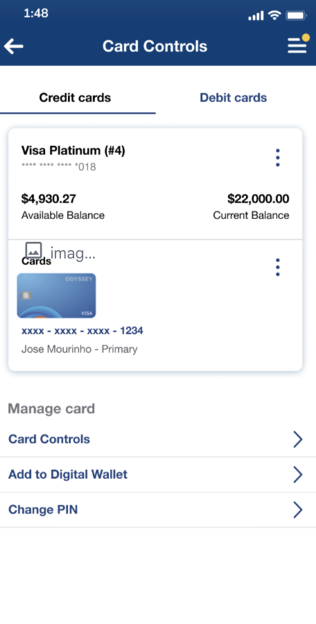
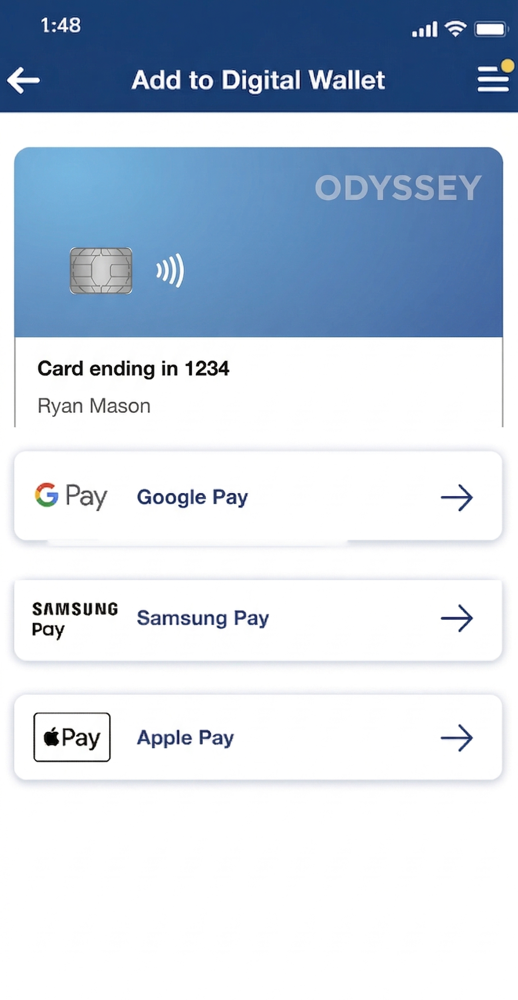
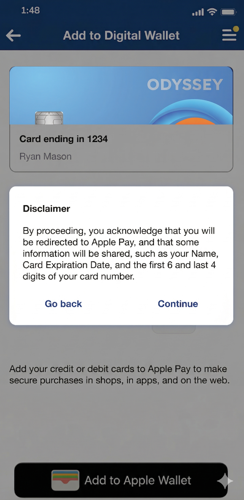
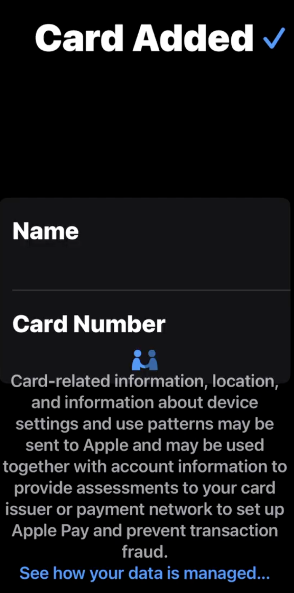
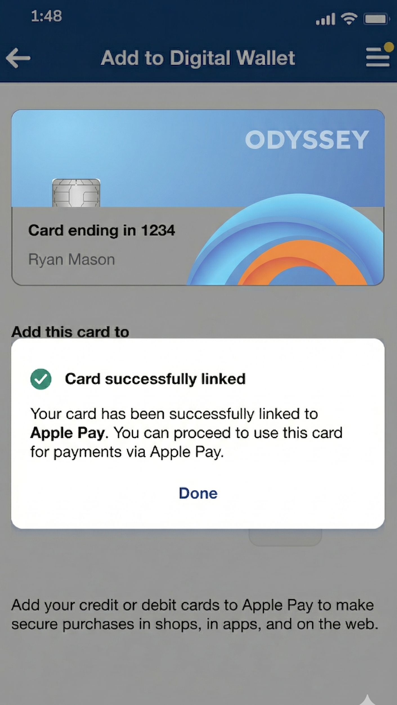

# Add to Digital Wallet — Mobile

\| nFinia Digital Banking | Summerville Credit Union | Member User Guide | | :---- |

**Add to Digital Wallet**

|   |
| - |

_Module: Banking › Cards › Card Details › Add to Digital Wallet_

| 01 PRODUCT SUMMARY |
| ------------------ |

Add to Digital Wallet lets you link your Summerville Credit Union credit or debit card directly to a digital wallet — Apple Pay, Google Pay, or Samsung Pay — without leaving nFinia Digital Banking. Once linked, your card is ready for contactless tap-to-pay purchases in stores, in apps, and online.

The process takes under a minute. From your Card Details, tap Add to Digital Wallet, select your preferred wallet, accept the provisioning disclaimer, and complete the brief native wallet setup on your device. A confirmation appears in nFinia as soon as the card is successfully linked.

**At a Glance**

| Feature Name           | Add to Digital Wallet (Push Provisioning)               |
| ---------------------- | ------------------------------------------------------- |
| **Module Location**    | Banking › Cards › Card Details › Add to Digital Wallet  |
| **Supported Wallets**  | Apple Pay · Google Pay · Samsung Pay                    |
| **Supported Cards**    | Credit cards and debit cards enrolled in nFinia         |
| **Provisioning Speed** | Immediate — card ready in wallet once setup is complete |
| **Multiple Wallets**   | The same card can be linked to more than one wallet     |
| **Channels**           | Mobile Banking (iOS & Android)                          |
| **Prerequisite**       | Device must support the chosen wallet (NFC-enabled)     |

| 02 KEY USE CASES |
| ---------------- |

| Use Case                | Member Goal                                          | Steps                                                                                               | Outcome                                                                            |
| ----------------------- | ---------------------------------------------------- | --------------------------------------------------------------------------------------------------- | ---------------------------------------------------------------------------------- |
| Add card to Apple Pay   | Enable tap-to-pay on iPhone or Apple Watch           | Card Details › Add to Digital Wallet › Apple Pay › accept disclaimer › complete Apple Pay setup     | Card provisioned to Apple Pay; ready for contactless use on iPhone and Apple Watch |
| Add card to Google Pay  | Enable tap-to-pay on Android device                  | Card Details › Add to Digital Wallet › Google Pay › accept disclaimer › complete Google Pay setup   | Card provisioned to Google Pay immediately                                         |
| Add card to Samsung Pay | Enable tap-to-pay on Samsung Galaxy device           | Card Details › Add to Digital Wallet › Samsung Pay › accept disclaimer › complete Samsung Pay setup | Card provisioned to Samsung Pay; works at NFC and MST terminals                    |
| Link after card reissue | Resume contactless payments after a card replacement | After reissuance, go to Card Details › Add to Digital Wallet and re-provision the new card          | New card number active in wallet for contactless payments                          |

| 03 STEP-BY-STEP GUIDE |
| --------------------- |

| _📍 Navigation: Banking › Cards › \[select card] › Card Details › Add to Digital Wallet_ |
| ---------------------------------------------------------------------------------------- |

**Step 1 Open Card Details**

<figure><figcaption></figcaption></figure>

From the nFinia Cards screen, locate the card you want to add to a digital wallet. Tap the card tile to open Card Details. Under the Manage Card section, tap Add to Digital Wallet.

_Card Details — Manage Card menu showing Add to Digital Wallet_

**Step 2 Select Your Wallet**

<figure><figcaption></figcaption></figure>

The Add to Digital Wallet screen shows your card details and the three available wallet options. Tap the wallet you want to use: Google Pay, Samsung Pay, or Apple Pay.

_Select wallet — Google Pay, Samsung Pay, or Apple Pay_

| ℹ️ Tip: You can link the same card to more than one wallet. Simply repeat this process and select a different wallet each time. |
| ------------------------------------------------------------------------------------------------------------------------------- |

**Step 3 Accept the Disclaimer**

<figure><figcaption></figcaption></figure>

A disclaimer appears confirming that by proceeding, you authorise Summerville Credit Union to provision your card to the selected wallet. Some card details — your name, card expiry date, and the first 6 and last 4 digits of your card number — will be shared with the wallet provider. Tap Continue to proceed, or Go back to cancel.

_Provisioning disclaimer — review and tap Continue_

| ⚠️ Note: You must accept the disclaimer to complete provisioning. Tapping Go back cancels the process and your card will not be added to the wallet. |
| ---------------------------------------------------------------------------------------------------------------------------------------------------- |

**Step 4 Complete the Wallet Setup on Your Device**

<figure><figcaption></figcaption></figure>

After accepting the disclaimer, your device's native wallet app takes over to complete the provisioning. The steps vary slightly by wallet:

| Apple Pay       | Select the device (iPhone or Apple Watch) you want to add the card to, review Terms & Conditions, and tap Agree. Apple confirms the card has been added. |
| --------------- | -------------------------------------------------------------------------------------------------------------------------------------------------------- |
| **Google Pay**  | Follow the on-screen prompts in the Google Wallet app to verify and activate the card.                                                                   |
| **Samsung Pay** | Follow the on-screen prompts in Samsung Wallet to verify and activate the card.                                                                          |

|  _Select device — iPhone or Apple Watch_ |   |  _Apple Pay Terms & Conditions_ |
| :--------------------------------------: | - | :-----------------------------: |

_Apple Pay — Card Added confirmation_

**Step 5 Card Successfully Linked**

<figure><figcaption></figcaption></figure>

Once the wallet setup is complete, nFinia shows a Card successfully linked confirmation. Your card is now active in the selected wallet and ready for contactless tap-to-pay purchases. Tap Done to return to Card Details.

_nFinia — Card successfully linked to Apple Pay_

| ℹ️ Tip: After linking, open your wallet app to confirm the card appears. On Apple Pay, check Settings › Wallet & Apple Pay. On Google Pay or Samsung Pay, check the Cards section of the app. |
| --------------------------------------------------------------------------------------------------------------------------------------------------------------------------------------------- |

| ⚠️ Note: If you replace your card through the Digital Card Reissuance flow, you will need to re-link the new card number to your digital wallet. The old card number will be removed automatically. |
| --------------------------------------------------------------------------------------------------------------------------------------------------------------------------------------------------- |
